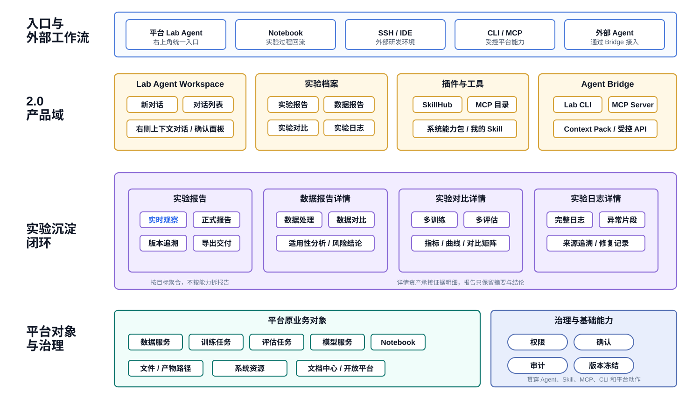
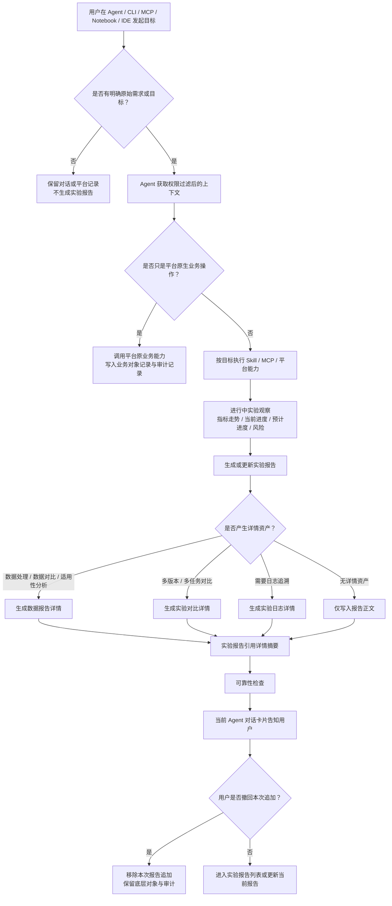

# DeepexiLab 2.0 Agent Native PRD（评审版）

> 文档版本：v0.3  
> 更新日期：2026-06-18  
> 适用范围：DeepexiLab 2.0 产品需求评审

## 一、产品总览

DeepexiLab 2.0 的方向是建设 **Agent Native 模型研发工作台**。平台不再只承接数据集、训练任务、评估任务、模型服务这些离散业务对象，而是进一步承接算法工程师在 Notebook、SSH、IDE、CLI、外部 Agent 中产生的目标、过程、诊断、对比、结论和证据。

2.0 的核心产品形态由四部分组成：

| 产品域 | 核心作用 |
| --- | --- |
| Lab Agent Workspace | DeepexiLab 内统一的 Agent 工作台，承接对话、实验档案、SkillHub、MCP。 |
| 实验档案 | 沉淀实验报告、数据报告详情、实验对比详情、实验日志详情。 |
| 插件与工具 | 通过 SkillHub 能力包和 MCP 扩展 Agent 可调用能力与连接能力。 |
| Agent Bridge | 通过 CLI、MCP Server、Context Pack 打通 Notebook、SSH、IDE、外部 Agent 与平台。 |

2.0 的核心资产是 **实验报告**。只要用户通过 Agent/CLI/MCP 围绕明确目标完成了分析、处理、诊断、对比、复盘或交付结论，就生成或更新实验报告。报告完全生成前，实验报告详情先作为进行中实验观察入口，展示实时指标走势、当前进程、预计进程、ETA、阶段时间线和关键风险；实验完成后，这些过程证据收敛为正式报告的执行过程和关键证据摘要。数据报告详情、实验对比详情、实验日志详情作为证据与细节资产被实验报告引用；数据集、训练任务、评估任务、模型服务仍然保留在原平台模块中。

## 二、产品架构与主流程

### 2.1 产品架构图



产品架构图采用固定排版的块状能力地图，避免 Mermaid 自动布局造成模块重叠；图中按 PRD 的 2.0 产品域组织 Lab Agent Workspace、实验档案、插件与工具、Agent Bridge，并展示实验沉淀闭环、平台原业务对象和治理基础能力。

### 2.2 目标型 Agent 工作流程



## 三、业务背景与目标

### 3.1 背景问题

DeepexiLab 已具备数据服务、在线 Notebook、大模型训练、模型评估、模型服务、系统管理等平台基础能力。但算法工程师的真实工作通常跨越 Notebook、SSH、IDE、CLI、通用 Agent 和平台页面，关键过程容易散落在日志路径、Notebook 文件、聊天记录和个人脚本中。

当前平台能承接部分事实对象，但仍难以回答：

- 这次工作的原始目标是什么？
- 为什么选择这份数据、这个参数和这个模型版本？
- 中间遇到过哪些报错，如何修复？
- 多次训练或评估之间到底差在哪里？
- 最终结论是否有证据支撑，能否用于复盘、汇报或交付？

2.0 需要把这些跨工具、跨对象、跨阶段的信息沉淀为可回看、可追溯、可复用的研发资产。

### 3.2 产品目标

| 目标 | 说明 |
| --- | --- |
| 建立 Agent 工作台 | 用户可以通过 Lab Agent Workspace 发起对话、查看实验档案、管理 SkillHub 和 MCP。 |
| 建立实验报告入口 | 用实验报告统一承接 Agent 目标型工作的目标、过程、结论和证据。 |
| 建立详情资产 | 用数据报告详情、实验对比详情、实验日志详情承接细节，避免实验报告过重。 |
| 打通外部工作流 | 通过 CLI/MCP/Context Pack 让 Notebook、SSH、IDE、外部 Agent 与平台协同。 |
| 沉淀可复用能力 | 通过 SkillHub 把日志分析、报错诊断、实验对比、数据处理、交付材料生成沉淀为可调用能力。 |
| 保持治理边界 | 所有 Agent、Skill、MCP、CLI 动作均受账号权限、项目权限、确认机制和审计约束。 |

## 四、目标用户与核心场景

| 角色 | 核心场景 |
| --- | --- |
| 算法工程师 | 在 Notebook、SSH、IDE 或平台中完成数据处理、训练调优、日志诊断、实验对比，并自动沉淀实验报告。 |
| 算法负责人 | 查看实验报告和对比详情，判断实验方向、风险和候选版本。 |
| 评估/测试人员 | 查看评估差异、失败样例、日志证据和实验对比依据。 |
| 交付/项目经理 | 导出可复盘、可汇报、可交付的实验报告。 |
| 平台管理员 | 治理 Agent、Skill、MCP、CLI、权限、确认和审计记录。 |

典型场景：

- 用户让 Agent 对比三次训练结果，平台生成实验报告和实验对比详情。
- 用户在训练或评估尚未完成时打开实验报告，查看 loss、win-rate、stability 等指标走势、当前进度、预计进度和关键风险。
- 用户在 Notebook 中处理数据并写回平台，平台生成实验报告和数据报告详情。
- 用户让 Agent 分析训练失败原因，日志分析和报错诊断直接进入实验报告。
- 用户在外部 Agent 中通过 MCP 查询项目、训练任务、评估结果和实验档案。
- 用户导入自定义 Skill，用于团队常见日志格式的分析和修复建议生成。

## 五、核心产品原则

| 原则 | 内容 |
| --- | --- |
| 实验报告是统一入口 | 用户回看 Agent 目标型工作时，优先进入实验报告，再跳转到详情资产。 |
| 过程先可观察 | 报告未完全生成前，实验报告详情先展示实时走势、当前进程、预计进程和风险，完成后再沉淀正式结论。 |
| 按目标聚合 | 报告按用户目标聚合，不按数据处理、日志分析、报错诊断等能力拆分。 |
| 不替代平台业务对象 | 数据集、训练任务、评估任务、模型服务仍归原模块管理；实验报告只引用它们。 |
| 同一目标更新同一报告 | 目标未变化时持续更新同一报告；目标变化时新建实验报告。 |
| 线性版本 | 报告只使用 `V1/V2/V3` 线性版本；导出只记录当前版本，不制造新版本。 |
| 默认沉淀，显式告知 | 普通追加可以不新增版本，但必须通过 Agent 对话卡片告知用户报告已更新。 |
| 能力包对外，细粒度能力对内 | SkillHub 对用户展示报告生成、实验对比、数据分析等能力包，内部可由多个 Skills 编排。 |
| 能力开放，治理收紧 | Skill、MCP、CLI 可以扩展平台能力，但必须受权限、确认、审计约束。 |

## 六、产品模块方案

### 6.1 Lab Agent Workspace

Lab Agent Workspace 是 DeepexiLab 2.0 的统一 Agent 工作空间。

左侧结构：

```text
新对话
对话

实验档案
  实验报告
  数据报告详情
  实验对比详情
  实验日志详情

插件与工具
  SkillHub
  MCP
```

关键规则：

- 平台 Agent 入口默认进入“新对话”。
- CLI、Notebook、IDE 返回链接直达对应资产详情。
- 左侧不展开具体报告列表，列表在主内容区展示。
- 详情页右侧对话默认收起，通过 Workspace 右上角 Agent 按钮展开。
- 右侧对话自动带入当前资产上下文，但追问不自动写回报告。

### 6.2 实验档案

实验档案沉淀目标型 Agent 工作的结果和证据。

| 资产 | 定位 | 主要内容 |
| --- | --- | --- |
| 实验报告 | 面向目标的正式结论文档；未完成前也是进行中实验观察入口 | 原始需求、变更记录、实时观察区、实验路径、结论、风险、关键证据摘要、下一步动作。 |
| 数据报告详情 | 数据侧证据页 | 数据来源、处理过程、变化摘要、风险结论、产物去向。 |
| 实验对比详情 | 对比侧证据页 | 多训练、多评估、多版本、多数据差异，以及指标/曲线图表。 |
| 实验日志详情 | 日志追溯证据页 | 完整日志、异常片段、时间线、来源、采集方式、修复记录。 |

实验报告生成条件：

- 必须有明确原始需求或目标。
- 必须由 Agent/CLI/MCP/Agent Bridge 围绕目标产出分析、处理、诊断、对比、复盘或交付结论。
- 平台普通操作不自动生成报告，例如手动上传数据、手动创建训练任务、启动评估、停止任务、部署模型。

实验报告关键规则：

- 报告按目标命名，例如“DPO 参数调优实验”，不以“日志分析报告”作为主报告名。
- 报告生命周期包括进行中、分析中、已生成、证据不足、有风险；进行中和分析中优先表达过程状态，已生成后再表达可靠性状态。
- 进行中报告详情展示当前阶段、当前进度、预计进度、ETA、核心指标走势、阶段时间线、最近事件和关键风险。
- 指标走势只展示平台训练、评估、Notebook、CLI/MCP、Agent Bridge 已回流的真实采集值；Agent 只做解释、归因、风险判断和报告组织，不补造指标点。
- 首版前端通过 `GET /agent-workspace/reports/:id/live-snapshot` 以 5-15 秒准实时轮询读取运行快照，后续再升级 SSE 或 WebSocket。
- 实验完成后，实时观察区收敛为报告中的执行过程和关键证据摘要；原始曲线、事件和运行快照保留为证据资产或事实层记录。
- 纯数据处理或纯数据对比也生成实验报告，细节跳转数据报告详情。
- 完整日志、大型对比矩阵、样本明细、曲线全量数据、参数全量 diff、评估 case 全量列表不塞进报告正文，只进入详情资产。
- 实验对比详情 P0 必须支持核心指标柱状图、训练/评估曲线折线图、能力维度涨跌对比图。
- 目标归属采用“平台筛候选 -> Agent 语义判断 -> 置信度分档 -> 用户纠偏”。
- 可靠性状态包括可信、有风险、证据不足、人工修订、生成失败。
- 证据不足也进入正式报告列表，但必须明确标识状态。
- 补证重生成、保存阶段结论、编辑已形成结论内容时新增线性版本。
- 导出不新增版本，只记录当前版本号和导出时间。

### 6.3 SkillHub

SkillHub 是 Agent 可调用能力库，展示系统能力包和我的能力包。对用户不平铺底层细粒度 Skills，而是展示高阶能力包。

系统能力包首批方向：

- 报告生成：内部包含成败归因、曲线诊断、评估回归、可复现性检查、下一步建议、研究叙事总结。
- 实验对比：内部包含参数差异、数据差异、指标对比、曲线对比、回归分析、成本收益分析。
- 数据分析：内部包含数据处理分析、数据贡献分析、变化摘要、适用性判断、风险识别。
- 日志与报错诊断：内部包含日志分析、报错诊断、异常片段识别、修复建议、经验沉淀。
- 代码与参数检查：内部包含配置检查、参数 diff、代码版本检查、README 一致性、复现风险。
- 交付材料生成：内部包含周报、复盘、交付摘要、汇报版改写、Markdown/PDF 输出。

报告生成在 SkillHub 中只展示一个系统能力包，不拆成训练报告、评估报告、数据清洗报告等多个入口。

我的 Skill：

- 首版仅个人可用。
- 支持 `SKILL.md + references/scripts/assets`。
- 支持导入、编辑、发布、禁用、删除。
- 编辑中可保存，但只有发布版本可被 Agent 调用。
- 支持脚本执行，但脚本执行受平台权限、安全策略、确认和执行记录约束。

能力权限声明：

| 权限类别 | 示例 |
| --- | --- |
| 读取项目数据 | 数据集、训练任务、评估任务、模型版本、实验档案。 |
| 读取文件/日志 | Notebook 文件、日志文件、产物路径。 |
| 写回平台对象 | 写回数据版本、报告内容、对比结果、任务配置。 |
| 执行平台动作 | 创建任务、停止任务、部署模型、释放资源。 |
| 外部网络访问 | 调用外部 API、搜索、发送请求。 |
| 敏感内容访问 | 样本内容、客户数据、Token、路径、日志明文。 |

### 6.4 MCP

MCP 是 Agent 的能力连接目录，用于展示系统 MCP 和个人 MCP。

| 类型 | 定位 | 操作 |
| --- | --- | --- |
| 系统 MCP | DeepexiLab 官方 MCP Server，暴露平台能力组。 | 用户可查看状态和能力说明，不可修改系统能力。 |
| 我的 MCP | 用户个人安装或配置的 MCP。 | 支持新增、编辑、测试连接、禁用、删除。 |

MCP 状态：

- 未配置
- 已连接
- 异常
- 权限失效
- 已禁用

系统 MCP 能力组：

- 项目上下文
- 数据集
- 训练任务
- 评估任务
- 模型与服务
- 实验档案
- 实验报告
- 数据报告详情
- 实验对比详情
- 实验日志详情
- Skill 调用

### 6.5 Agent Bridge / CLI / MCP

Agent Bridge 让 Notebook、SSH、IDE、CLI、外部 Agent 受控访问 DeepexiLab。

组成：

- Lab CLI：面向算法工程师和脚本，是人在 Notebook/SSH/IDE 中直接使用的平台入口。
- Lab MCP Server：面向 Codex CLI、Claude Code、Cursor、通用 Agent，是 Agent 使用的平台入口。
- Context Pack：面向平台和外部 Agent，是平台理解外部实验上下文的协议。
- 平台账号校验
- 受控 API
- 确认机制
- 审计记录

三者边界：

- Lab CLI 解决人如何登录、切换项目、写回数据、生成报告、对比实验、分析日志和打开平台链接。
- Lab MCP Server 解决外部 Agent 如何查询项目/数据/训练/评估/实验档案，提交日志/产物/指标，生成或更新报告。
- Context Pack 解决平台如何判断外部工作属于哪个目标、是否生成/更新实验报告、是否生成详情资产。

平台模块 CLI/MCP 覆盖节奏：

| 优先级 | 覆盖模块 |
| --- | --- |
| P0 | 项目上下文、训练/测试数据、实验档案、大模型训练、模型评估、在线 Notebook。 |
| P1 | 推理结果、数据标注、数据清洗、我的模型、模型服务、文件管理、SkillHub、MCP 目录。 |
| P2 | 项目管理、集群、存储、镜像、模型仓库、系统配置、权限配置、文档中心、开放平台、机器学习模块。 |

实现原则：

- CLI/MCP 不机械复制页面按钮，优先覆盖 Agent、Notebook、SSH、IDE 高频工作流。
- 只读查询、上下文获取、状态查看优先 MCP 化。
- 创建、提交、停止、部署、释放、写回可以 CLI/MCP 化，但必须走确认。
- 删除、覆盖、公开发布、外部分享、敏感数据导出必须强确认。
- 平台管理类能力优先只读 MCP 化。

## 七、实现优先级

### 7.1 P0：核心闭环

目标：跑通“Agent 目标型工作 -> 实验报告统一承接 -> 详情资产引用 -> 用户可回看”。

| 能力 | 说明 |
| --- | --- |
| Lab Agent Workspace 基础壳层 | 新对话、对话、实验档案、插件与工具。 |
| 实验报告 | 列表、详情、目标识别、生成、追加、撤回、可靠性状态、进行中实时观察。 |
| 数据报告详情 | 承接数据处理、数据对比、数据适用性分析细节。 |
| 实验对比详情 | 承接多训练、多评估、多版本对比细节。 |
| 实验日志详情 | 承接日志片段、来源和追溯。 |
| 报告生成告知 | 报告更新后在 Agent 对话卡片提醒用户。 |
| 线性版本 | 最新版本查看、历史版本弱展示、导出记录版本号。 |
| 搜索、筛选、导出 | 支撑报告回看、汇报和复盘。 |
| CLI/MCP 基础覆盖 | 项目上下文、训练/测试数据、训练、评估、Notebook、实验档案。 |

### 7.2 P1：能力扩展

目标：让 Agent 具备可扩展能力，并与平台动作形成受控联动。

| 能力 | 说明 |
| --- | --- |
| SkillHub | 系统 Skill、我的 Skill、Skill 详情、导入、编辑、发布。 |
| 自定义 Skill | 支持 `SKILL.md + references/scripts/assets`，个人可用。 |
| MCP | 系统 MCP、我的 MCP、连接状态、配置、禁用、删除。 |
| Agent 平台动作确认面板 | 创建任务、部署模型、停止任务、释放资源、写回数据等动作确认。 |
| 结构化配置草案面板 | Agent 生成数据集、训练、评估配置时复用平台表单字段和校验。 |
| CLI/MCP 扩展覆盖 | 推理结果、标注、清洗、模型、服务、文件、SkillHub、MCP 目录。 |

### 7.3 P2：外部工作流与治理增强

目标：补齐跨环境接入、团队治理和企业级协作能力。

| 能力 | 说明 |
| --- | --- |
| Agent Bridge 完整能力 | CLI、MCP Server、Context Pack、账号校验、受控 API。 |
| Notebook/SSH/IDE/外部 Agent 接入 | 外部环境生成或更新实验档案资产。 |
| 项目级 Skill/MCP | 发布、审核、共享和治理。 |
| 运行审计中心 | 管理员或有权限角色查询完整操作留痕。 |
| 资源/环境可视化 | GPU、镜像、网络、挂载目录、存储、服务显存等。 |
| 交付材料与发版闭环 | 更强的交付模板、模型发版报告和上线决策闭环。 |
| 平台治理 CLI/MCP | 系统管理、文档中心、开放平台和机器学习模块。 |

## 八、权限、确认与审计

| 类型 | 规则 |
| --- | --- |
| 只读分析 | 日志分析、报错诊断、代码/参数检查、报告生成、只读对象读取，按权限执行。 |
| 需确认动作 | 创建训练/评估任务、部署模型、停止任务、释放资源、重启任务、写回数据集版本。 |
| 强确认动作 | 删除底层数据、删除模型产物、覆盖版本、公开发布、外部分享、敏感数据导出。 |
| 审计记录 | 记录谁、何时、从哪里、对什么对象、执行什么动作、结果如何。 |
| 报告引用 | 报告只展示与结论相关的证据引用，不展示完整审计流水。 |

统一确认面板只展示平台已知、Agent 可追溯的信息，不展示无可靠来源的“预计费用”“可回滚性”等字段。

## 九、成功指标

| 阶段 | 指标 | 含义 |
| --- | --- | --- |
| P0 | Agent 目标型工作生成/更新实验报告次数 | 判断实验报告是否成为统一回看入口。 |
| P0 | 报告更新后撤回率 | 判断目标归属判断是否过度误判。 |
| P0 | 实验报告详情打开率 | 判断用户是否真的回看报告。 |
| P0 | 进行中报告观察使用率 | 判断算法工程师是否在报告生成前使用实时走势、当前进程和预计进程辅助决策。 |
| P0 | 详情资产跳转率 | 判断数据报告、对比、日志是否支撑报告阅读。 |
| P0 | 报告导出次数 | 判断报告是否进入汇报、交付、复盘场景。 |
| P1 | 系统 Skill 调用次数 | 判断内置 Skill 是否覆盖高频需求。 |
| P1 | 我的 Skill 创建/发布次数 | 判断用户是否愿意沉淀个人能力。 |
| P1 | MCP 连接成功率 | 判断系统 MCP 和我的 MCP 是否可用。 |
| P2 | 外部 Agent / CLI / Notebook 接入调用次数 | 判断 Agent Bridge 是否真正进入外部工作流。 |

埋点边界：

- 不采集敏感样本、Token、客户数据、日志明文。
- 报告内容不进入埋点，只记录状态、类型、来源和对象引用摘要。
- CLI/MCP 调用需区分系统 MCP、我的 MCP、外部 Agent、Notebook/CLI 来源。

## 十、范围边界

| 不做或后置 | 说明 |
| --- | --- |
| 独立数据处理模块 | 数据相关能力作为数据分析能力包和数据报告详情资产存在，不作为独立左侧模块。 |
| 泛化数据质量评分 | 当前不做所有数据集的通用质量评分。 |
| 日志/报错/代码检查独立资产 | 日志分析、报错诊断、代码/参数检查首版直接进入实验报告。 |
| Agent 替代全部创建页 | Agent 生成结构化配置草案，但仍复用平台原表单字段、校验和确认。 |
| 项目级 Skill/MCP 共享 | 首版我的 Skill、我的 MCP 仅个人可用，项目级治理放后续。 |
| 公开链接和外部分享 | 首版不做公开链接、对外分享、复制链接。 |
