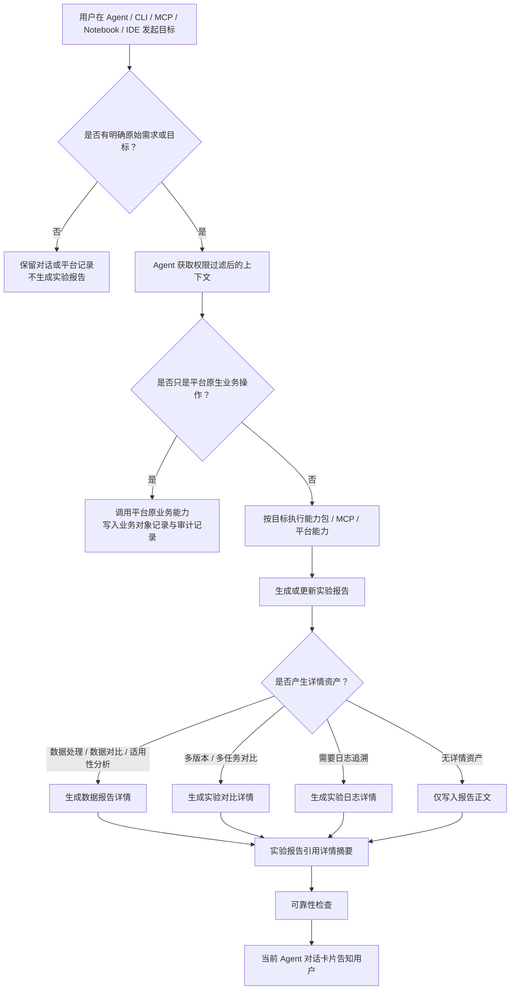

# DeepexiLab 2.0 Agent Native 需求探索与决策脉络

> 文档版本：v0.1  
> 创建日期：2026-06-18  
> 当前分支：`codex/deepexilab-2-agent-native-prd`  
> 适用对象：后续接手 DeepexiLab 2.0 产品、设计、原型、开发方案的 Agent  
> 文档定位：记录需求探索过程、关键讨论、已确认结论和后续接手方式；不替代 PRD、设计方案或原型说明。

## 一、先读结论

DeepexiLab 2.0 的方向已经收敛为 **Agent Native 模型研发工作台**。它不是给平台加一个聊天机器人，也不是用 Agent 替代数据集、训练任务、评估任务、模型服务等原生业务页面，而是让 Agent 承接算法工程师跨 Notebook、SSH、IDE、CLI、外部 Agent 和平台页面产生的目标、过程、诊断、对比、结论和证据。

当前方案的核心资产是 **实验报告**。只要用户通过 Agent/CLI/MCP 围绕明确目标完成了分析、处理、诊断、对比、复盘或交付结论，就生成或更新实验报告。数据报告详情、实验对比详情、实验日志详情作为证据与明细资产被实验报告引用；平台原生业务对象仍归原业务模块管理。

最新一次对齐后，SkillHub 的展示方式也已经调整：对用户展示的是 **能力包**，不是把所有底层 Skills 平铺出来。报告生成只展示一个系统能力包，内部再编排成败归因、训练曲线诊断、评估回归、可复现性检查、下一步建议、研究叙事总结等内部能力。

## 二、现有文档地图

后续 Agent 接手时，建议按以下顺序阅读：

1. 本文档：理解探索过程和决策脉络。
2. [详细版 PRD](/Users/daxiong/Desktop/lab-coding/docs/ai/deepexilab-2-agent-native-rpd.md)：作为产品细节与开发依据。
3. [精简评审版 PRD](/Users/daxiong/Desktop/lab-coding/docs/ai/deepexilab-2-agent-native-prd-review.md)：作为 30 分钟需求评审材料。
4. [系统 Skills 规格](/Users/daxiong/Desktop/lab-coding/docs/ai/deepexilab-2-agent-native-system-skills.md)：作为 SkillHub、报告生成和系统能力包依据。
5. [设计方案](/Users/daxiong/Desktop/lab-coding/docs/ai/deepexilab-2-agent-native-design-solution.md)：已有设计方案，但需要根据最新“能力包”和“报告/详情边界”继续修订。
6. [HTML 原型](/Users/daxiong/Desktop/lab-coding/docs/ai/prototypes/deepexilab-2-agent-native-prototype.html)：已有原型，但还需要继续按最新产品结论调整。
7. [原型说明](/Users/daxiong/Desktop/lab-coding/docs/ai/prototypes/deepexilab-2-agent-native-prototype-notes.md)：记录原型范围和说明。
8. [问卷分析报告 Markdown](/Users/daxiong/Desktop/lab-coding/docs/ai/research/deepexilab-2-agent-native/DeepexiLab_产品调研问卷分析报告.md) 与 [问卷分析报告 Excel](/Users/daxiong/Desktop/lab-coding/docs/ai/research/deepexilab-2-agent-native/DeepexiLab_产品调研问卷分析报告.xlsx)：需求调研依据。

## 三、项目背景

本轮 2.0 需求探索是在 DeepexiLab 已完成 1.0/第一阶段平台能力复刻和基础能力补齐之后展开的。项目当前进入第二阶段，后续工作以用户新需求、截图、原型和交互说明为主，不再默认回到第一阶段“生产环境高保真复刻”模式。

用户希望 2.0 打造 Agent Native 能力。最初方向包括两个核心想法：

- 打通 Notebook 数据、训练过程、结果回写至平台，并在平台侧展示对比情况。
- 做平台侧 Agent，让用户可以通过自然语言询问功能、触发实验对比、分析实验结果，并由界面呈现结果。

随着讨论深入，方案从“Notebook 写回 + 平台 Agent + 对比页”逐步演化为更完整的 Agent Native 工作台：Lab Agent Workspace、实验档案、SkillHub/MCP、Agent Bridge、CLI/MCP/Context Pack。

## 四、需求探索过程

### 4.1 读取旧对话和历史材料

用户一开始提供了另一个 Codex 对话深链，要求尽可能读取此前的产品设计想法。过程中发现可视化评审页、方案文档和相关产物可能不完整，于是多次回扫旧对话、产物和文件夹，确保背景被完整带回。

这一阶段形成了一个重要要求：后续文档必须能独立承接上下文，不能只依赖某个对话线程。

### 4.2 初始方案：Notebook 写回和平台 Agent

用户提出 2.0 想先做两件事：

- Notebook 数据、训练过程、结果回写平台。
- 平台侧 Agent 支持自然语言问答、实验对比和结果呈现。

讨论中确认：

- 这个方向没有偏离此前讨论，反而是 Agent Native 能力的自然落点。
- 平台训练列表侧可以有对比入口，但不应把所有对比能力绑定在训练列表按钮上。
- 更重要的是建立统一的 Agent 工作入口和可沉淀的实验资产。

### 4.3 实验对比页和 Agent 入口形态

曾讨论过对比页是否左右分屏、是否去掉平台导航、是否类似 Codex 桌面应用右侧可收起。最终倾向是：

- 对比/报告等详情页进入 Lab Agent Workspace 后，不需要保留原平台左侧业务导航。
- 从 CLI、Notebook、IDE 打开的链接可以直接进入对应详情页；关闭即可回到原外部工作流。
- 平台中右上角保留统一 Agent 展开入口。
- Agent 对话不需要每个详情页都单独放“继续追问”，统一用 Workspace 右上角 Agent 展开按钮。

### 4.4 问卷调研纳入

用户上传了两份问卷调研资料：

- `/Users/daxiong/Desktop/DeepexiLab_产品调研问卷分析报告.md`
- `/Users/daxiong/Desktop/DeepexiLab_产品调研问卷分析报告.xlsx`

这些资料已复制到 2.0 research 目录中，作为重要需求依据。问卷高频信号包括：

- 数据准备、清洗、选择是算法工程师高频痛点。
- 实验结论整理、多实验对比是强需求。
- Agent 首期最强需求是报错解释、日志分析、实验分析、差异对比、复现步骤和自动结论。
- Notebook、SSH、IDE、通用 Agent 是真实工作入口，不能只做平台页面内 Agent。

基于问卷，产品规划中强化了数据分析、日志与报错诊断、实验对比、报告生成、Agent Bridge。

### 4.5 从“分散诊断能力”收敛到“实验报告”

用户提出一个关键疑问：如果报错诊断、日志分析、代码/参数检查都分散在各功能入口，用户可能找不到，也不够灵活。

于是讨论出新的结构：

- 把实验报告做成整体功能模块。
- 报错诊断、日志分析、代码/参数检查不作为独立资产入口，而是作为报告正文中的分析模块。
- SkillHub 中提供相关能力，Agent 根据场景自动调用，用户也可以指定调用。

这里最重要的产品结论是：**实验报告不是某个训练任务的附属页，而是 Agent 目标型工作的统一回看入口。**

### 4.6 左侧信息架构多轮修正

左侧结构曾出现过“实验报告下再分实验结论/代码检查/日志分析”等层级，但用户认为容易误导。最终确认的 Workspace 左侧结构为：

```text
新对话
对话

实验档案
  实验报告
  数据报告详情
  实验对比详情
  实验日志详情

插件与工具
  SkillHub
  MCP
```

关键点：

- 左侧点击资产类型后，在主内容区展示列表，不能直接只展示一个详情。
- 实验报告按实验/目标展示，报告版本放在主内容顶部切换。
- 实验路径不是左侧子目录，也不是实验报告同级项，而是实验报告正文内容的一部分。

### 4.7 是否引入“实验节点”

曾讨论过“实验节点”概念，用来表示一次实验事件。但用户指出这可能会增加理解和识别复杂度：系统很难准确判断什么时候是节点，用户真正想看的是完整实验路径。

最终结论：

- 不引入“实验节点”作为核心产品概念。
- 一个实验报告代表一次目标型实验/工作。
- 报告中用“实验路径 / 执行过程”来表达原始需求、引用物、方案、执行过程、中间报错及修复、日志分析、最终产物和结论。

### 4.8 实验报告与详情资产边界

这部分经过多轮争论后明确：

实验报告不是所有分析内容的堆叠页，而是 **面向目标的正式结论文档**。它负责让用户读懂一次工作的目标、过程、结论、证据和下一步。

详情资产不是另一份报告，而是支撑实验报告的证据与明细页：

- 数据报告详情：承接数据处理、数据对比、数据适用性分析的证据。
- 实验对比详情：承接多训练、多评估、多版本、多数据之间的结构化对比。
- 实验日志详情：承接完整日志、异常片段、时间线、来源和追溯。

报告正文固定模块包括：

- 原始需求 / 实验目标。
- 报告变更记录。
- 实验结论与总结。
- 实验路径 / 执行过程。
- 关键证据摘要。
- 风险与证据不足。
- 下一步动作。

按需模块包括：

- 实验成败归因。
- 超参数敏感性。
- 数据贡献分析。
- 训练曲线诊断。
- 评测一致性与回归分析。
- 成本收益分析。
- 可复现性检查。
- 报错诊断与修复记录。
- 日志分析摘要。
- 研究叙事总结。

只放详情资产、不塞进报告正文的内容包括：

- 完整日志。
- 大型对比矩阵。
- 数据样本明细。
- 曲线全量数据。
- 参数全量 diff。
- 评估 case 全量列表。
- 文件路径、产物清单、执行明细。

### 4.9 实验对比详情需要可视化图表

用户特别补充：实验对比详情中的指标、曲线等数字指标必须有折线图、柱状图等可视化展示，方便快速对比。

当前结论：

- P0 必须支持核心指标柱状图。
- P0 必须支持训练/评估曲线折线图。
- P0 必须支持能力维度涨跌对比图。
- P1 可增加成本收益散点图和数据 mix 堆叠图。
- 图表负责快速判断趋势，表格负责追溯细节。

### 4.10 版本规则多轮调整

版本规则曾讨论过是否区分 V1.1/V2，最后用户认为不需要让用户理解大小版本差异。

当前结论：

- 报告使用线性版本：`V1/V2/V3`。
- 目标变化时新开报告。
- 同一目标普通进行中追加可以直接更新当前报告，不必每次新增版本，但 Agent 必须提醒用户报告已更新。
- 补充证据后重新生成、人工编辑已形成结论、保存阶段结论时新增版本。
- 导出 Markdown/PDF 不新增版本，只记录当前版本号和导出时间。
- 历史版本弱展示。

### 4.11 平台操作、报告触发和审计边界

讨论中明确：平台原生业务操作不应自动生成实验报告，否则会架空原平台操作层。

生成或更新实验报告的情况：

- 用户明确要求生成、总结、归档报告。
- Agent/CLI/MCP/外部 IDE 围绕明确目标完成实验分析、处理、诊断、对比、复盘或交付结论。
- 纯数据处理或纯数据对比，如果目标是完成一次分析/处理并形成结论，也生成实验报告，细节跳转数据报告详情。

不生成实验报告的情况：

- 用户只是问平台功能怎么用。
- 用户只创建训练任务、上传数据、启动/停止任务、部署模型等平台已有业务动作。
- 用户只是临时查询任务状态或参数位置。
- 用户做单点操作，平台原模块本身已经能承接结果。

Agent 执行动作时：

- 部署模型、停止任务、释放资源等不算最高风险，但需要按产品能力展示确认。
- 删除底层数据、删除模型产物、覆盖版本、公开发布、敏感数据导出等属于强确认。
- Agent 中出现统一确认面板，点击确认后调用平台原业务能力，底层不绕开平台。

### 4.12 SkillHub 从模板配置转向能力包

一开始讨论过“报告系统模板”，例如综合实验、数据清洗报告、训练报告、评估报告等常见模板。但用户担心模板配置会让产品变得不舒服，容易回到配置负担。

最终结论：

- 不做显性的报告模板配置中心。
- 报告结构、模块定义、证据要求和缺证处理规则沉淀在系统能力包里。
- SkillHub 对用户展示系统能力包和我的能力包。
- 报告生成只展示一个系统能力包，不拆成训练报告、评估报告、数据清洗报告等入口。
- 我的 Skill 支持用户自己创建、导入、编辑 `skill.md`、发布、启用/停用。
- 首版我的 Skill 仅个人可用，项目级共享后置。

系统能力包当前规划：

- 报告生成。
- 实验对比。
- 数据分析。
- 日志与报错诊断。
- 代码与参数检查。
- 深度实验分析。
- 知识沉淀与交付。

### 4.13 Agent 对话中的结果展示

用户确认：Agent 对话不直接暴露“调用了几个内部 Skills”这种技术过程，而是展示结果卡片。

结果卡片包括：

- 已生成实验报告。
- 已更新当前报告。
- 已生成实验对比详情。
- 已生成数据报告详情。
- 已生成实验日志详情。
- 发现证据不足。
- 需要确认动作。

专业用户需要时可展开“分析过程”，查看读取了哪些训练任务、评估结果、数据版本、日志文件，扫描了多大日志，调用了哪些系统能力包，写回或引用了哪些资产。

### 4.14 Agent Bridge、CLI、MCP 与 Context Pack

用户确认 Agent Bridge 是 2.0 的核心模块，不是附属工具。当前定义为三件套：

| 组成 | 面向对象 | 定位 |
| --- | --- | --- |
| Lab CLI | 算法工程师、脚本、Notebook/SSH/IDE 命令行 | 人直接使用的平台入口。 |
| Lab MCP Server | Codex CLI、Claude Code、Cursor、通用 Agent、平台 Agent | Agent 使用的平台入口。 |
| Context Pack | 平台 Agent、外部 Agent、CLI/MCP 调用链路 | 平台理解外部实验上下文的协议。 |

核心边界：

- Lab CLI 解决人在 Notebook、SSH、IDE 中如何直接连接平台。
- Lab MCP Server 解决外部 Agent 如何安全调用平台能力。
- Context Pack 解决平台如何理解外部实验上下文并判断是否生成/更新报告。
- CLI/MCP/Context Pack 都不能绕过账号权限、项目权限、确认机制和审计边界。

## 五、当前已确认的产品架构

DeepexiLab 2.0 包含四个产品域：

| 产品域 | 说明 |
| --- | --- |
| Lab Agent Workspace | DeepexiLab 内统一的 Agent 工作台，承接新对话、对话、实验档案、SkillHub、MCP。 |
| 实验档案 | 沉淀实验报告、数据报告详情、实验对比详情、实验日志详情。 |
| 插件与工具 | 通过 SkillHub 能力包和 MCP 扩展 Agent 可调用能力与连接能力。 |
| Agent Bridge | 通过 Lab CLI、Lab MCP Server、Context Pack 打通 Notebook、SSH、IDE、外部 Agent 与平台。 |

产品主流程：



## 六、已确认的关键产品原则

1. 实验报告是所有 Agent 目标型工作的统一回看入口。
2. 报告按目标聚合，不按数据处理、日志分析、报错诊断等能力拆分。
3. 平台原生业务对象不被 Agent 替代。
4. 平台普通业务操作不自动生成实验报告。
5. 同一目标更新同一报告，目标变化新建报告。
6. 报告是正式成果，不使用草稿概念。
7. 报告版本使用线性版本，不区分主版本/小版本。
8. 详情资产是证据与明细，不是另一套主报告。
9. SkillHub 展示能力包，不平铺内部 Skills。
10. 报告生成在 SkillHub 中只展示一个系统能力包。
11. CLI/MCP/Context Pack 是 Agent Bridge 的核心三件套。
12. 权限检查、对象引用解析、审计写入、版本冻结、删除确认、导出权限属于平台硬规则，不属于可被用户修改的 Skill。

## 七、原型和设计过程中的关键反馈

已有 HTML 原型经历过多轮反馈，用户指出过以下问题：

- 第一版原型看起来几乎没有内容，需要补全。
- 新对话页不应仍然是左中右复杂分布，进入新对话后主区域应该直接展示对话界面，但 Workspace 左侧菜单仍需存在，方便切换。
- 实验档案子菜单点击后应该先展示列表，方便查看更多不同报告或详情。
- Agent 收起按钮和整体视觉不够高级，需要更多参考 Codex 风格。
- 1.0 平台基础页没有按照现有页面呈现，需要在 1.0 基础上设计 2.0 入口。
- 报告详情不应左右排版，而应竖向连续阅读。
- 原始需求需要在报告正文中作为明显模块，而不是放在顶部小字里。
- “关联对象”表达不清，应改为更易懂的“引用的任务/数据”或类似表达。
- 报告详情缺少变更记录。
- 日志详情不是摘要页，而要能呈现完整日志。
- SkillHub 和 MCP 的系统/我的需要用 Tab 区分。

部分反馈已经体现在 PRD 中，但设计方案和 HTML 原型仍需要继续按最新结论修订。

## 八、当前仍需继续处理的事项

### 8.1 设计方案需要更新

[设计方案](/Users/daxiong/Desktop/lab-coding/docs/ai/deepexilab-2-agent-native-design-solution.md) 是早于最新一次“能力包”和“报告/详情边界”对齐产生的。后续需要重点更新：

- SkillHub 从零散 Skills 列表改为能力包展示。
- 实验对比详情补充图表要求。
- 实验报告详情改成更连贯的正式报告阅读体验。
- 数据报告详情、实验对比详情、实验日志详情按“证据页”重新定义。
- Agent Bridge 三件套的设计表达补齐。

### 8.2 HTML 原型需要继续调整

[HTML 原型](/Users/daxiong/Desktop/lab-coding/docs/ai/prototypes/deepexilab-2-agent-native-prototype.html) 仍需要基于最新产品结论继续迭代：

- SkillHub 页面展示系统能力包和我的能力包。
- 实验对比详情增加柱状图、折线图、能力涨跌图等可视化区域。
- 报告详情需要更高级、更连续的文档版式。
- 数据报告详情、实验对比详情、实验日志详情需要从“页面拼装”调整为“证据页”设计。
- 1.0 平台基础页和 2.0 入口仍需更贴近现有平台。

### 8.3 后续开发方案尚未开始

用户明确要求：当前还处于产品方案、设计方案、原型阶段。PRD 没问题后，再开始设计方案与原型，最后才输出前后端开发方案和实际开发。因此后续 Agent 不应直接进入开发，除非用户明确确认进入开发阶段。

## 九、推荐接手路径

如果后续 Agent 接手，建议按以下步骤工作：

1. 阅读 `/Users/daxiong/Desktop/lab-coding/AGENTS.md`，确认项目第二阶段规则。
2. 阅读本文档，理解探索过程和已确认结论。
3. 阅读详细版 PRD 和精简评审版 PRD，确认产品口径。
4. 阅读系统 Skills 规格，确认 SkillHub 的能力包逻辑。
5. 如果任务是继续产品方案，优先修改 PRD 和 Skills 规格。
6. 如果任务是继续设计方案，先更新设计方案，再更新原型。
7. 如果任务是原型优化，优先解决用户在浏览器评论中指出的视觉、结构和内容问题。
8. 如果任务是开发方案或实际开发，必须先确认用户已经批准 PRD、设计方案和原型。

## 十、建议使用的 Skills

后续 Agent 可按任务类型选择：

| 任务类型 | 建议 Skill |
| --- | --- |
| 继续脑暴产品边界 | `brainstorming`、`grill-with-docs` |
| 修订 PRD | `SPACE-prd-writer` |
| 评审 PRD/方案查漏补缺 | `SPACE-review-board` 或 `pm-execution:pre-mortem` |
| 优化设计方案和交互 | `design-consultation`、`design-taste-frontend`、`impeccable` |
| 更新 HTML 原型 | `prototype`、`playwright` |
| 将方案拆成开发计划 | `writing-plans`、`to-issues` |
| 生成交接总结 | `handoff` |

## 十一、注意事项

- 不要把第一阶段生产环境复刻文档当成当前默认基线；当前以 2.0 用户确认的 Agent Native 方案为准。
- 不要把实验报告拆成数据报告、日志报告、报错报告等多个主报告。
- 不要把 SkillHub 做成模板配置中心。
- 不要把每个内部 Skill 平铺给用户；对外展示能力包。
- 不要让平台普通按钮操作自动生成实验报告。
- 不要在未确认设计和原型前进入真实前后端开发。
- 不要删除或覆盖现有 PRD、设计方案、原型；需要新版本时另存或在原文中明确修订版本。
- 调研资料是重要需求依据，应继续保留在 2.0 research 目录。

## 十二、当前最新状态

截至本文件创建时：

- 详细版 PRD 已更新到 v0.4。
- 精简评审版 PRD 已更新到 v0.3。
- 系统 Skills 规格已更新到 v0.3。
- 设计方案和 HTML 原型存在，但尚未完全同步最新“能力包 + 报告/详情证据页 + Agent Bridge 三件套”的口径。
- 当前分支为 `codex/deepexilab-2-agent-native-prd`。

