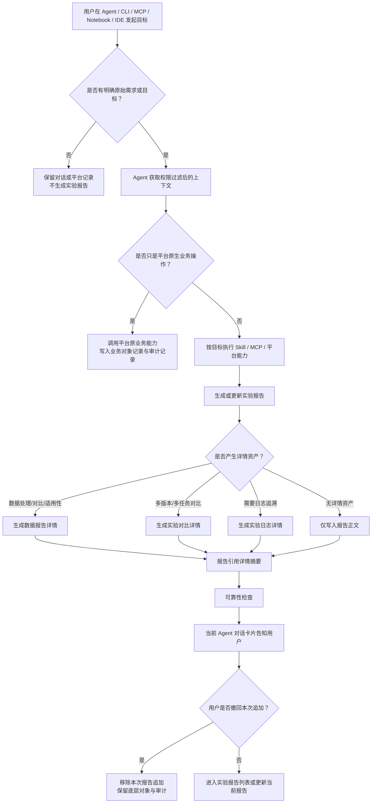
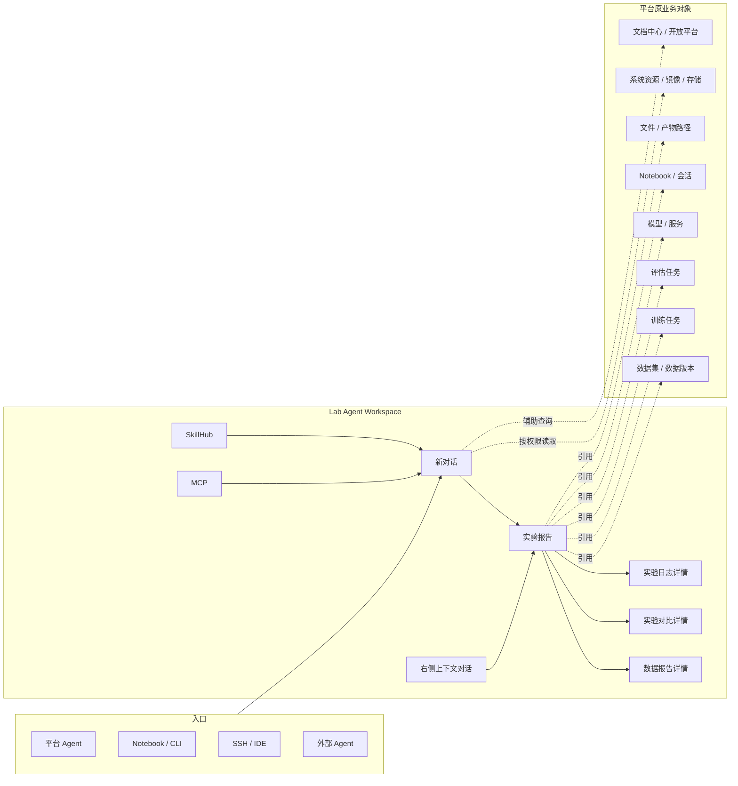

# DeepexiLab 2.0 Agent Native PRD

> 文档版本：v0.4
> 创建日期：2026-06-11
> 最近更新：2026-06-16
> 当前基线：第二阶段用户迭代需求
> 文档用途：用于产品、设计、研发、算法、测试、交付进行 2.0 需求评审
> 调研输入：DeepexiLab 产品调研问卷，样本量 9 份，分析时间 2026-06-11
> 分支要求：2.0 相关文档、设计与开发均在独立分支推进，方案确定后再合并主线

## 一、背景与目标

### 1.1 背景

DeepexiLab 已具备数据服务、Notebook、大模型训练、模型评估、模型服务、系统管理等平台基础能力。2.0 的核心不是继续堆更多后台功能，而是把平台升级为 **Agent Native 的模型研发工作台**。

算法工程师的真实工作通常发生在 Notebook、SSH、IDE、CLI、通用 Agent 等环境中：他们会处理数据、试参数、启动训练、看日志、定位报错、对比指标、沉淀结论。但这些过程往往散落在 Notebook 文件、日志路径、聊天记录和个人脚本里。平台只承接了部分业务对象，却难以回答：

- 这次工作的原始目标是什么？
- 为什么选择这份数据、这个参数和这个模型版本？
- 中间遇到过哪些报错，怎么修复的？
- 多次训练或评估之间到底差在哪里？
- 最终结论是否有证据支撑，能否用于交付或复盘？

因此，2.0 要建立一套围绕 Agent 的新工作闭环：用户可以通过平台 Agent、CLI/MCP、Notebook/SSH/IDE 中的 Agent Bridge 发起目标型工作；平台在不替代原业务对象的前提下，将分析、处理、诊断、对比、报告等认知资产沉淀到实验档案中。

### 1.2 产品目标

业务目标：

- 建立 Lab Agent Workspace，作为平台内 Agent 对话、实验档案、插件与工具的统一入口。
- 建立实验档案体系，用实验报告统一承接所有 Agent 目标型工作的回看入口。
- 通过数据报告详情、实验对比详情、实验日志详情承接细节证据，避免实验报告变成细节堆叠。
- 建立 SkillHub，让日志分析、报错诊断、实验对比、数据处理分析、交付材料生成等能力被发现、调用、编辑和扩展。
- 建立 MCP 目录，让系统 MCP 和个人 MCP 以统一方式展示、配置和治理。
- 建立 DeepexiLab Agent Bridge，让 Notebook、SSH、IDE、CLI、通用 Agent 在账号权限、确认机制和审计边界内访问平台能力。
- 保持平台原业务对象的主位置：数据集仍在数据服务，训练任务仍在训练模块，评估任务仍在评估模块，模型服务仍在模型服务模块。

用户目标：

- 算法工程师只需要先找实验报告，就能回看一次工作的目标、过程、结论和相关详情。
- 纯数据处理、数据对比、训练调优、日志诊断、报错修复、实验复盘等不同工作，都能用统一入口回看。
- 用户在 Notebook/SSH/IDE 或外部 Agent 中完成的实验过程，也能被平台可靠沉淀。
- 用户可以用自然语言让 Agent 创建任务配置、分析任务、生成报告、对比实验，但关键动作仍需确认。
- 团队能够沉淀可复用 Skills 和 MCP 能力，而不是把经验停留在个人脚本中。

### 1.3 调研洞察

本次问卷样本量为 9 份，不能直接推导市场规模，但足以校准 DeepexiLab 2.0 的试点方向。

| 高频信号 | 数据表现 | 对 2.0 的影响 |
| --- | --- | --- |
| 数据准备是最高频痛点 | 准备/清洗数据 77.8%；开放题多次提到数据准备、数据质量、数据集选择 | 数据处理分析必须成为 Agent 高频能力，产物沉淀为数据报告详情，并由实验报告统一总结 |
| 实验结论与多实验对比是强需求 | 整理实验结论、对比多组实验结果均 88.9% | 实验报告与实验对比详情必须进入首版 |
| Agent 首期最强需求是诊断和分析 | 解释报错并给出修复建议 88.9%；实验分析、差异对比、复现步骤、自动结论均 66.7% | SkillHub 内置能力应优先覆盖日志分析、报错诊断、代码/参数检查、实验对比和报告生成 |
| 平台阻力是找不到、配不顺、串不起来 | 入口/路径不清、参数配置不直观、对象关联不明显 | Agent 可生成结构化配置草案，但不能绕过原业务页和校验 |
| 关键动作需要人工确认 | 多人提到方案、训练参数、评测结果、核心代码需确认 | 平台动作分级确认是 2.0 必须能力 |
| 外部工作流不可忽视 | Notebook、SSH、IDE、通用 Agent 是真实工作入口 | Agent Bridge 是核心模块，不是附属工具 |

## 二、产品定位与核心原则

### 2.1 产品定位

DeepexiLab 2.0 是一个 **Agent Native 模型研发工作台**。它不是通用聊天机器人，不是单独的实验追踪系统，也不是让 Agent 替代平台所有业务页面。

它的产品定位是：

- 平台业务对象继续承接事实对象和业务流程。
- Agent 承接跨对象理解、分析、诊断、对比、生成和沉淀。
- 实验档案承接平台业务对象之外的认知资产。
- SkillHub/MCP/Agent Bridge 让平台能力进入 Notebook、SSH、IDE 和外部 Agent 工作流。

### 2.2 核心原则

1. **实验报告是所有 Agent 目标型工作的统一回看入口**  
   只要 Agent/CLI/MCP 围绕明确目标产出了分析、处理、对比、诊断、复盘或交付结论，就生成或更新实验报告。

2. **按目标聚合，不按能力拆报告**  
   一份报告覆盖什么内容取决于当前任务整体目标。数据处理、训练、日志分析、报错诊断、实验对比是同一份报告里的章节或证据，不拆成多个主报告。

3. **平台原生业务操作不自动生成实验报告**  
   手动上传数据、创建训练任务、启动评估、停止任务、部署模型等，如果平台本身已有承接对象，默认只进入业务对象记录、Agent 对话记录和平台审计记录。

4. **Agent 不替代平台业务对象**  
   数据集、训练任务、评估任务、模型服务等仍归原模块管理；实验报告只引用它们并沉淀目标、过程、结论和证据。

5. **默认沉淀，但必须可见、可撤回、可纠正归属**  
   同一目标持续推进时，Agent 默认追加到同一实验报告，但每次更新后必须在当前 Agent 对话卡片告知用户；用户可移除本次追加或纠正归属。

6. **报告是正式成果，不使用草稿概念**  
   报告生成前做可靠性检查；即使状态为“证据不足”，也进入正式报告列表，并清楚标识可靠性状态。

7. **版本追溯使用线性版本**  
   报告只使用 `V1/V2/V3` 等线性版本。普通进行中追加可以更新当前报告；补证重生成、人工修改已形成结论、保存阶段结论时新增版本；目标变化时新建实验报告。

8. **确认面板展示真实可得信息，不虚构字段**  
   Agent 执行平台动作前，在 Agent 内展示统一确认面板；字段按动作类型渲染，只展示平台已知、Agent 可追溯的信息。

9. **Skill 是用户可理解和可扩展的能力，不是平台内部规则**  
   权限检查、对象引用解析、审计写入、版本冻结属于平台硬规则，不允许作为 Skill 被改写。

10. **2.0 独立分支推进**  
    2.0 相关文档、设计和开发均单开分支，未来方案确定后再合并主线。

## 三、术语说明

| 名词 | 说明 |
| --- | --- |
| Lab Agent Workspace | 2.0 的统一 Agent 工作空间，包含新对话、对话、实验档案、插件与工具。 |
| 实验档案 | 实验类资产空间，包含实验报告、数据报告详情、实验对比详情、实验日志详情。 |
| 实验报告 | 一个目标型 Agent 工作的统一总结入口，按用户目标聚合，而不是按能力类别拆分。 |
| 数据报告详情 | 数据处理、数据对比、数据适用性分析的细节资产，可被一个或多个实验报告引用。 |
| 实验对比详情 | 多数据、多训练、多评估、多版本之间的细节对比资产，可被实验报告引用。 |
| 实验日志详情 | 日志原始片段、来源、采集时间和追溯信息的详情资产；日志分析结论直接进入实验报告。 |
| SkillHub | Agent 可调用能力库，包含系统能力包和我的能力包。 |
| Skill 能力包 | 面向用户展示的一组可调用能力，如报告生成、实验对比、数据分析、日志与报错诊断；能力包内部可包含多个细粒度 Skills。 |
| 自定义 Skill | 用户个人可用的能力包，支持 `SKILL.md + references/scripts/assets`，可导入、编辑、发布。 |
| MCP | Agent 能力连接目录，包含系统 MCP 和我的 MCP。 |
| 系统 MCP | DeepexiLab 官方 MCP 能力，按账号、项目、对象权限校验。 |
| 我的 MCP | 用户个人安装或配置的 MCP，仅本人可用。 |
| Agent Bridge | DeepexiLab 官方连接层，由 Lab CLI、Lab MCP Server、Context Pack 组成，让 Notebook、SSH、IDE、CLI、外部 Agent 受控访问平台能力。 |
| 平台审计记录 | 系统级操作留痕，记录谁、何时、从哪里、对什么对象做了什么动作；不是实验档案入口。 |
| 结构化配置草案面板 | Agent 创建数据集、训练、评估等任务时展示的结构化配置面板，复用平台原有字段和校验。 |

## 四、角色与用户故事

### 4.1 目标角色

| 角色 | 核心诉求 |
| --- | --- |
| 算法工程师 | 在 Notebook、SSH、IDE、平台之间连续工作，自动沉淀目标、过程、结论和证据。 |
| 算法负责人 | 快速查看实验结论、对比结果、风险和候选方案，判断下一步投入方向。 |
| 评估/测试人员 | 查看评估相关结论、失败样例、对比依据和可复现信息。 |
| 交付/项目经理 | 获取可导出的实验报告、对比结论和交付材料依据。 |
| 平台管理员 | 管理 Agent、Skill、MCP、权限、审计和安全策略。 |

### 4.2 核心用户故事

| 优先级 | 作为 | 我希望 | 以便 |
| --- | --- | --- | --- |
| P0 | 算法工程师 | 通过 Agent 发起一次目标型工作后，系统自动生成或更新实验报告 | 后续能按目标回看过程、结论和证据 |
| P0 | 算法工程师 | 平台在报告更新后用 Agent 对话卡片提醒我，并允许撤回本次追加 | 我知道报告发生变化，也能纠正错误归属 |
| P0 | 算法工程师 | 在实验报告完全生成前查看指标实时走势、当前进程和预计进程 | 训练或评估还在运行时就能判断是否需要继续观察、补证或提前干预 |
| P0 | 算法工程师 | 纯数据处理或数据对比也能生成实验报告，并跳转查看数据报告详情 | 不需要判断到底应该去哪类报告里找结果 |
| P0 | 算法负责人 | 在实验报告里看到结论、风险、关联对象和对比摘要 | 快速判断实验是否值得继续 |
| P0 | 评估/测试人员 | 查看实验对比详情和日志详情 | 追溯评估差异、失败原因和日志证据 |
| P0 | 交付/项目经理 | 导出 Markdown/PDF 报告 | 用于汇报、交付和复盘 |
| P0 | 算法工程师 | 在 CLI/MCP 中查询项目、数据、训练、评估、Notebook 和实验档案上下文 | 在外部工作流中不用反复回到平台页面查信息 |
| P1 | 算法工程师 | 在 SkillHub 看到系统 Skill 和我的 Skill | 快速找到日志分析、报错诊断、实验对比等能力 |
| P1 | 算法工程师 | 导入、编辑、发布自己的 `SKILL.md` Skill | 把个人经验沉淀为可复用能力 |
| P1 | 算法工程师 | 在 MCP 页面配置我的 MCP | 让 Agent 连接个人常用工具或知识来源 |
| P1 | 算法工程师 | 用自然语言生成任务配置草案，并在结构化面板中补齐字段 | 减少配置训练、评估任务时的理解和填写成本 |
| P1 | 算法工程师 | 通过 CLI/MCP 操作模型、服务、文件产物和数据处理任务 | 让 Notebook、SSH、IDE 工作流能覆盖更多平台能力 |
| P1 | 平台管理员 | 高影响动作必须经过用户确认 | 防止 Agent 或 Skill 直接执行不可控操作 |
| P2 | 算法工程师 | 在 Notebook/SSH/IDE/外部 Agent 中接入 DeepexiLab Agent Bridge | 外部工作也能安全地沉淀回平台 |
| P2 | 平台管理员 | 将系统管理、开放平台和文档中心能力逐步纳入 CLI/MCP | 支撑更完整的平台治理和外部 Agent 生态 |
| P2 | 平台管理员 | 查看更完整的运行审计与项目级 Skill/MCP 治理 | 支撑企业级安全、协作和复盘 |

## 五、信息架构

### 5.1 Lab Agent Workspace 左侧结构

```text
新对话

对话
  对话1
  对话2

实验档案
  实验报告
  数据报告详情
  实验对比详情
  实验日志详情

插件与工具
  SkillHub
  MCP
```

左侧不展开具体报告、数据报告、对比、日志列表。点击资产类型后，在主内容区展示列表、筛选和详情。

### 5.2 页面内部分组

SkillHub 页面内部使用 Tab：

- 系统 Skill
- 我的 Skill

MCP 页面内部使用 Tab：

- 系统 MCP
- 我的 MCP

### 5.3 默认打开规则

| 打开来源 | 默认落点 |
| --- | --- |
| 平台右上角 Agent 入口 | 新对话 |
| 实验报告链接 | 对应实验报告详情 |
| 数据报告详情链接 | 对应数据报告详情 |
| 实验对比详情链接 | 对应实验对比详情 |
| 实验日志详情链接 | 对应实验日志详情 |
| CLI/Notebook/IDE 返回链接 | 对应生成资产详情 |

### 5.4 详情页右侧对话

- 报告、数据报告、对比、日志详情页默认不展示右侧对话。
- 用户点击 Workspace 右上角 Agent 展开按钮后，右侧对话抽屉打开。
- 右侧对话自动带入当前资产上下文。
- 追问内容不自动写回报告。
- 只有用户明确保存到报告、补充证据并重新生成、重新生成报告时，才更新报告或产生版本。

## 六、实验档案

### 6.1 实验档案定位

实验档案是 2.0 的核心资产空间，但不是替代平台业务模块的“第二套数据中心”。它承接的是目标、过程、结论、证据引用和可追溯详情。

实验档案包含：

- 实验报告
- 数据报告详情
- 实验对比详情
- 实验日志详情

### 6.2 实验报告

#### 6.2.1 生成条件

必须满足：

- 有明确原始需求或目标。
- 由 Agent/CLI/MCP/Agent Bridge 围绕该目标产出了分析、处理、对比、诊断、复盘或交付结论。

不生成实验报告的情况：

- 用户只在平台手动上传数据。
- 用户只在平台手动创建训练任务。
- 用户只在平台手动发起评估。
- 用户只停止任务、释放资源、部署模型，且没有要求 Agent 分析或总结。

生成实验报告的情况：

- 纯数据处理、纯数据对比、数据适用性分析。
- 训练完成后让 Agent 对比实验情况。
- Notebook/SSH/IDE 中的目标型实验过程。
- 日志分析、报错诊断、代码/参数检查，并形成结论。
- 多轮训练/评估对比。
- 交付材料、复盘材料、复现实验步骤整理。

#### 6.2.2 命名规则

实验报告按目标命名，不按能力命名。

优先级：

1. 用户明确说出的目标名称。
2. Agent 根据原始需求推断的目标。
3. 主要对象 + 动作。
4. 方法/模型/数据组合。
5. 时间兜底名称。

示例：

- 代码能力数据集筛选实验
- DPO 参数调优实验
- Qwen-7B 评估集适用性分析
- 多轮 SFT 训练结果对比
- 训练失败原因定位与修复

避免：

- 数据处理报告
- 日志分析报告
- 报错诊断报告

#### 6.2.3 报告内容

实验报告不是所有分析结果的堆叠页，而是面向目标的正式结论文档。它负责让用户读懂一次工作的目标、过程、结论、证据和下一步；详情资产负责承接可查证的明细。

实验报告固定模块：

| 区块 | 说明 |
| --- | --- |
| 原始需求 / 实验目标 | 必填。说明这次工作为什么发生。若系统推断目标，需标记“目标由系统推断”。 |
| 报告变更记录 | 必填。说明当前版本相较上一版本新增、修订、补证或人工修改了什么。 |
| 实验结论与总结 | 最重要结论、风险和下一步建议。 |
| 实验路径 | 作为报告内容的一部分，不作为左侧子目录。描述从需求、方案、执行到结论的完整路径。 |
| 关键证据摘要 | 只放最能支撑结论的证据摘要，并跳转数据报告详情、实验对比详情、实验日志详情或平台业务对象。 |
| 风险与证据不足 | 明确哪些结论可信，哪些因为日志、指标、参数、数据版本或评估口径不足只能弱判断。 |
| 下一步动作 | 给出下一轮实验、补证、停止投入、进入交付、回滚或继续观察等建议。 |
| 证据与引用 | 弱展示关联对象、Skill 能力包、MCP 名称与版本、关键证据引用。 |

实验报告按需模块：

| 区块 | 说明 |
| --- | --- |
| 实验输入与产物 | 引用数据集、训练任务、评估任务、模型版本、文件路径等。 |
| 数据报告摘要 | 若本次包含数据处理/对比/适用性分析，展示摘要并跳转数据报告详情。 |
| 实验成败归因 | 分析哪些参数、数据、评测口径、seed 或执行差异带来了提升或失败。 |
| 超参数敏感性 | 分析 learning rate、batch size、warmup、weight decay、LoRA rank、训练步数等影响。 |
| 数据贡献分析 | 分析不同数据类型、数据 mix、清洗策略对能力的贡献、负迁移和边际收益。 |
| 训练曲线诊断 | 分析欠拟合、过拟合、训练不稳定、loss spike、最佳 checkpoint。 |
| 评测一致性和回归分析 | 分析 benchmark 冲突、能力维度退步、隐藏 regression 和评测可信度。 |
| 成本收益分析 | 分析 GPU 小时、token 数、资源规格和指标收益之间的关系。 |
| 可复现性检查 | 检查参数、数据版本、代码 commit、评测脚本、README、metadata 完整性。 |
| 代码/参数检查 | 首版直接放在实验报告中，不单独沉淀为详情资产。 |
| 日志分析 | 日志分析结论直接放在实验报告中。 |
| 报错诊断与修复记录 | 直接放在实验报告中。 |
| 实验对比摘要 | 若有对比，展示摘要并跳转实验对比详情。 |
| 研究叙事总结 | 面向周报、复盘或交付，说明这条实验线试了什么、学到了什么、下一步为什么这样做。 |

进行中报告的实时观察区：

| 区块 | 说明 |
| --- | --- |
| 当前进程概览 | 展示当前阶段、真实完成进度、预计进度、ETA、最后更新时间。 |
| 核心指标走势 | 按实验类型展示已采集到的 loss、eval loss、win-rate、accuracy、F1、stability 等曲线；未采集到的指标显示为空，不补造数据。 |
| 当前进度 vs 预计进度 | 对比实际进度和按平台 ETA、阶段权重或历史耗时估算的预计进度；明显滞后时标记风险。 |
| 阶段时间线 | 展示数据读取、训练、评估、日志分析、报告生成等阶段的已完成、进行中、待开始、异常阻塞状态。 |
| 最近事件 | 展示来自训练、评估、Notebook、CLI/MCP、Agent Bridge 的关键事件。 |
| 关键风险 | 展示指标异常、日志缺段、评估失败、进度滞后、证据缺失等风险。 |

实验完成后，实时观察区不作为独立结论保留，而是收敛为“实验路径 / 执行过程”和“关键证据摘要”；原始曲线、事件和运行快照保留为证据资产或事实层记录，可从报告跳转查看。

只放详情资产、不塞进报告正文的内容：

- 完整日志。
- 大型对比矩阵。
- 数据样本明细。
- 曲线全量数据。
- 参数全量 diff。
- 评估 case 全量列表。
- 文件路径、产物清单、执行明细。

#### 6.2.4 可靠性状态

报告生成前必须做可靠性检查：

- 原始需求完整性
- 证据完整性
- 结论可追溯性
- 风险项完整性
- 权限一致性
- 版本引用一致性

状态：

| 状态 | 说明 |
| --- | --- |
| 进行中 | 实验或证据采集仍在推进，报告展示实时观察区和当前可得过程证据。 |
| 分析中 | 事实数据已基本就绪，Agent 正在做归因、对比、日志诊断或报告组织。 |
| 可信 | 证据充分，结论可追溯。 |
| 有风险 | 有明确风险项，但仍可作为正式报告查看。 |
| 证据不足 | 缺少关键日志、指标、参数、产物或对象引用。 |
| 人工修订 | 用户修改了结论、风险、指标解释或证据引用。 |
| 生成失败 | 报告未成功生成。 |

`证据不足` 也进入正式报告列表，不使用草稿状态。

`进行中` 和 `分析中` 是报告生命周期状态；`可信`、`有风险`、`证据不足`、`人工修订` 是报告形成后的可靠性状态。列表和详情页可同时展示生命周期和可靠性，例如“分析中 / 暂无结论”或“已生成 / 有风险”。

#### 6.2.5 生成告知

报告生成或更新后，只在当前 Agent 对话内用结果卡片告知用户。

卡片内容：

- 报告名称
- 状态
- 关联对象
- 主要结论一句话
- 查看报告
- 若需要：补充证据并重新生成、从报告中移除本次更新

Agent 对话不直接暴露“调用了几个内部 Skill”的技术过程，而是用结果卡片呈现用户可理解的产物：

- 已生成实验报告。
- 已更新当前报告。
- 已生成实验对比详情。
- 已生成数据报告详情。
- 已生成实验日志详情。
- 发现证据不足。
- 需要确认动作。

专业用户需要查看过程时，可展开“分析过程”：

- 已读取的训练任务、评估结果、数据版本、日志文件数量。
- 已扫描日志大小和关键时间范围。
- 已调用的系统能力包，如实验对比、日志与报错诊断、数据分析。
- 已写回或引用的实验档案资产。

平台首版不新增右上角通知体系。

#### 6.2.6 持续更新与撤回

- 同一目标持续推进时，更新同一份实验报告。
- 每次追加后必须用 Agent 对话卡片告知用户。
- 用户可选择“从报告中移除本次更新”。
- 移除只撤回报告追加内容，不删除底层数据集、训练任务、日志、模型产物或审计记录。
- 如果同一 Notebook/CLI/Agent 会话中穿插多个任务，Agent 应先确认归属。
- 用户明确说“这次不要写入报告”时，只保留对话和平台记录，不更新报告。

#### 6.2.7 目标归属决策

目标归属不能只依赖 Agent 自主判断，应采用“平台筛候选 -> Agent 语义判断 -> 置信度分档 -> 用户纠偏”的机制。

平台先筛选候选报告：

- 同项目。
- 当前用户有权限查看。
- 报告处于进行中。
- 最近有更新。
- 关联过相同 Notebook/CLI/Agent 会话。
- 关联过相同训练任务、数据集、评估任务、模型版本或日志来源。

Agent 在候选范围内判断当前任务与候选报告的目标相似度，并输出置信度：

| 置信度 | 触发条件 | 产品动作 |
| --- | --- | --- |
| 高置信 | 同一对话或连续会话中，用户明确表达“继续/再跑一版/看这次日志/对比刚才结果”，且核心对象和目标语义一致 | 自动追加到同一实验报告，并用卡片告知，用户可撤回 |
| 中置信 | 同一会话中出现多个目标；多个候选报告都可能匹配；对象重叠但目标不同；用户表达含糊 | 先问用户：追加到某份报告，还是新建报告 |
| 低置信 | 用户明确提出新目标；核心对象明显变化且无延续说明；用途发生明显变化；没有合适候选报告 | 新建实验报告，并用卡片告知 |

用户纠偏规则：

- 用户撤回本次追加后，系统记录该次任务不属于原报告。
- 用户将本次任务改归属到另一报告后，当前会话和同一项目内后续判断应优先参考该纠偏。
- 用户明确选择新建后，后续相同目标优先归入新报告。
- 所有自动追加均记录来源：对话、Notebook/CLI 会话、任务对象、时间和判断方式。

#### 6.2.8 生命周期与版本

实验报告生命周期：

| 状态 | 说明 |
| --- | --- |
| 进行中 | 同一目标还在持续推进，报告持续更新当前内容，并展示实时观察区。 |
| 分析中 | 事实层数据采集基本完成，Agent 正在进行归因、对比、日志诊断或组织报告。 |
| 已生成 | 阶段性完成、用户要求总结/交付，或形成完整结论。 |
| 证据不足 | 已形成报告，但缺少关键日志、指标、参数、产物或对象引用。 |
| 有风险 | 已形成报告，且存在明确风险项或待补证项。 |

版本规则：

- 采用线性版本，例如 `V1/V2/V3`。
- 同一目标内出现需要追溯的新变动时，新增一个版本。
- 目标变化时新建实验报告，不在原报告中继续升版本。
- 默认查看最新版本。
- 导出、交付、引用记录当前报告版本号。
- 每个版本的报告开头展示版本变更内容，说明相对上一版本新增、修正或补充了什么。
- 历史版本弱展示，旧版本只读，不覆盖。

普通追加与版本触发边界：

| 行为 | 版本处理 |
| --- | --- |
| 同一目标进行中的普通追加，如补充一次训练结果、补充日志结论、追加过程记录 | 更新当前报告内容，不必立即新增版本，但必须在当前 Agent 对话卡片提醒用户报告已更新 |
| 用户导出 Markdown/PDF | 不新增版本；导出文件记录当前报告版本号和导出时间 |
| 用户手动保存阶段结论 | 新增一个线性版本 |
| 补充证据后重新生成 | 新增一个线性版本 |
| 人工编辑进行中报告的叙述内容 | 更新当前内容 |
| 人工编辑已形成结论的报告，且修改结论、风险、指标解释或证据引用 | 新增一个线性版本，并标记人工修订 |
| 目标明显变化 | 新建实验报告 |

#### 6.2.9 编辑规则

实验报告支持编辑，但编辑的是叙述层，不直接改事实层。

可编辑：

- 标题
- 原始需求 / 目标
- 结论摘要
- 过程说明
- 经验沉淀
- 下一步建议

不可直接编辑：

- 指标原始值
- 日志原文
- 产物引用
- 任务状态
- 数据集版本引用
- 模型版本引用

事实层变化只能通过补充证据、重新关联对象、重新生成形成新版本。

如果用户只编辑标题、措辞、格式，可继承原可靠性状态；如果修改结论、风险、指标解释、证据引用，则状态显示为“人工修订”，并保留原系统可靠性状态作为参考。

#### 6.2.10 顶部操作

报告详情页顶部操作：

- 编辑
- 导出
- 历史版本
- 更多

`补充证据并重新生成` 的展示规则：

- 证据不足 / 有风险：作为主操作展示。
- 可信 / 人工修订：弱展示或放入更多菜单。

所有 Agent 对话展开统一使用 Workspace 右上角 Agent 展开按钮，不在内容操作区单独增加“继续追问”按钮。

#### 6.2.11 列表字段

实验报告列表字段：

- 报告名称
- 可靠性状态
- 创建人
- 最新版本时间
- 关联对象
- 来源渠道
- 主要结论一句话

来源渠道：

- Agent 对话
- Notebook / CLI
- MCP / 外部 Agent
- 平台对象分析

#### 6.2.12 进行中实验观察接口

首版前端使用 5-15 秒准实时轮询读取实验运行快照：

```text
GET /agent-workspace/reports/:id/live-snapshot
```

运行快照模型：

| 字段 | 说明 |
| --- | --- |
| reportId | 实验报告 ID。 |
| status | 生命周期状态：进行中、分析中、已生成、证据不足、有风险。 |
| currentStage | 当前阶段，如数据读取、训练中、评估中、日志分析中、报告生成中。 |
| actualProgress | 平台事实层返回的真实完成百分比。 |
| expectedProgress | 按平台 ETA、阶段权重或历史耗时估算的预计完成百分比。 |
| eta | 预计剩余时间和预计完成时间；不可估算时为空。 |
| metrics[] | 已采集到的指标曲线点，包含指标名、采集时间或 step、真实值、来源对象。 |
| timeline[] | 阶段时间线，包含阶段名、状态、开始时间、结束时间、异常说明。 |
| events[] | 最近关键事件，来自训练、评估、Notebook、CLI/MCP、Agent Bridge。 |
| risks[] | 关键风险，如指标异常、日志缺段、评估失败、进度滞后。 |
| updatedAt | 快照更新时间。 |

数据来源边界：

- 平台训练任务、评估任务、Notebook、CLI/MCP、Agent Bridge 提供事实数据。
- Agent 只做归因、解释、风险判断和报告组织。
- 指标曲线只展示真实采集值，Agent 不补造数据点。
- 轮询失败时保留最近一次成功快照，并提示数据更新时间异常。

后续可升级为 SSE 或 WebSocket 推送，但首版不要求秒级推送。

### 6.3 数据报告详情

数据报告详情是数据处理、数据对比、数据适用性分析的细节资产。它可以独立存在，也可以被一个或多个实验报告引用。

触发场景：

- Agent 数据清洗、转换、拆分、合成。
- Agent/Skill 对比数据版本。
- Agent 检查数据是否适合某个训练或评估目标。
- CLI/MCP 发起数据处理或分析。
- Notebook/SSH/IDE 通过 Agent Bridge 写回处理后的数据。
- 用户要求“总结这次数据处理”“分析这批数据”“生成数据报告”。

产品边界：

- 普通平台数据上传不生成数据报告详情。
- 不做泛化数据质量评分。
- 不做通用数据结构检查作为 2.0 首版重点。
- 具体数据集、样本、字段仍在数据服务查看。
- 不替代平台数据服务的完整数据集查看、版本管理、上传下载、标注和权限能力。

列表字段：

- 数据报告名称
- 报告类型
- 创建人
- 生成时间
- 关联数据集/版本
- 来源渠道
- 主要结论一句话

报告类型：

- 数据处理
- 数据对比
- 数据适用性分析

详情内容：

| 区块 | 说明 |
| --- | --- |
| 任务目标 | 为什么处理、对比或分析这批数据。 |
| 数据来源 | 引用了哪些数据集、版本、样本范围。 |
| 处理过程 | 清洗、过滤、抽样、合并、去重、格式转换等规则。 |
| 变化摘要 | 处理前后样本量、字段、类别、长度分布、异常比例等可量化变化。 |
| 质量/风险结论 | 重复、缺失、格式异常、污染、偏差、潜在负迁移。 |
| 对实验目标的影响 | 这批数据适合什么目标，不适合什么目标。 |
| 产物与去向 | 新数据版本、写回平台情况、跳转数据服务查看。 |
| 被引用情况 | 被哪些实验报告引用。 |

版本规则：

- 采用线性版本，例如 `V1/V2/V3`。
- 补充数据对象、重新分析、重新生成时新增版本。
- 分析目标变化时新建数据报告详情。

操作：

- 导出
- 历史版本
- 补充对象/证据并重新生成

首版不开放自由文本编辑。

### 6.4 实验对比详情

实验对比详情承接多数据、多训练、多评估、多版本之间的细节对比。实验报告展示摘要，细节跳转到实验对比详情。

对比类型：

- 训练对比
- 评估对比
- 数据版本对比
- 综合对比

列表字段：

- 对比名称
- 对比类型
- 创建人
- 生成时间
- 对比对象
- 来源渠道
- 主要结论一句话

详情内容：

| 区块 | 说明 |
| --- | --- |
| 对比目标 | 为什么比较这些版本、任务或数据。 |
| 对比对象 | 训练任务、评估任务、数据版本、模型版本、checkpoint。 |
| 推荐结论 | 推荐哪个版本，为什么推荐，是否适合交付或继续实验。 |
| 可视化对比 | 用图表快速比较指标、曲线、能力维度和成本收益。 |
| 参数差异 | lr、batch、warmup、LoRA rank、训练步数等关键差异。 |
| 数据差异 | 使用的数据版本、数据 mix、处理差异和数据风险。 |
| 指标对比 | 核心指标、能力维度、benchmark、回归项。 |
| 曲线对比 | loss、eval metric、reward、关键 checkpoint。 |
| 产物状态 | 模型产物、checkpoint、是否可部署或可交付。 |
| 风险说明 | 口径变化、seed 差异、数据版本差异、证据不足。 |
| 被引用情况 | 被哪些实验报告引用。 |

可视化对比要求：

- P0 必须支持核心指标柱状图。
- P0 必须支持训练/评估曲线折线图。
- P0 必须支持能力维度涨跌对比图，可采用分组柱状图。
- P1 可增加成本收益散点图。
- P1 可增加数据 mix 堆叠图。
- 图表下方保留结构化表格；图表负责快速判断趋势，表格负责追溯细节。

版本规则：

- 采用线性版本，例如 `V1/V2/V3`。
- 补充对象、重新分析、重新对比时新增版本。
- 对比目标变化时新建实验对比详情。

操作：

- 导出
- 历史版本
- 补充对象/证据并重新生成

首版不开放自由文本编辑。

### 6.5 实验日志详情

实验日志详情用于统一存储平台任务、Notebook、SSH、IDE、CLI/MCP 等来源的日志原始片段、来源和追溯信息。

产品边界：

- 日志分析结论直接放在实验报告中。
- 不单独创建“日志分析报告”。
- 实验日志详情只承接原始日志片段、来源、时间、关联对象和追溯。

日志来源：

- 训练任务日志
- 评估任务日志
- Notebook 日志
- SSH / IDE 日志
- CLI / MCP 日志

列表字段：

- 日志名称
- 日志来源
- 创建人
- 采集时间
- 关联对象
- 来源渠道
- 日志结论一句话

详情内容：

| 区块 | 说明 |
| --- | --- |
| 日志来源 | 平台任务、Notebook、SSH/IDE、CLI/MCP、外部 Agent。 |
| 采集信息 | 时间、路径、采集方式、关联任务/会话。 |
| 完整日志查看器 | 支持搜索、筛选级别、时间跳转、折叠长段。 |
| 异常片段 | 错误栈、warning、OOM、依赖问题、数据读取失败等。 |
| 时间线 | 启动、加载数据、保存 checkpoint、评估、失败、恢复等关键事件。 |
| Agent 诊断摘要 | 简短诊断结论，并链接回实验报告正文中的诊断段落。 |
| 修复记录 | 同一目标下发生修复时，记录修复动作和结果。 |
| 被引用情况 | 被哪些实验报告引用。 |

操作：

- 查看
- 关联
- 导出
- 由 Agent 触发重新分析

首版不强调版本机制，可按采集批次和来源追溯。

### 6.6 搜索与筛选

四类资产列表均支持：

- 关键词搜索：名称、主要结论、关联对象。
- 通用筛选：创建人、来源渠道、时间范围。
- 类型筛选：
  - 实验报告：可靠性状态
  - 数据报告详情：报告类型
  - 实验对比详情：对比类型
  - 实验日志详情：日志来源
- 默认排序：最新版本时间或生成时间倒序。

### 6.7 导出

实验报告、数据报告详情、实验对比详情、实验日志详情均支持导出：

- Markdown
- PDF

规则：

- 导出受当前用户权限控制。
- 首版不做公开链接。
- 首版不做对外分享。
- 首版不做复制链接。
- 若用户无权查看某些对象、日志、样本或路径，导出中也不包含。

## 七、插件与工具

### 7.1 SkillHub

SkillHub 是 Agent 可调用能力库，面向用户展示“有哪些能力包可用、怎么用、能否扩展”。它不是内部机制列表，也不是把每个细粒度 Skill 平铺给用户的市场。

#### 7.1.1 Skill 范围

系统内置能力包覆盖高频共性场景。每个能力包面向用户展示为一个系统 Skill，但内部可由多个细粒度 Skills 编排完成。

| 系统能力包 | 内部能力 | 主要产物 |
| --- | --- | --- |
| 报告生成 | 实验成败归因、训练曲线诊断、评估一致性与回归分析、可复现性检查、下一步实验建议、研究叙事总结 | 实验报告 |
| 实验对比 | 参数差异、数据差异、指标对比、曲线对比、回归分析、成本收益分析 | 实验对比详情，或被实验报告引用 |
| 数据分析 | 数据处理分析、数据贡献分析、数据变化摘要、适用性判断、风险识别 | 数据报告详情，或被实验报告引用 |
| 日志与报错诊断 | 日志分析、报错诊断、异常片段识别、修复建议、经验沉淀 | 实验日志详情；诊断结论进入实验报告 |
| 代码与参数检查 | 配置检查、参数 diff、代码版本检查、README 一致性、复现风险 | 实验报告正文模块或 Agent 对话卡片 |
| 交付材料生成 | 周报、复盘、交付摘要、汇报版改写、Markdown/PDF 输出 | 交付文档或报告导出版 |

报告生成能力包在 SkillHub 中只展示一个，不拆成“综合实验报告、训练报告、评估报告、数据清洗报告”等多个入口。不同报告形态由报告生成能力包根据目标和证据自动判断，避免用户重新承担“选模板”的负担。

不属于 Skill：

- 权限检查
- 对象引用解析
- 审计写入
- 版本冻结
- 可靠性状态流转

这些是 Agent 或平台硬规则，不允许通过 Skill 改写。

#### 7.1.2 页面结构

SkillHub 页面内部 Tab：

- 系统 Skill
- 我的 Skill

系统 Skill：

- 平台内置。
- 所有有权限用户可见。
- 用户不能修改核心内容。
- 展示名称、用途、适用场景、版本、分类、启用状态、简要说明。
- 展示能力包内部包含的代表性能力，但不展示底层 Prompt。
- 展示会读取哪些对象、会写回哪些内容、会生成哪些资产、缺证据时如何处理。

我的 Skill：

- 首版仅个人可用。
- 用户可以创建、导入、编辑、发布、禁用、删除。
- 不做项目级共享、审核、市场。
- 对用户也按能力包理解和展示，而不是把内部步骤拆成多个入口。

#### 7.1.3 自定义 Skill

自定义 Skill 支持通用 Agent Skill 形态：

```text
skill-name/
  SKILL.md
  references/
  scripts/
  assets/
```

能力：

- 编辑 `SKILL.md`。
- 支持预览/源码视图。
- 支持导入 `SKILL.md`。
- 支持导入包含 `SKILL.md + references/scripts/assets` 的目录或包。
- 支持 Agent 在用户授权后安装 Skill。
- 支持 Agent 在用户授权后将对话中的流程写回自定义 Skill。

#### 7.1.4 自定义 Skill 版本

- 编辑中可保存，但不会被 Agent 调用。
- 点击发布后生成新版本。
- Agent 只调用最新已发布版本。
- 历史版本可查看发布记录，弱展示。
- 如果 Skill 被实验报告引用，报告记录当时调用的 Skill 名称和版本。

#### 7.1.5 能力权限声明

用户创建、导入、发布一个带脚本或外部依赖的 Skill 时，平台需要展示“能力权限声明”，让用户知道该 Skill 可能访问或执行什么。

声明类别：

| 类别 | 示例 |
| --- | --- |
| 读取项目数据 | 数据集、训练任务、评估任务、模型版本、实验档案 |
| 读取文件/日志 | Notebook 文件、日志文件、产物路径 |
| 写回平台对象 | 写回数据版本、报告内容、对比结果、任务配置 |
| 执行平台动作 | 创建任务、停止任务、部署模型、释放资源 |
| 外部网络访问 | 调用外部 API、搜索、发送请求 |
| 敏感内容访问 | 样本内容、客户数据、Token、路径、日志明文 |

展示规则：

- Skill 列表可用标签弱展示高风险能力，如“外部网络”“写回平台”“敏感内容”。
- Skill 详情页展示完整权限声明。
- 用户发布或导入 Skill 时，需要看到权限声明摘要。
- Agent 执行 Skill 前，根据权限声明和实际动作决定是否弹出确认。
- 权限声明不等于授权结果；最终能否执行仍由账号权限、项目权限、对象权限和平台安全策略决定。

#### 7.1.6 脚本执行边界

自定义 Skill 允许包含脚本，但脚本执行受平台硬规则约束。

产品规则：

- 访问项目数据、文件、日志、外部网络、平台对象时按权限控制。
- 写回平台对象、创建任务、停止任务、部署模型、释放资源等动作需要用户确认。
- 删除、覆盖、公开分享、敏感数据导出等动作需要更强确认。
- 每次执行记录 Skill 名称、版本、触发人、触发来源、访问对象、执行结果。
- 执行失败返回可理解原因，并支持继续让 Agent 诊断。

完整运行记录不放在 SkillHub 详情页，SkillHub 只展示能力说明、安装/启用/配置和权限说明。

### 7.2 MCP

MCP 是 Agent 能力连接目录，和 SkillHub 一样具有系统与个人的治理逻辑，但语义不同：

- SkillHub 管“Agent 做事的方法/流程”。
- MCP 管“Agent 能连接哪些平台或外部能力”。

#### 7.2.1 页面结构

MCP 页面内部 Tab：

- 系统 MCP
- 我的 MCP

系统 MCP：

- DeepexiLab 官方 MCP Server。
- 暴露平台能力组。
- 用户不能修改系统能力。
- 调用时必须校验账号、项目权限、对象权限、动作风险和确认规则。

我的 MCP：

- 用户个人安装或配置。
- 仅本人可用。
- 首版不做项目级共享、审核、市场。
- 用户可以新增、编辑、禁用、删除。

#### 7.2.2 MCP 状态

MCP 页面需要展示连接状态，避免用户只看到抽象能力列表。

状态定义：

| 状态 | 说明 | 适用范围 |
| --- | --- | --- |
| 未配置 | 尚未完成连接或必要配置 | 系统 MCP / 我的 MCP |
| 已连接 | 当前账号可正常使用 | 系统 MCP / 我的 MCP |
| 异常 | 连接失败、服务不可用、配置错误或调用失败 | 系统 MCP / 我的 MCP |
| 权限失效 | 授权过期、账号权限变化、项目权限不足 | 系统 MCP / 我的 MCP |
| 已禁用 | 用户主动禁用个人 MCP，或系统禁用某个能力组 | 我的 MCP / 系统 MCP 能力组 |

系统 MCP 展示：

- DeepexiLab MCP Server 总体状态。
- 各能力组是否可用。
- 权限不足时展示原因，不提供用户修改系统能力的入口。

我的 MCP 展示：

- 连接名称。
- 用途说明。
- 连接状态。
- 权限范围。
- 最近一次连接检查时间。
- 操作：新增、编辑、测试连接、禁用、删除。

#### 7.2.3 系统 MCP 能力组

首版展示能力组，而不是把每个 tool 做成用户手动按钮：

- 项目上下文
- 数据集
- 训练任务
- 评估任务
- 模型与服务
- 实验档案
- 实验报告
- 数据报告详情
- 实验对比详情
- 实验日志详情
- Skill 调用

#### 7.2.4 调用与记录

- Agent 调用 MCP 时仍受账号权限、安全策略、敏感数据外发确认和执行记录约束。
- MCP 详情页不展示完整运行审计。
- 实验报告只在“证据与引用”区域弱展示用到的 MCP 名称、版本或能力组。
- 完整审计属于平台后台治理能力。

## 八、Agent Bridge

### 8.1 定位

DeepexiLab Agent Bridge 是 2.0 的核心模块，不是附属工具。它让 Notebook、SSH、IDE、CLI、Codex、Claude、Cursor 等外部或通用 Agent 在受控边界内访问 DeepexiLab。

包含：

- CLI
- MCP Server
- Context Pack
- 平台账号校验
- 受控 API
- 确认机制
- 审计记录

三件套定义：

| 组成 | 面向对象 | 定位 | 典型能力 |
| --- | --- | --- | --- |
| Lab CLI | 算法工程师、脚本、Notebook/SSH/IDE 命令行 | 人直接使用的平台入口 | 登录、切换项目、写回数据、生成报告、对比实验、分析日志、打开平台链接。 |
| Lab MCP Server | Codex CLI、Claude Code、Cursor、通用 Agent、平台 Agent | Agent 使用的平台入口 | 查询项目/数据/训练/评估/实验档案，提交日志/产物/指标，生成或更新报告，返回资产链接。 |
| Context Pack | 平台 Agent、外部 Agent、CLI/MCP 调用链路 | 平台理解外部实验上下文的协议 | 打包用户、项目、目标、会话来源、引用对象、日志、产物、可写回范围和报告归属候选。 |

产品边界：

- Lab CLI 解决“人如何在 Notebook、SSH、IDE 中直接连接平台”。
- Lab MCP Server 解决“外部 Agent 如何安全调用平台能力”。
- Context Pack 解决“平台如何理解外部实验上下文并判断是否生成/更新报告”。
- CLI/MCP/Context Pack 都不能绕过账号权限、项目权限、确认机制和审计边界。

### 8.2 使用场景

- Notebook 中发起数据处理，并将处理结果写回平台数据集版本。
- SSH/IDE 中运行训练脚本，由 Agent Bridge 回传关键日志、指标、产物路径。
- 通用 Agent 通过 MCP 获取项目上下文、训练任务、数据集、实验报告。
- 用户在 CLI 中发起“对比这几次训练结果”，生成实验报告和实验对比详情链接。
- 用户在外部 Agent 中安装 DeepexiLab 能力，后续通过账号校验与平台打通。

### 8.3 平台模块 CLI/MCP 覆盖清单

当前平台仅支持训练数据和测试数据相关 CLI，2.0 需要把 Agent Bridge 扩展为覆盖平台主要模块的 CLI/MCP 能力层。CLI 面向用户、脚本和 Notebook/SSH/IDE 命令行；MCP 面向外部 Agent 和平台 Agent 的工具调用。两者共享同一套账号权限、项目权限、确认机制和审计边界。

| 优先级 | 平台模块 | CLI 能力 | MCP 能力 | 风险与确认边界 |
| --- | --- | --- | --- | --- |
| P0 | 项目空间 / 项目上下文 | 查询项目、切换当前项目、查看项目概览、获取项目上下文 | 为 Agent 提供当前项目、权限、业务对象摘要 | 只读为主；切换项目需明确上下文 |
| P0 | 数据服务：训练数据 / 测试数据 | 当前已有基础 CLI，需补齐列表、详情、版本、上传、下载、写回、删除引用 | 读取数据集、数据版本、字段摘要、样本摘要，支持写回处理结果 | 写回数据版本需确认；删除底层数据强确认 |
| P0 | 实验档案 | 查询实验报告、数据报告详情、实验对比详情、实验日志详情，导出报告 | 创建/更新报告、生成对比、读取详情、返回资产链接 | 更新报告需告知用户；导出受权限控制 |
| P0 | 大模型训练 | 查询训练任务、创建配置草案、提交训练、查看状态、停止/重启、拉取日志、指标、产物 | Agent 读取训练上下文、生成训练配置、分析日志指标、对比训练结果 | 提交/停止/重启需确认；删除训练结果强确认 |
| P0 | 模型评估 | 查询评估任务、创建配置草案、提交评估、查看指标、结果和失败样例 | Agent 读取评估上下文、解释指标、生成评估对比 | 提交评估需确认；敏感样本读取按权限控制 |
| P0 | 在线 Notebook | 查询 Notebook、启动/停止、查看资源状态、拉取运行日志、回传实验证据 | Agent 获取 Notebook 会话、日志、产物路径和上下文 | 启停 Notebook、释放资源需确认 |
| P1 | 数据服务：推理结果 / 数据标注 / 数据清洗 | 查询任务、创建任务、查看状态、写回结果、导出处理产物 | Agent 读取推理结果、标注状态、清洗过程，生成数据报告详情 | 创建任务/写回结果需确认；样本内容受权限控制 |
| P1 | 我的模型 / 模型资产 | 查询模型列表、模型版本、注册模型、关联训练/评估结果 | Agent 读取模型版本、产物、来源和评估证据 | 注册/修改模型资产需确认；删除强确认 |
| P1 | 模型服务 / 大模型部署 | 查询部署、创建部署配置草案、部署、停止、重启、释放资源、查看日志 | Agent 读取服务状态、部署配置、运行日志，辅助诊断服务问题 | 部署/停止/释放资源需确认；公开发布强确认 |
| P1 | SkillHub | 查询系统 Skill、我的 Skill、导入、编辑、发布、禁用、执行 Skill | Agent 发现并调用 Skill，读取 Skill 描述、版本和权限声明 | 发布/执行带脚本 Skill 需遵守权限声明和确认 |
| P1 | MCP 目录 | 查询系统 MCP、我的 MCP、新增、编辑、测试连接、禁用、删除 | Agent 发现可用 MCP 能力和连接状态 | 外部网络、敏感数据外发需确认 |
| P1 | 文件管理 / 产物路径 | 上传、下载、查询文件，查看产物路径与引用关系 | Agent 读取文件/产物摘要，引用到报告或数据报告详情 | 文件下载和敏感路径展示受权限控制 |
| P2 | 系统管理：项目管理 | 查询项目、成员、角色、权限摘要 | Agent 获取项目治理上下文 | 管理动作仅管理员可用，变更需确认 |
| P2 | 系统管理：集群 / 存储 / 镜像 / 模型仓库 | 查询集群资源、存储、镜像、基础模型、可用资源规格 | Agent 读取资源环境上下文，辅助训练/部署配置 | 资源变更、镜像变更、仓库写入需管理员确认 |
| P2 | 系统管理：系统配置 / 权限配置 | 查询系统配置、权限策略、能力开关 | Agent 获取权限和配置边界说明 | 修改配置和权限为高风险，仅管理员强确认 |
| P2 | 文档中心 / 开放平台 | 搜索文档、读取使用说明、查询 API Key 状态、生成接入指引 | Agent 回答平台使用问题，辅助外部 Agent 安装配置 | API Key 创建、展示、删除需强确认 |
| P2 | 机器学习模块 | 覆盖 ML 数据集、ML Notebook、ML 标注、ML 模型、ML 部署 | Agent 获取传统机器学习工作流上下文 | 先跟随实际使用频率推进，避免抢占大模型主线 |

实现原则：

- CLI 和 MCP 不等于为每个页面机械生成命令；优先覆盖 Agent/Notebook/SSH/IDE 高频工作流。
- 只读查询、上下文获取、状态查看应优先 MCP 化，方便 Agent 理解平台对象。
- 创建、提交、停止、部署、释放、写回等动作可以 CLI/MCP 化，但必须走统一确认面板。
- 删除、覆盖、公开发布、外部分享、敏感数据导出必须强确认。
- 平台管理类能力优先只读 MCP 化，写操作后置到管理员治理能力成熟后。
- 文档中心不出现在 Lab Agent Workspace 主架构中，但可作为 MCP/CLI 的辅助知识来源。

### 8.4 Context Pack

Context Pack 是权限过滤后的上下文包。它可包含：

- 项目
- 数据集/数据版本
- 训练任务
- 评估任务
- 模型版本
- 模型服务
- Notebook/CLI 会话
- 文件/产物路径
- 资源环境摘要
- 实验报告
- 数据报告详情
- 实验对比详情
- 实验日志详情
- Skill/MCP 状态
- 文档中心/开放平台知识摘要
- 可调用 Skill/MCP 能力

Context Pack 不是全量数据库导出，也不允许绕过用户权限。

### 8.5 外部工作流与实验报告

Notebook/SSH/IDE/外部 Agent 中，如果发生目标型实验工作，且平台原业务对象无法完整承接目标、过程、结论，则生成或更新实验报告。

若只是平台已有业务动作，例如创建训练任务、上传训练数据、启动评估，则不自动生成实验报告。

如果后续 Agent 对这些平台对象做分析、对比、诊断或复盘，则生成实验报告。

## 九、Agent 平台动作与确认

### 9.1 支持动作分级

Agent 可以接收并编排平台动作，但不能绕过权限、校验、影响说明和用户确认。

| 分级 | 动作示例 | 规则 |
| --- | --- | --- |
| 可自动或轻确认 | 日志分析、报错诊断、代码/参数检查、报告生成、对比生成、只读对象读取 | 按权限执行，必要时在对话中提示 |
| 需确认 | 创建训练/评估任务、部署模型、停止任务、释放资源、重启任务、写回数据集版本 | Agent 内统一确认面板确认后调用平台原能力 |
| 强确认 | 删除底层数据、删除模型产物、删除训练结果、覆盖版本、公开发布、外部分享、敏感数据导出 | 二次确认或更高权限 |

### 9.2 统一确认面板

确认面板是统一交互壳，不是固定字段表。字段按动作模板渲染，只展示平台确实知道、用户确实需要确认的信息。

固定结构：

| 区块 | 说明 |
| --- | --- |
| Agent 理解的动作 | 例如部署模型版本、停止训练任务、释放 Notebook GPU 资源。 |
| 将被影响的对象 | 展示平台已有对象，如项目、任务、模型版本、数据集版本、服务实例、资源实例。 |
| 执行后的变化 | 展示确定信息，不做无来源估算。 |

不作为固定字段：

- 预计费用
- 可回滚性
- 复杂影响链路

只有平台确实支持并能获取时才展示：

- 资源信息
- 恢复方式
- 直接影响对象

### 9.3 结构化配置草案面板

Agent 支持通过自然语言生成数据集、训练、评估等任务配置，但不使用纯聊天填写字段。

规则：

- 主内容区展示结构化配置草案面板。
- 复用平台原有创建表单字段、校验和提交流程。
- 缺失字段高亮。
- 推荐项说明依据。
- 用户可在面板中补充，也可通过对话补充。
- 提交前进入确认面板。
- 点击确认后调用平台原业务能力执行。

## 十、权限、审计与安全边界

### 10.1 权限

- 项目内有权限用户默认可查看实验档案资产。
- 实验报告、数据报告详情、实验对比详情、实验日志详情均记录创建人。
- 导出受权限控制。
- 用户无权查看的对象、日志、样本或路径，不出现在详情和导出内容中。

### 10.2 审计记录

平台审计记录是底层操作留痕，不是实验档案入口。

记录内容：

- 谁操作的
- 什么时候操作的
- 从哪里触发的：平台页面、Agent、CLI、MCP
- 操作了什么对象
- 操作结果：成功、失败、取消
- 关键参数摘要

展示位置：

- 管理员或有权限角色可在后台审计能力中查询。
- 业务对象详情可展示必要操作记录，如“由 Agent 触发创建/停止/部署”。
- 实验报告不展示审计流水，只展示与结论相关的证据引用。

### 10.3 删除与合并

删除实验档案资产：

- 删除或归档档案容器和报告快照。
- 不删除数据集、训练任务、评估结果、Skill 运行记录等底层对象。
- 保留审计记录。

删除引用：

- 从报告或档案资产中移除引用。
- 不删除底层对象。
- 若要删除底层对象，必须回到原业务对象权限流程。

合并实验档案资产：

- 将报告、详情引用、诊断结果合并到目标档案资产。
- 保留来源资产合并记录。
- 在目标资产展示操作内容和时间。

## 十一、产品流程图

### 11.1 目标型 Agent 工作流程



### 11.2 更形象的工作台流转



## 十二、产品架构图


产品架构图采用固定排版的块状能力地图，避免 Mermaid 自动布局造成模块重叠；图中按 PRD 的 2.0 产品域组织 Lab Agent Workspace、实验档案、插件与工具、Agent Bridge，并展示实验沉淀闭环、平台原业务对象和治理基础能力。

## 十三、2.0 蓝图与实现优先级

本 PRD 描述 DeepexiLab 2.0 的完整产品蓝图。评审时应先理解全貌，再按 P0/P1/P2 分阶段落地。P0/P1/P2 不是拆分产品方向，而是拆分实现节奏。

### 13.1 P0：核心闭环

P0 目标是先跑通“Agent 目标型工作 -> 实验报告统一承接 -> 详情资产引用 -> 用户可回看”的主闭环。

| 能力 | 说明 |
| --- | --- |
| Lab Agent Workspace 基础壳层 | 支持新对话、对话、实验档案、插件与工具的左侧导航。 |
| 实验报告 | 列表、详情、目标识别、生成、追加、撤回、可靠性状态。 |
| 数据报告详情 | 支持列表与详情，用于承接数据处理、数据对比、数据适用性分析细节。 |
| 实验对比详情 | 支持列表与详情，用于承接多训练、多评估、多版本对比细节。 |
| 实验日志详情 | 支持列表与详情，用于承接日志片段、来源和追溯。 |
| 报告生成告知 | 报告生成或更新后，在当前 Agent 对话内用卡片告知用户。 |
| 线性版本 | 支持最新版本查看、历史版本弱展示、导出/引用记录具体版本号。 |
| 搜索与筛选 | 四类资产列表支持关键词、创建人、来源渠道、时间范围和类型筛选。 |
| 导出 | 实验报告、数据报告详情、实验对比详情、实验日志详情支持 Markdown/PDF 导出。 |
| 平台审计边界 | 明确审计记录不进入实验档案主导航，业务对象操作仍归原模块。 |
| CLI/MCP 基础覆盖 | 覆盖项目上下文、训练/测试数据、训练任务、评估任务、Notebook、实验档案的查询、上下文获取和必要写回。 |

### 13.2 P1：能力扩展

P1 目标是让 Agent 真正具备可扩展能力，并与平台动作形成受控联动。

| 能力 | 说明 |
| --- | --- |
| SkillHub | 系统 Skill、我的 Skill、Skill 详情、导入、编辑、发布。 |
| 自定义 Skill | 支持 `SKILL.md + references/scripts/assets`，个人可用，已发布版本才可被 Agent 调用。 |
| Skill 脚本执行边界 | 支持脚本执行，但受权限、安全策略、用户确认和执行记录约束。 |
| MCP | 系统 MCP、我的 MCP、连接状态、配置、禁用、删除。 |
| Agent 平台动作确认面板 | 对创建任务、部署模型、停止任务、释放资源、写回数据等动作进行确认。 |
| 结构化配置草案面板 | Agent 生成数据集、训练、评估等任务配置时，复用平台原表单字段与校验。 |
| Skill/MCP 证据引用 | 实验报告弱展示使用过的 Skill/MCP 名称、版本和关键引用对象。 |
| CLI/MCP 扩展覆盖 | 覆盖推理结果、数据标注、数据清洗、我的模型、模型服务、文件管理、SkillHub、MCP 目录。 |

### 13.3 P2：外部工作流与治理增强

P2 目标是补齐跨环境接入、团队治理和更完整的企业级协作能力。

| 能力 | 说明 |
| --- | --- |
| Agent Bridge 完整能力 | CLI、MCP Server、Context Pack、账号校验、受控 API。 |
| Notebook/SSH/IDE/外部 Agent 接入 | 支持外部环境生成或更新实验报告、数据报告详情、实验对比详情、实验日志详情。 |
| 项目级 Skill | 项目级 Skill 发布、审核、共享和治理。 |
| 项目级 MCP | 项目级 MCP 发布、审核、共享和治理。 |
| 更完整的运行审计中心 | 面向管理员或有权限角色的审计查询和治理。 |
| 报告协作评论与评审 | 支持报告协作、评审、评论、确认。 |
| 报告对外分享与脱敏发布 | 在权限与脱敏能力成熟后支持。 |
| 资源/环境可视化 | GPU、镜像、网络、挂载目录、存储、服务显存等可视化。 |
| 训练基础设施增强 | 断点续训、多机多卡、镜像与目录治理等。 |
| 交付材料与发版闭环 | 更强的交付模板、模型发版报告和上线决策闭环。 |
| 平台治理 CLI/MCP | 覆盖项目管理、集群、存储、镜像、模型仓库、系统配置、权限配置、文档中心、开放平台和机器学习模块。 |

### 13.4 明确不做或后置

- 不把数据处理与分析作为独立左侧模块。
- 不做泛化数据质量评分。
- 不做通用数据结构检查作为 2.0 当前重点。
- 不将日志分析、报错诊断、代码/参数检查拆成独立详情资产。
- 不用 Agent 替代平台所有创建页。
- 不允许绕过平台权限的脚本执行。
- 不允许报告静默生成或静默更新。
- 首版不做公开链接、对外分享、复制链接。

## 十四、成功指标与埋点

### 14.1 产品成功指标

2.0 的成功不应只看“功能是否上线”，还要看 Agent Native 工作流是否真的被使用、是否减少回查成本、是否沉淀出可复用资产。

| 阶段 | 指标 | 说明 |
| --- | --- | --- |
| P0 | Agent 目标型工作生成/更新实验报告次数 | 判断实验报告是否成为统一回看入口。 |
| P0 | 报告更新后撤回率 | 判断目标归属自动判断是否过度误判。撤回率过高说明归属规则需要调整。 |
| P0 | 实验报告详情打开率 | 判断用户是否真的回看报告，而不是报告生成后无人使用。 |
| P0 | 数据报告详情/实验对比详情/实验日志详情跳转率 | 判断详情资产是否支撑报告阅读。 |
| P0 | 报告导出次数 | 判断报告是否进入汇报、交付、复盘场景。 |
| P1 | 系统 Skill 调用次数 | 判断内置 Skill 是否覆盖高频需求。 |
| P1 | 我的 Skill 创建/发布次数 | 判断用户是否愿意沉淀个人能力。 |
| P1 | MCP 连接成功率 | 判断系统 MCP 和我的 MCP 是否可用。 |
| P1 | Agent 动作确认通过率 / 取消率 | 判断确认面板是否清楚，动作建议是否可信。 |
| P2 | 外部 Agent / CLI / Notebook 接入调用次数 | 判断 Agent Bridge 是否真正进入外部工作流。 |
| P2 | 项目级治理能力使用次数 | 判断企业级共享、审计、权限治理是否有需求。 |

### 14.2 关键埋点

| 事件 | 触发时机 | 关键属性 |
| --- | --- | --- |
| agent_workspace_opened | 打开 Lab Agent Workspace | 来源、项目、默认落点 |
| agent_goal_started | 用户发起目标型 Agent 工作 | 来源渠道、目标类型、关联对象 |
| experiment_report_created | 新建实验报告 | 来源渠道、可靠性状态、关联对象类型 |
| experiment_report_updated | 更新实验报告 | 更新方式、是否自动追加、是否提醒用户 |
| experiment_report_update_reverted | 用户撤回本次报告追加 | 原报告、触发来源、撤回原因 |
| experiment_report_viewed | 打开实验报告详情 | 报告版本、可靠性状态、来源渠道 |
| experiment_report_exported | 导出报告 | 格式、版本号、权限结果 |
| detail_asset_opened | 打开数据报告/实验对比/实验日志详情 | 资产类型、来源报告、来源渠道 |
| skill_invoked | Agent 调用 Skill | Skill 类型、版本、来源、结果 |
| custom_skill_published | 用户发布我的 Skill | 是否含脚本、权限声明类别 |
| mcp_connected | MCP 连接成功 | MCP 类型、连接来源 |
| mcp_call_invoked | Agent 调用 MCP | MCP 类型、能力组、结果 |
| agent_action_confirmed | 用户确认 Agent 平台动作 | 动作类型、对象类型、风险等级 |
| agent_action_cancelled | 用户取消 Agent 平台动作 | 动作类型、对象类型、取消位置 |
| agent_bridge_called | CLI/MCP/外部 Agent 调用平台能力 | 来源、能力组、结果、是否触发报告 |

### 14.3 指标使用原则

- 指标用于判断产品方向是否有效，不用于替代权限审计。
- 敏感样本、Token、客户数据、日志明文不进入埋点属性。
- 报告内容本身不进入埋点，只记录状态、类型、来源和对象引用摘要。
- CLI/MCP 调用指标需要区分系统 MCP、我的 MCP、外部 Agent、Notebook/CLI 来源。

## 十五、阶段验收标准

### 15.1 P0 产品验收

- 用户从平台 Agent 入口进入时，默认进入新对话。
- 用户从 CLI/Notebook/IDE 返回链接进入时，直达对应资产详情。
- 左侧不展开具体报告列表。
- 实验报告按目标命名，不按能力命名。
- 平台普通业务操作不会自动生成实验报告。
- Agent 目标型工作会生成或更新实验报告，并在当前对话卡片告知。
- 同一目标持续推进时更新同一份报告，而不是每次生成新报告。
- 用户可撤回本次报告追加。
- 证据不足报告也进入正式列表，并清楚标识状态。
- 历史版本按线性版本展示。
- 详情页右侧对话默认收起。
- 所有 Agent 展开统一使用 Workspace 右上角按钮。

### 15.2 P1 产品验收

- SkillHub 页面通过 Tab 区分系统 Skill 与我的 Skill。
- 我的 Skill 支持导入、编辑、发布和历史版本查看。
- 自定义 Skill 只有已发布版本可被 Agent 调用。
- MCP 页面通过 Tab 区分系统 MCP 与我的 MCP。
- 我的 MCP 支持新增、编辑、禁用和删除。
- Agent 执行平台动作前展示统一确认面板。
- Agent 生成任务配置时进入结构化配置草案面板。

### 15.3 安全与权限验收

- Agent、Skill、MCP、CLI/MCP 调用均不能绕过账号和项目权限。
- 高影响动作必须确认。
- 删除、覆盖、公开分享、敏感数据导出必须强确认。
- 导出内容受权限控制。
- 审计记录不进入实验档案主导航。

### 15.4 文档验收

- PRD、设计方案、开发方案均在 2.0 独立分支维护。
- 问卷调研文件保存在 2.0 项目资料目录。
- PRD 中包含产品流程图和产品架构图。
- PRD 不再把数据处理与分析作为独立左侧模块。

## 十六、待设计确认

以下内容进入后续设计方案阶段，不在本 PRD 中展开开发细节：

- Lab Agent Workspace 具体视觉布局。
- 实验报告详情页版式。
- 数据报告详情、实验对比详情、实验日志详情的内容模板。
- SkillHub 的卡片、详情、编辑器、导入流程。
- MCP 的配置页和连接状态样式。
- Agent 统一确认面板样式。
- 结构化配置草案面板样式。

## 十七、待开发确认

以下内容进入后续开发方案阶段：

- 实验档案数据模型。
- 报告版本模型。
- 可靠性检查实现方式。
- Skill 执行环境与安全沙箱。
- MCP 配置与调用实现。
- Agent Bridge CLI/MCP/API 边界。
- 平台审计记录落库与查询权限。
- 与现有数据、训练、评估、模型服务模块的接口边界。
