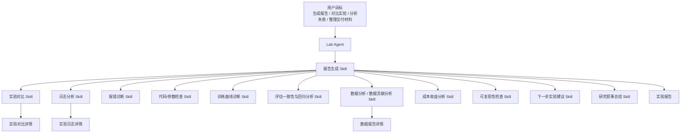

# DeepexiLab 2.0 Agent Native 系统 Skills 规格

> 文档版本：v0.3  
> 创建日期：2026-06-18  
> 适用范围：DeepexiLab 2.0 SkillHub / Lab Agent / 实验档案 / Agent Bridge  
> 产品决策：不把“报告模板配置”作为用户主入口；报告结构、模块定义、证据要求和缺证处理规则沉淀在系统 Skills 中，由 Agent 自动调用。

## 一、核心结论

DeepexiLab 2.0 的报告能力不做成显性的“模板配置中心”，而是做成一组系统能力包。用户感知到的是“Agent 会生成高质量报告、会诊断问题、会分析数据和实验”，而不是“我要先配置报告模板”。

系统内部仍然需要稳定的报告结构和模块定义，但这些规则应藏在 **报告生成能力包** 和相关分析 Skills 中。报告生成能力包负责识别目标、选择报告形态、调用分析 Skills、校验证据、组织正文和生成结论；日志分析、报错诊断、数据贡献分析、训练曲线诊断、评估回归分析等内部 Skills 负责提供可引用的证据与分析结果。

## 二、设计原则

| 原则 | 说明 |
| --- | --- |
| 能力包是用户可感知能力 | 用户看到的是“报告生成、实验对比、数据分析”等能力包，不是内部模板和 Prompt。 |
| 报告生成能力包是总编排 | 报告生成能力包负责把各类分析结果组织成实验报告，而不是每个分析 Skill 各写一份报告。 |
| 结构一致但不僵硬 | 同类报告有稳定模块，但不是所有报告都强制展示所有模块。 |
| 缺证据要明示 | 无法分析的模块不能硬写结论，必须标识“证据不足”和缺失项。 |
| 平台对象仍是证据源 | 数据集、训练任务、评估任务、模型版本、Notebook、日志、产物路径仍由原业务模块管理。 |
| 用户少配置，更多反馈 | 首版不做模板编辑；用户通过自然语言反馈报告偏好，后续沉淀为个人报告偏好或自定义 Skill。 |

## 三、Skill 规格格式

每个系统 Skill 在产品上都应能被用户理解，在工程上都应能被 Agent 调用。首版 SkillHub 详情页建议统一展示以下字段：

| 字段 | 说明 |
| --- | --- |
| 展示名称 | 用户在 SkillHub 中看到的能力名称。 |
| Skill ID | 系统内部调用标识。 |
| 类型 | 系统 Skill / 我的 Skill / 项目 Skill。 |
| 能力说明 | 这个 Skill 解决什么问题，适合什么场景。 |
| 触发方式 | 用户显式调用，或 Agent 根据目标、日志、任务状态自动调用。 |
| 输入证据 | 需要读取哪些对象、日志、指标、文件或上下文。 |
| 输出结果 | 给 Agent、实验报告、详情资产或用户对话返回什么。 |
| 报告关系 | 输出是进入实验报告正文、生成详情资产，还是只作为证据引用。 |
| 权限边界 | 需要读取/写入哪些平台对象，是否需要确认。 |
| 可靠性规则 | 缺证据、证据冲突、低可信结论如何处理。 |

需要明确：权限检查、对象引用解析、审计写入、版本冻结、删除确认、导出权限等属于平台与 Agent 的硬规则，不属于可被用户修改的 Skill。

## 四、系统能力包总览

SkillHub 首版对外展示系统能力包，不把每个内部 Skill 平铺出来。能力包内部可编排多个细粒度 Skills。

| 优先级 | 系统能力包 | 内部代表能力 | 主要输出 |
| --- | --- | --- | --- |
| P0 | 报告生成 | 实验成败归因、训练曲线诊断、评估一致性与回归分析、可复现性检查、下一步实验建议、研究叙事总结 | 实验报告、报告更新、变更记录、可靠性状态。 |
| P0 | 实验对比 | 参数差异、数据差异、指标对比、曲线对比、回归分析 | 实验对比详情、对比摘要、推荐对象。 |
| P0 | 数据分析 | 数据处理分析、数据变化摘要、适用性判断、风险识别 | 数据报告详情、数据变化、风险与适用结论。 |
| P0 | 日志与报错诊断 | 日志分析、报错诊断、异常片段识别、修复建议、经验沉淀 | 实验日志详情、诊断结论、修复建议。 |
| P0 | 代码与参数检查 | 配置检查、参数 diff、代码版本检查、README 一致性、复现风险 | 参数差异、配置风险、可复现性证据。 |
| P1 | 深度实验分析 | 数据贡献分析、超参数敏感性、成本收益分析、可复现性增强、下一步实验建议增强 | 数据贡献、稳定区间、性价比排序、实验建议。 |
| P2 | 知识沉淀与交付 | 实验聚类与模式发现、研究叙事总结、交付材料生成、报告编辑润色 | 研究线演进、周报、复盘、交付材料。 |

## 五、Skill 调用关系

报告生成 Skill 不替代其他 Skills。它更像“主编”和“证据编排器”：先判断任务目标，再调用必要 Skills，最后决定报告中展示哪些模块、哪些模块只给摘要、哪些模块因为证据不足不展示或弱展示。

## 六、报告生成 Skill

### 6.1 基本定义

| 字段 | 内容 |
| --- | --- |
| Skill 名称 | `report-generation` |
| 展示名称 | 报告生成 |
| 类型 | 系统 Skill |
| 触发方式 | 用户要求生成/更新/整理/导出报告；Agent 判断目标型工作已产生可沉淀结论。 |
| 核心目标 | 把目标、过程、证据、结论、风险和下一步建议组织成可信报告。 |

### 6.2 适用场景

- 综合实验报告
- 训练实验报告
- 评估分析报告
- 数据处理/数据清洗报告
- 实验对比报告
- 失败诊断报告
- 周报、复盘、交付材料

注意：这些不是用户要配置的模板，而是报告生成 Skill 内部识别的报告形态。

### 6.3 输入证据

| 证据类型 | 示例 |
| --- | --- |
| 原始目标 | Agent 对话、CLI 指令、Notebook 注释、外部 Agent 请求。 |
| 平台对象 | 数据集、训练任务、评估任务、模型版本、模型服务、文件产物。 |
| 训练信息 | 参数、曲线、checkpoint、产物路径、资源消耗。 |
| 评估信息 | 指标、benchmark、失败样例、能力维度、评估脚本。 |
| 日志信息 | 训练日志、评估日志、Notebook 日志、SSH/IDE/CLI 日志。 |
| 代码与环境 | commit、分支、配置文件、镜像、依赖、脚本版本。 |
| Skill 结果 | 实验对比、日志分析、报错诊断、数据分析、成本分析等结果。 |

### 6.4 输出结构

报告生成 Skill 根据证据和目标选择模块，不强制所有报告都包含全部模块。

| 模块 | 是否常用 | 定义 |
| --- | --- | --- |
| 原始需求 / 实验目标 | 必选 | 用户最初要解决的问题、目标和约束。 |
| 变更记录 | 必选 | 当前版本相较历史版本的新增、修订和补证说明。 |
| 实验结论与总结 | 必选 | 最核心结论、推荐对象、是否可交付/继续/停止。 |
| 实验路径 / 执行过程 | 常用 | 用户做了什么、系统/Agent 调用了什么、关键过程如何演进。 |
| 实验成败归因 | 按需 | 哪些参数、数据、评测口径或随机因素导致结果变化。 |
| 超参数敏感性 | 按需 | 哪些超参数影响最大，是否存在稳定区间。 |
| 数据贡献分析 | 按需 | 哪类数据贡献最大，是否存在负迁移或边际收益下降。 |
| 训练曲线诊断 | 按需 | 是否欠拟合、过拟合、loss spike、最佳 checkpoint。 |
| 评测一致性和回归分析 | 按需 | 哪些能力上涨/退步，benchmark 是否矛盾，评测是否可信。 |
| 实验聚类和模式发现 | 按需 | 历史实验属于哪类，是否重复试验，相似实验中谁最好。 |
| 成本收益分析 | 按需 | GPU 小时、token 数、成本与收益的关系。 |
| 可复现性检查 | 常用 | 参数、数据版本、commit、评测脚本、metadata 是否完整。 |
| 报错诊断与修复记录 | 按需 | 报错原因、修复过程和经验沉淀。 |
| 日志分析摘要 | 按需 | 关键日志、异常片段、日志详情入口。 |
| 下一步实验建议 | 常用 | 3-5 个建议，包含预期收益、风险、算力和验证指标。 |
| 研究叙事总结 | 按需 | 这条实验线试了什么、学到了什么、下一步为什么这样做。 |
| 证据与引用 | 必选 | 关联的平台对象、详情资产、日志、Skill 调用结果。 |

### 6.5 缺证据处理

| 情况 | 处理规则 |
| --- | --- |
| 模块完全无证据 | 不展示该模块，或展示“证据不足，无法生成”并列出缺失项。 |
| 证据不完整但可弱判断 | 输出弱结论，并标注风险和所需补证。 |
| 证据互相冲突 | 保留冲突事实，不强行给单一结论；调用评估一致性或日志分析 Skill。 |
| 用户明确要求必须包含模块 | 展示模块，但以“无法形成可靠结论”的形式呈现。 |

### 6.6 用户偏好沉淀

首版不做模板编辑，但允许用户通过自然语言表达偏好：

- “以后我的训练报告都加成本收益分析。”
- “报告不要写太长，保留结论和证据入口。”
- “评估报告一定要写 regression。”
- “交付版报告不要暴露日志路径。”

这些偏好可先作为个人报告偏好保存，后续 P1/P2 再升级为“我的报告生成 Skill”。

### 6.7 报告版本与写入规则

| 情况 | 处理规则 |
| --- | --- |
| 同一目标仍在进行中 | 更新当前报告，并在 Agent 对话中提示“已追加到当前报告”。 |
| 用户补充证据后重新生成 | 生成新版本，不覆盖旧版本。 |
| 用户手动编辑报告文本 | 保存为新版本，便于追溯。 |
| 目标发生变化 | 新开实验报告，不继续写入原报告。 |
| 导出 Markdown/PDF | 不额外生成版本；导出内容标注当前报告版本。 |

## 七、核心分析 Skills

### 7.1 实验成败归因 Skill

| 字段 | 内容 |
| --- | --- |
| Skill 名称 | `experiment-attribution` |
| 展示名称 | 实验成败归因 |
| 触发方式 | 用户问“为什么涨了/为什么没涨/这次提升是否可信”；报告生成 Skill 需要归因模块。 |
| 输入证据 | 训练任务、数据版本、参数、seed、评测口径、指标曲线、失败样例。 |
| 输出 | 成功因素、失败因素、伪提升风险、口径变化说明、可信度。 |

重点回答：

- 哪些参数组合或数据集带来了提升。
- 哪些改动看似提升，但可能只是数据集、seed、评测口径变化造成。
- loss 降了但 benchmark 没涨的可能原因。

### 7.2 超参数敏感性 Skill

| 字段 | 内容 |
| --- | --- |
| Skill 名称 | `hyperparameter-sensitivity` |
| 展示名称 | 超参数敏感性 |
| 触发方式 | 用户要求调参建议、对比多组参数、寻找稳定区间。 |
| 输入证据 | learning rate、batch size、warmup、weight decay、LoRA rank、训练步数、指标曲线。 |
| 输出 | 敏感参数、低敏参数、稳定区间、推荐调参方向。 |

重点回答：

- 哪些参数最敏感，哪些基本不用调。
- 是否存在表现稳定区间。
- 下一次实验优先调整哪些参数。

### 7.3 数据贡献分析 Skill

| 字段 | 内容 |
| --- | --- |
| Skill 名称 | `data-contribution-analysis` |
| 展示名称 | 数据贡献分析 |
| 触发方式 | 数据 mix、数据清洗、数据增强、数据版本对比相关任务。 |
| 输入证据 | 数据版本、样本类型、数据标签、数据 mix、能力维度评估、失败样例。 |
| 输出 | 数据贡献、负迁移风险、边际收益、是否继续加数据。 |

重点回答：

- 哪类数据对哪个能力提升最大。
- 哪些数据可能带来安全下降、幻觉增加、格式变差。
- 再加某类数据是否值得。

### 7.4 训练曲线诊断 Skill

| 字段 | 内容 |
| --- | --- |
| Skill 名称 | `training-curve-diagnosis` |
| 展示名称 | 训练曲线诊断 |
| 触发方式 | 训练完成、训练异常、loss/metric 波动、checkpoint 选择。 |
| 输入证据 | loss 曲线、reward 曲线、eval metric、checkpoint、训练日志、资源状态。 |
| 输出 | 欠拟合/过拟合/不稳定判断、loss spike 原因、最佳 checkpoint 建议。 |

重点回答：

- 是否欠拟合、过拟合、训练不稳定。
- 为什么早期好、后期变差。
- 是否存在最佳 checkpoint，而不是最后 checkpoint。

### 7.5 评估一致性与回归分析 Skill

| 字段 | 内容 |
| --- | --- |
| Skill 名称 | `evaluation-regression-analysis` |
| 展示名称 | 评估一致性与回归分析 |
| 触发方式 | 评估结果解释、benchmark 冲突、能力退步排查、交付前复查。 |
| 输入证据 | 评估指标、能力维度、benchmark、失败样例、评测脚本、评测数据版本。 |
| 输出 | 能力上涨/退步列表、隐藏 regression、benchmark 可信度、口径风险。 |

重点回答：

- 整体分数上涨时，具体哪些能力退步了。
- 是否有隐藏 regression。
- benchmark 之间是否矛盾，哪些评测更可信。

### 7.6 实验聚类与模式发现 Skill

| 字段 | 内容 |
| --- | --- |
| Skill 名称 | `experiment-pattern-mining` |
| 展示名称 | 实验聚类与模式发现 |
| 触发方式 | 历史实验较多、用户需要复盘实验线、避免重复实验。 |
| 输入证据 | 实验报告、训练任务、评估结果、参数、数据版本、实验目标。 |
| 输出 | 实验簇、相似实验、最佳相似实验、重复实验提醒。 |

重点回答：

- 历史实验自动分成哪些类型。
- 相似实验中表现最好的那个是谁。
- 团队是否一直在重复试同一种东西。

### 7.7 成本收益分析 Skill

| 字段 | 内容 |
| --- | --- |
| Skill 名称 | `experiment-cost-benefit` |
| 展示名称 | 成本收益分析 |
| 触发方式 | 用户关注算力投入、实验性价比、是否继续烧资源。 |
| 输入证据 | GPU 小时、token 数、资源规格、训练时长、指标收益、产物状态。 |
| 输出 | 成本收益比、性价比排序、继续投入建议。 |

重点回答：

- 每个实验的 GPU 小时、token 数、训练成本对应的收益。
- 哪些实验性价比最高。
- 哪些方向继续烧算力不划算。

### 7.8 可复现性检查 Skill

| 字段 | 内容 |
| --- | --- |
| Skill 名称 | `reproducibility-check` |
| 展示名称 | 可复现性检查 |
| 触发方式 | 报告生成、交付前、复盘前、用户要求检查实验是否可复现。 |
| 输入证据 | 参数、数据版本、代码 commit、镜像、依赖、评测脚本、README、metadata。 |
| 输出 | 可复现性状态、缺失项、补充建议、风险等级。 |

重点回答：

- 参数、数据版本、代码 commit、评测脚本是否完整。
- README 和实际训练配置是否一致。
- 哪些实验以后无法复现，需要补 metadata。

### 7.9 下一步实验建议 Skill

| 字段 | 内容 |
| --- | --- |
| Skill 名称 | `next-experiment-recommendation` |
| 展示名称 | 下一步实验建议 |
| 触发方式 | 用户要求下一步计划、报告生成后的建议模块、负责人评审。 |
| 输入证据 | 历史实验、当前结论、风险、资源、目标指标、失败原因。 |
| 输出 | 3-5 个实验建议、预期收益、风险、所需算力、验证指标、config diff。 |

重点回答：

- 最值得做的 3-5 个实验。
- 每个建议的收益、风险、算力和验证指标。
- 尽量给出具体 config diff。

### 7.10 研究叙事总结 Skill

| 字段 | 内容 |
| --- | --- |
| Skill 名称 | `research-narrative-summary` |
| 展示名称 | 研究叙事总结 |
| 触发方式 | 周报、复盘、交付、实验线总结、负责人汇报。 |
| 输入证据 | 实验报告、历史实验、关键结论、失败记录、下一步建议。 |
| 输出 | 实验线叙事、学到什么、为什么下一步这样做、汇报版总结。 |

重点回答：

- 一条实验线如何演进。
- 团队学到了什么。
- 如何把 jobs 变成知识。

## 八、诊断与详情资产 Skills

### 8.1 日志分析 Skill

| 字段 | 内容 |
| --- | --- |
| Skill 名称 | `log-analysis` |
| 展示名称 | 日志分析 |
| 触发方式 | 用户上传日志、任务失败、报告需要日志证据、CLI/MCP 回传日志。 |
| 输入证据 | 训练日志、评估日志、Notebook 日志、SSH/IDE/CLI 日志。 |
| 输出 | 日志摘要、异常片段、时间线、日志详情资产。 |
| 详情资产 | 可生成或更新实验日志详情。 |

### 8.2 报错诊断 Skill

| 字段 | 内容 |
| --- | --- |
| Skill 名称 | `error-diagnosis` |
| 展示名称 | 报错诊断 |
| 触发方式 | 任务失败、用户粘贴报错、日志分析发现异常。 |
| 输入证据 | 错误栈、日志、任务配置、资源状态、镜像/依赖信息。 |
| 输出 | 可能原因、影响范围、修复建议、是否已修复、经验沉淀。 |
| 报告关系 | 诊断结果进入实验报告正文，不单独成为详情资产。 |

### 8.3 代码/参数检查 Skill

| 字段 | 内容 |
| --- | --- |
| Skill 名称 | `code-parameter-check` |
| 展示名称 | 代码/参数检查 |
| 触发方式 | 报告生成、训练前检查、任务失败、复现检查。 |
| 输入证据 | 配置文件、代码 commit、训练参数、评估参数、README、任务配置。 |
| 输出 | 参数差异、配置风险、代码版本风险、复现风险。 |
| 报告关系 | 检查结果进入实验报告正文，未来可扩展为详情资产。 |

### 8.4 数据分析 Skill

| 字段 | 内容 |
| --- | --- |
| Skill 名称 | `data-analysis` |
| 展示名称 | 数据分析 |
| 触发方式 | 数据清洗、数据对比、数据适用性分析、Notebook 数据处理后写回、用户要求分析数据变化。 |
| 输入证据 | 处理前后数据版本、样本变化、字段摘要、过滤规则、质量变化、关联目标、样例片段。 |
| 输出 | 数据变化摘要、处理结论、风险、适用目标、跳转数据服务入口。 |
| 详情资产 | 可生成或更新数据报告详情。 |

数据分析 Skill 是数据相关任务的通用入口。它不替代平台数据服务，也不把完整数据管理搬进 Agent；平台继续承接数据集查看、版本管理、上传下载、标注和权限。Agent 只沉淀“这次数据处理或数据对比到底发生了什么、对目标是否有帮助、有什么风险”。

### 8.5 实验对比 Skill

| 字段 | 内容 |
| --- | --- |
| Skill 名称 | `experiment-comparison` |
| 展示名称 | 实验对比 |
| 触发方式 | 用户要求对比训练/评估/数据版本；报告生成需要对比证据。 |
| 输入证据 | 多个训练任务、评估结果、数据版本、参数、日志、产物状态。 |
| 输出 | 对比矩阵、关键差异、推荐对象、风险、Agent 结论。 |
| 详情资产 | 可生成或更新实验对比详情。 |

## 九、交付与表达 Skills

### 9.1 交付材料生成 Skill

| 字段 | 内容 |
| --- | --- |
| Skill 名称 | `delivery-material-generation` |
| 展示名称 | 交付材料生成 |
| 触发方式 | 用户要求汇报、交付、周报、复盘、项目总结。 |
| 输入证据 | 实验报告、数据报告详情、实验对比详情、评估结果、模型版本。 |
| 输出 | 汇报版摘要、交付版结论、Markdown/PDF 内容、风险说明。 |

### 9.2 报告编辑润色 Skill

| 字段 | 内容 |
| --- | --- |
| Skill 名称 | `report-polish` |
| 展示名称 | 报告编辑润色 |
| 触发方式 | 用户要求“写得更适合交付/更短/更专业/更像周报”。 |
| 输入证据 | 当前报告版本、用户偏好、目标读者。 |
| 输出 | 新报告版本或修订建议。 |

## 十、系统 Skill 与我的 Skill 的关系

| 类型 | 首版规则 |
| --- | --- |
| 系统 Skill | 平台内置，不可修改；用户可查看用途、触发场景、权限声明。 |
| 我的 Skill | 用户个人可创建、导入、编辑、发布；首版仅个人可用。 |
| 报告生成类系统 Skill | 首版不允许用户直接复制和编辑，避免报告质量规则被破坏。 |
| 报告偏好 | 首版通过自然语言沉淀个人偏好，不做模板配置 UI。 |
| 高级自定义 | P2 支持复制系统报告 Skill 或创建项目级报告 Skill。 |

## 十一、SkillHub 展示方式

SkillHub 首版不展示“模板市场”，而展示“系统 Skill”和“我的 Skill”两个 Tab。两个 Tab 中的条目都按能力包展示。

| Tab | 展示内容 | 操作 |
| --- | --- | --- |
| 系统 Skill | 报告生成、实验对比、数据分析、日志与报错诊断、代码与参数检查、交付材料生成等平台内置能力包。 | 查看用途、触发方式、权限范围、可生成资产。不可编辑。 |
| 我的 Skill | 用户个人创建、导入或由 Agent 写回的能力包。 | 新建、导入、编辑 `skill.md`、启用/停用、删除。 |

系统 Skill 详情页重点让用户知道“它能做什么、什么时候会被 Agent 调用、会读写哪些对象、结果会沉淀到哪里”。不展示底层 Prompt，不要求用户配置模块。

报告生成能力包在 SkillHub 中展示为一个系统 Skill，而不是拆成“综合实验报告/训练报告/评估报告/数据清洗报告”等多个 Skill。不同报告形态放在详情页能力说明中，避免用户重新陷入“选模板”的负担。

## 十二、权限与安全边界

| 行为 | 规则 |
| --- | --- |
| 只读分析 | 按用户项目权限读取对象、日志、指标、样本摘要。 |
| 读取敏感日志/样本 | 受权限控制；报告导出时不绕过权限。 |
| 写回报告/详情资产 | 允许，但必须在 Agent 对话内告知用户。 |
| 写回数据版本 | 需确认。 |
| 执行脚本 | 我的 Skill 可支持脚本，但受沙箱、权限和确认约束。 |
| 外部网络 | 需权限声明，敏感数据外发需确认。 |

## 十三、P0/P1/P2 实现建议

### P0：报告主闭环

- 报告生成能力包
- 实验对比能力包
- 数据分析能力包
- 日志与报错诊断能力包
- 代码与参数检查能力包

P0 要能支撑：生成实验报告、对比训练/评估、分析失败、沉淀日志、分析数据处理/对比任务、输出可靠性状态。

### P1：深度分析

- 深度实验分析能力包
- 数据贡献分析
- 超参数敏感性
- 成本收益分析
- 可复现性增强
- 下一步实验建议增强

P1 要能支撑：更像算法工程师想看的研究分析，而不是简单流水账。

### P2：知识沉淀与表达

- 知识沉淀与交付能力包
- 实验聚类与模式发现
- 研究叙事总结
- 交付材料生成
- 报告编辑润色
- 我的报告生成能力包 / 项目级报告能力包

P2 要能支撑：团队知识沉淀、周报、复盘、交付和项目级标准。

## 十四、对实验报告和详情资产的影响

引入系统 Skills 后，实验报告和详情资产的关系应调整为：

| 资产 | 由哪些 Skills 主要生成 | 展示重点 |
| --- | --- | --- |
| 实验报告 | 报告生成能力包总编排 | 原始目标、变更记录、结论、关键分析模块、证据与引用、下一步建议。 |
| 数据报告详情 | 数据分析、数据贡献分析 | 数据变化、数据贡献、负迁移、边际收益、适用目标。 |
| 实验对比详情 | 实验对比、超参数敏感性、评估回归分析 | 对比矩阵、曲线、参数差异、能力变化、推荐对象。 |
| 实验日志详情 | 日志分析、报错诊断 | 完整日志、异常片段、时间线、来源路径、采集方式。 |

这意味着后续原型不应再手工静态定义每个报告模块，而应围绕“报告生成能力包如何选择和组织模块”来重新设计。

## 十五、边界与不做事项

| 不做事项 | 原因 |
| --- | --- |
| P0 不做显性报告模板配置中心 | 容易把用户拉回配置负担，也会削弱 Agent Native 的产品感。 |
| P0 不允许编辑系统报告生成能力包 | 报告可靠性、证据规则和平台合规边界不应被个人随意破坏。 |
| 不把平台原生对象搬进实验档案 | 数据集、训练任务、评估任务、模型服务仍归平台原模块管理。 |
| 不把日志分析结果拆成独立报告 | 日志结论进入实验报告，完整日志进入实验日志详情，减少入口分裂。 |
| 不把权限/审计/确认做成可变 Skill | 这些是平台硬规则，不是用户可扩展能力。 |

## 十六、待确认问题

1. P0 是否需要直接包含“数据贡献分析 Skill”，还是先放 P1。当前建议：P0 做数据分析，P1 做更深的数据贡献归因。
2. “成本收益分析”是否需要依赖平台资源计费能力，若资源成本数据不足，首版是否只展示 GPU 小时和 token 数。
3. “实验聚类与模式发现”是否需要足够历史实验数据后再上线。
4. 用户自然语言偏好是否首版就保存，还是仅在当前会话内生效。
5. 已确认：报告生成在 SkillHub 中只展示一个系统能力包，详情页说明内部可生成多类报告，不拆成多个报告入口。
