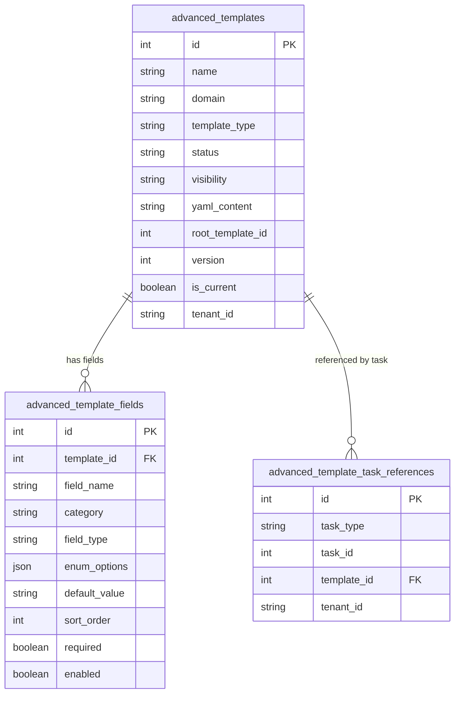

# 高级模板管理模块设计文档

## 核心设计：模板版本行承担快照作用

本模块不增加 `fields_snapshot`、`snapshot` 等 JSON 快照字段，也不增加独立模板版本表。为了避免模板编辑后影响已创建任务的回显，每次模板发生编辑时，会新建一条 `advanced_templates` 记录，并复制一份对应的 `advanced_template_fields`。

因此，一个具体的 `advanced_templates.id` 就是一份可回溯的模板版本快照：

1. 新建模板生成 v1，`advanced_templates.id` 就是该版本 ID。
2. 编辑模板主信息、YAML、字段、排序、启停时，生成新的模板版本行。
3. 旧任务继续保存旧的 `template_id`，通过旧模板行和旧字段行稳定回显。
4. 列表接口只返回 `is_current=true` 的当前版本，历史版本不在列表展示。
5. `root_template_id` 仅作为后端内部归组字段，用于识别同一逻辑模板下的多个版本。

## 一、目标与边界

高级模板是平台通用模块，不是训练专用模块。训练、评测、推理、部署、数据处理等任务都可以复用同一套模板模型；GRPO 只是 `domain=training`、`template_type=grpo` 的一种模板类型。

本模块负责模板主信息、字段、YAML 导入、启停和版本化保存；不负责资源申请、任务执行、参数推导，也不保存 CPU、内存、GPU、队列等资源参数。

## 二、表设计

### 2.1 模板主表

表名：`advanced_templates`

| 字段 | 说明 |
|------|------|
| `id` | 模板版本 ID |
| `name` | 模板名称 |
| `description` | 模板描述 |
| `domain` | 使用领域，例如 `training`、`evaluation`、`inference` |
| `template_type` | 模板类型，例如 `grpo`、`sft`、`rag_eval` |
| `status` | `draft`、`enabled`、`disabled` |
| `visibility` | `system`、`project`、`private` |
| `yaml_content` | YAML 原始内容 |
| `root_template_id` | 内部归组字段，根模板 ID，同一模板版本族共享 |
| `version` | 版本号，从 1 递增 |
| `is_current` | 是否当前版本 |
| `created_at/updated_at/created_id/created_by/tenant_id` | 项目基础字段 |

### 2.2 模板字段表

表名：`advanced_template_fields`

| 字段 | 说明 |
|------|------|
| `id` | 字段 ID |
| `template_id` | 外键，关联具体模板版本 `advanced_templates.id` |
| `field_name` | 字段名，例如 `actor_rollout_ref.model.lora_rank` |
| `category` | 一级分类，默认取字段路径第一段 |
| `description` | 字段描述 |
| `field_type` | `int`、`float`、`string`、`bool`、`enum`、`json` |
| `enum_options` | 枚举选项列表，仅 `field_type=enum` 时使用 |
| `default_value` | 默认值，按字符串保存 |
| `sort_order` | 排序 |
| `required` | 是否必填 |
| `enabled` | 是否启用 |
| `created_at/updated_at/created_id/created_by/tenant_id` | 项目基础字段 |

### 2.3 任务引用表

表名：`advanced_template_task_references`

| 字段 | 说明 |
|------|------|
| `id` | 引用 ID |
| `task_type` | 任务类型，例如 `training`、`evaluation`、`inference` |
| `task_id` | 任务 ID |
| `template_id` | 外键，指向具体模板版本 ID |
| `created_at/updated_at/created_id/created_by/tenant_id` | 项目基础字段 |

训练任务仍保留 `training_tasks.advanced_template_id` 用于详情接口直接回传；引用表用于通用模块判断模板版本是否被任务使用。`root_template_id` 只作为后端内部字段，不要求前端依赖。

## 三、ER 图



## 四、PostgreSQL SQL

```sql
CREATE TABLE IF NOT EXISTS advanced_templates (
    id SERIAL PRIMARY KEY,
    name VARCHAR(100) NOT NULL,
    description VARCHAR(1000),
    domain VARCHAR(50) NOT NULL,
    template_type VARCHAR(50) NOT NULL,
    status VARCHAR(20) NOT NULL DEFAULT 'draft',
    visibility VARCHAR(20) NOT NULL DEFAULT 'system',
    yaml_content TEXT,
    root_template_id INTEGER,
    version INTEGER NOT NULL DEFAULT 1,
    is_current BOOLEAN NOT NULL DEFAULT TRUE,
    created_at TIMESTAMP WITHOUT TIME ZONE NOT NULL DEFAULT CURRENT_TIMESTAMP,
    updated_at TIMESTAMP WITHOUT TIME ZONE NOT NULL DEFAULT CURRENT_TIMESTAMP,
    created_id BIGINT,
    created_by VARCHAR(100),
    tenant_id VARCHAR(32) NOT NULL,
    CONSTRAINT uq_advanced_templates_name_domain_type_version_tenant
        UNIQUE (name, domain, template_type, version, tenant_id)
);

COMMENT ON TABLE advanced_templates IS '高级模板主表，模板行即版本';
COMMENT ON COLUMN advanced_templates.name IS '模板名称';
COMMENT ON COLUMN advanced_templates.description IS '模板描述';
COMMENT ON COLUMN advanced_templates.domain IS '使用领域，如 training/evaluation/inference/deployment';
COMMENT ON COLUMN advanced_templates.template_type IS '模板类型，如 grpo/sft/rag_eval';
COMMENT ON COLUMN advanced_templates.status IS '状态：draft/enabled/disabled';
COMMENT ON COLUMN advanced_templates.visibility IS '可见性：system/project/private';
COMMENT ON COLUMN advanced_templates.yaml_content IS 'YAML 原始内容';
COMMENT ON COLUMN advanced_templates.root_template_id IS '内部归组字段，根模板ID，同一模板版本族共享';
COMMENT ON COLUMN advanced_templates.version IS '模板版本号';
COMMENT ON COLUMN advanced_templates.is_current IS '是否当前版本';
COMMENT ON COLUMN advanced_templates.created_id IS '创建者用户ID';
COMMENT ON COLUMN advanced_templates.created_by IS '创建者用户名';
COMMENT ON COLUMN advanced_templates.tenant_id IS '租户ID';

CREATE INDEX IF NOT EXISTS idx_advanced_templates_domain_type
    ON advanced_templates (domain, template_type);

CREATE INDEX IF NOT EXISTS idx_advanced_templates_status
    ON advanced_templates (status);

CREATE INDEX IF NOT EXISTS idx_advanced_templates_root_version
    ON advanced_templates (root_template_id, version);

CREATE INDEX IF NOT EXISTS idx_advanced_templates_current
    ON advanced_templates (root_template_id, is_current);

CREATE TABLE IF NOT EXISTS advanced_template_fields (
    id SERIAL PRIMARY KEY,
    template_id INTEGER NOT NULL,
    field_name VARCHAR(100) NOT NULL,
    category VARCHAR(100),
    description VARCHAR(1000),
    field_type VARCHAR(50) NOT NULL,
    enum_options JSON,
    default_value TEXT,
    sort_order INTEGER NOT NULL DEFAULT 0,
    required BOOLEAN NOT NULL DEFAULT FALSE,
    enabled BOOLEAN NOT NULL DEFAULT TRUE,
    created_at TIMESTAMP WITHOUT TIME ZONE NOT NULL DEFAULT CURRENT_TIMESTAMP,
    updated_at TIMESTAMP WITHOUT TIME ZONE NOT NULL DEFAULT CURRENT_TIMESTAMP,
    created_id BIGINT,
    created_by VARCHAR(100),
    tenant_id VARCHAR(32) NOT NULL,
    CONSTRAINT uq_advanced_template_fields_template_field
        UNIQUE (template_id, field_name),
    CONSTRAINT fk_advanced_template_fields_template
        FOREIGN KEY (template_id) REFERENCES advanced_templates(id)
);

COMMENT ON TABLE advanced_template_fields IS '高级模板字段表';
COMMENT ON COLUMN advanced_template_fields.template_id IS '模板版本ID';
COMMENT ON COLUMN advanced_template_fields.field_name IS '字段名';
COMMENT ON COLUMN advanced_template_fields.category IS '一级分类';
COMMENT ON COLUMN advanced_template_fields.description IS '字段描述';
COMMENT ON COLUMN advanced_template_fields.field_type IS '字段类型：int/float/string/bool/enum/json';
COMMENT ON COLUMN advanced_template_fields.enum_options IS '枚举选项列表';
COMMENT ON COLUMN advanced_template_fields.default_value IS '默认值，按字符串保存';
COMMENT ON COLUMN advanced_template_fields.sort_order IS '排序';
COMMENT ON COLUMN advanced_template_fields.required IS '是否必填';
COMMENT ON COLUMN advanced_template_fields.enabled IS '是否启用';
COMMENT ON COLUMN advanced_template_fields.created_id IS '创建者用户ID';
COMMENT ON COLUMN advanced_template_fields.created_by IS '创建者用户名';
COMMENT ON COLUMN advanced_template_fields.tenant_id IS '租户ID';

CREATE INDEX IF NOT EXISTS idx_advanced_template_fields_template
    ON advanced_template_fields (template_id);

CREATE INDEX IF NOT EXISTS idx_advanced_template_fields_category
    ON advanced_template_fields (template_id, category);

CREATE INDEX IF NOT EXISTS idx_advanced_template_fields_order
    ON advanced_template_fields (template_id, sort_order);

CREATE TABLE IF NOT EXISTS advanced_template_task_references (
    id SERIAL PRIMARY KEY,
    task_type VARCHAR(50) NOT NULL,
    task_id INTEGER NOT NULL,
    template_id INTEGER NOT NULL,
    created_at TIMESTAMP WITHOUT TIME ZONE NOT NULL DEFAULT CURRENT_TIMESTAMP,
    updated_at TIMESTAMP WITHOUT TIME ZONE NOT NULL DEFAULT CURRENT_TIMESTAMP,
    created_id BIGINT,
    created_by VARCHAR(100),
    tenant_id VARCHAR(32) NOT NULL,
    CONSTRAINT uq_advanced_template_task_references_task_tenant
        UNIQUE (task_type, task_id, tenant_id),
    CONSTRAINT fk_advanced_template_task_references_template
        FOREIGN KEY (template_id) REFERENCES advanced_templates(id)
);

COMMENT ON TABLE advanced_template_task_references IS '高级模板任务引用表';
COMMENT ON COLUMN advanced_template_task_references.task_type IS '任务类型，如 training/evaluation/inference';
COMMENT ON COLUMN advanced_template_task_references.task_id IS '任务ID';
COMMENT ON COLUMN advanced_template_task_references.template_id IS '模板版本ID';
COMMENT ON COLUMN advanced_template_task_references.created_id IS '创建者用户ID';
COMMENT ON COLUMN advanced_template_task_references.created_by IS '创建者用户名';
COMMENT ON COLUMN advanced_template_task_references.tenant_id IS '租户ID';

CREATE INDEX IF NOT EXISTS idx_advanced_template_task_references_template
    ON advanced_template_task_references (template_id);
```

## 五、接口行为

| 方法 | 路径 | 说明 |
|------|------|------|
| `POST` | `/api/v1/advanced-templates` | 新增模板，生成 v1 |
| `POST` | `/api/v1/advanced-templates/from-yaml` | 通过 YAML 字符串新增模板 |
| `POST` | `/api/v1/advanced-templates/yaml-to-json` | 将 YAML 字符串转换为模板字段 JSON，不落库 |
| `GET` | `/api/v1/advanced-templates` | 查询当前版本列表，默认只返回 `is_current=true` |
| `GET` | `/api/v1/advanced-templates/{template_id}` | 查询指定模板版本详情 |
| `POST` | `/api/v1/advanced-templates/{template_id}/copy` | 复制模板，名称追加 ` 副本`，生成新的 v1 模板 |
| `DELETE` | `/api/v1/advanced-templates/{template_id}` | 删除模板；任一版本被任务引用时拒绝删除 |
| `PUT` | `/api/v1/advanced-templates/{template_id}` | 编辑并生成新版本 |
| `PUT` | `/api/v1/advanced-templates/{template_id}/from-yaml` | 通过 YAML 编辑并生成新版本 |
| `POST` | `/api/v1/advanced-templates/{template_id}/fields` | 新增字段并生成新版本 |
| `PUT` | `/api/v1/advanced-templates/{template_id}/fields/{field_id}` | 编辑字段并生成新版本 |
| `PUT` | `/api/v1/advanced-templates/{template_id}/fields/reorder` | 调整排序并生成新版本 |
| `POST` | `/api/v1/advanced-templates/{template_id}/enable` | 启用并生成新版本 |
| `POST` | `/api/v1/advanced-templates/{template_id}/disable` | 停用并生成新版本 |

模板详情中的 `fields` 按 `category` 分组返回：

```json
{
  "id": 12,
  "version": 3,
  "is_current": true,
  "yaml_content": "actor_rollout_ref:\n  model:\n    lora_rank: 8\n",
  "fields": [
    {
      "category": "actor_rollout_ref",
      "fields": [
        {
          "template_id": 12,
          "field_name": "actor_rollout_ref.model.lora_rank",
          "category": "actor_rollout_ref",
          "field_type": "int",
          "enum_options": null,
          "default_value": "8"
        }
      ]
    }
  ]
}
```

## 六、YAML 注释规则

YAML 接口接收 `yaml_content` 字符串，解析标量参数为模板字段，字段名使用点号路径。

```yaml
actor_rollout_ref:
  rollout:
    # @template type=float default=0.6 required=true description="GPU memory utilization"
    gpu_memory_utilization: 0.5
    # @template type=enum default=vllm enum_options=vllm,sglang required=true description="Rollout 后端"
    name: vllm
```

支持属性：

| 属性 | 说明 |
|------|------|
| `type` / `field_type` | 字段类型 |
| `enum_options` | 枚举选项，支持逗号分隔或 YAML/JSON 数组形式 |
| `default` | 默认值，优先于 YAML 值 |
| `required` | 是否必填 |
| `enabled` | 是否启用 |
| `category` | 一级分类，默认取路径第一段 |
| `description` / `desc` | 字段描述 |
| `order` / `sort_order` | 字段排序 |

## 七、校验规则

1. 同一租户下当前版本不允许出现同 `name + domain + template_type` 的模板。
2. 同一个模板版本下 `field_name` 唯一。
3. `field_type` 必须在允许枚举内。
4. `field_type=enum` 时必须配置非空 `enum_options`。
5. `default_value` 必须能按 `field_type` 解析；枚举默认值必须包含在 `enum_options` 中。
6. 启用模板必须至少有一个启用字段。
7. CPU、内存、GPU、worker 副本数不进入模板字段。
