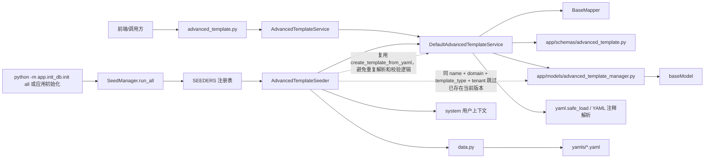

# 高级模板种子初始化架构视图

## 目标

本文档补齐高级模板种子初始化相关的三类架构视图，作为后续实现默认高级参数模板初始化的工作地图。

范围仅覆盖：

- 高级模板 API、Schema、Service、Model。
- 数据库种子初始化入口、管理器、模块注册和模块 Seeder。
- 存放系统内置高级模板 YAML 的种子数据文件。

不覆盖训练任务执行、GRPO RayJob 生成、资源参数合成等链路；这些内容继续参考 `design/grpo_training_design.md`。

## 一、架构树状图

```mermaid
flowchart TD
    Root["后端应用"]
    Root --> ApiLayer["API 层"]
    Root --> ServiceLayer["Service 层"]
    Root --> ModelLayer["Model 层"]
    Root --> SeedLayer["种子初始化层"]
    Root --> DocsLayer["设计与迁移文档"]

    ApiLayer --> AdvancedTemplateApi["app/api/v1/advanced_template.py<br/>高级模板 REST 接口"]

    ServiceLayer --> AdvancedTemplateInterface["app/services/advanced_template/interface.py<br/>服务契约"]
    ServiceLayer --> AdvancedTemplateService["app/services/advanced_template/advanced_template.py<br/>模板创建、版本化、YAML 解析、字段同步"]
    ServiceLayer --> BaseMapper["app/repository/base_mapper.py<br/>通用数据库访问"]

    ModelLayer --> AdvancedTemplateModel["app/models/advanced_template_manager.py<br/>advanced_templates / fields / task_references"]
    ModelLayer --> TenantBase["app/models/models.py<br/>baseModel 租户与审计字段"]

    SeedLayer --> SeedInit["app/init_db/init.py<br/>命令入口与便捷函数"]
    SeedLayer --> SeedManager["app/init_db/manager.py<br/>按注册顺序运行 Seeder"]
    SeedLayer --> SeedRegistry["app/init_db/modules/__init__.py<br/>Seeder 注册表"]
    SeedLayer --> AdvancedTemplateSeed["app/init_db/modules/advanced_templates/<br/>高级模板种子模块"]
    SeedLayer --> SeedYaml["app/init_db/modules/advanced_templates/yamls/<br/>系统内置模板 YAML"]

    DocsLayer --> ExistingDesign["design/advanced_template_module_design.md<br/>高级模板数据模型与接口行为"]
    DocsLayer --> ThisDoc["design/advanced_template_seed_architecture.md<br/>本架构视图"]
```

## 二、模块依赖关系图

## 三、模块相关代码文件索引图

```mermaid
flowchart TD
    AdvancedTemplateModule["高级模板模块"]
    AdvancedTemplateModule --> ApiFiles["接口文件<br/>app/api/v1/advanced_template.py"]
    AdvancedTemplateModule --> SchemaFiles["Schema 文件<br/>app/schemas/advanced_template.py"]
    AdvancedTemplateModule --> ServiceFiles["服务文件<br/>app/services/advanced_template/interface.py<br/>app/services/advanced_template/advanced_template.py"]
    AdvancedTemplateModule --> ModelFiles["模型文件<br/>app/models/advanced_template_manager.py"]
    AdvancedTemplateModule --> TestFiles["已有测试<br/>tests/unit/schemas/test_advanced_template_schema.py<br/>tests/unit/services/test_advanced_template_service_helpers.py"]

    SeedModule["种子初始化模块"]
    SeedModule --> SeedCore["核心入口<br/>app/init_db/init.py<br/>app/init_db/manager.py<br/>app/init_db/modules/__init__.py"]
    SeedModule --> ExistingSeedExamples["现有 Seeder 参考<br/>app/init_db/modules/common_config/<br/>app/init_db/modules/data_cleaning/<br/>app/init_db/modules/evaluation_metrics/"]
    SeedModule --> NewSeedFiles["高级模板 Seeder<br/>app/init_db/modules/advanced_templates/__init__.py<br/>app/init_db/modules/advanced_templates/data.py<br/>app/init_db/modules/advanced_templates/seeder.py"]
    SeedModule --> NewYamlFiles["内置 YAML 模板<br/>app/init_db/modules/advanced_templates/yamls/*.yaml"]

    Docs["文档"]
    Docs --> ArchitectureDoc["design/advanced_template_seed_architecture.md"]
    Docs --> DesignDoc["后续设计文档<br/>design/advanced_template_seed_initialization_design.md"]
    Docs --> ChangeDocs["改动审查文档<br/>docs/changes/*.md"]
```

## 四、关键边界和约束

1. 高级模板的业务规则仍由 `DefaultAdvancedTemplateService` 统一维护。Seeder 不应重新实现 YAML 解析、字段校验、版本化创建等逻辑。
2. YAML 种子文件只承载模板内容。模板名称、领域、类型、状态、可见性等元数据由 `data.py` 明确描述，便于后续新增多个系统模板。
3. 初始化逻辑应幂等。同一租户下已经存在当前版本的 `name + domain + template_type` 时跳过，不覆盖用户后续编辑出的模板版本。
4. 系统内置模板默认使用 `created_id=0`、`created_by="system"`；租户来源应遵循现有种子模块约定。
5. 若后续需要初始化全局模板，可显式使用 `tenant_id="0"`；若需要每个租户可见，则按已有 `RepositoryResource.tenant_id` 枚举租户。
6. Seeder 接入时机为 `SeedManager.run_all` 运行 `SEEDERS` 注册表时，以及单独执行 `python -m app.init_db.init advanced_templates` 时。

## 五、后续实现落点

- 新增 `app/init_db/modules/advanced_templates/`，封装高级模板种子数据与初始化逻辑。
- 在 `app/init_db/modules/__init__.py` 注册 `AdvancedTemplateSeeder`。
- 在 `app/init_db/init.py` 增加 `init_advanced_templates()` 和命令行参数分支。
- 增加一个 GRPO 系统模板 YAML 作为首个种子模板。
- 增加聚焦单元测试，覆盖 YAML 加载、幂等跳过、通过 service 生成模板。
