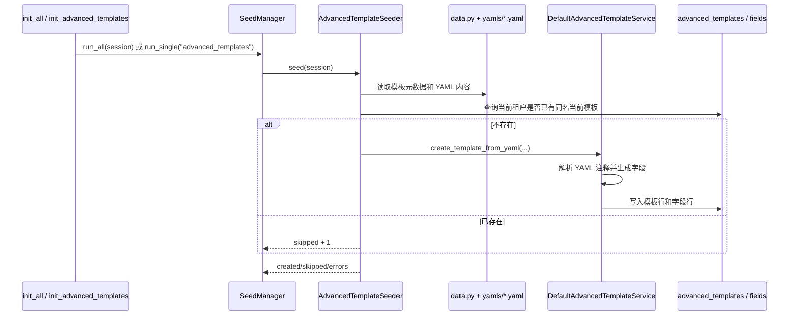

# 高级模板种子初始化设计

## 目标

为高级参数模板增加系统种子初始化能力：

1. 将内置高级模板内容保存为 YAML 文件。
2. 在数据库初始化流程运行时，为租户生成默认高级模板。
3. 生成模板时通过 lab 依赖容器获取高级模板 Service，复用其 YAML 解析、字段校验和模板创建逻辑。
4. 初始化逻辑保持幂等，避免覆盖用户已编辑出的模板版本。

## 非目标

1. 不改变高级模板 API 契约。
2. 不改变 GRPO 训练任务创建、编辑和执行流程。
3. 不把 CPU、内存、GPU、worker 副本数等资源字段放进高级模板。
4. 不在训练任务创建阶段根据模板反推或补齐 `additional_params`。

## 架构依据

本设计基于以下架构视图：

- `design/advanced_template_seed_architecture.md`
- `design/advanced_template_module_design.md`
- `design/grpo_training_design.md`

## 用户可见行为

初始化默认数据后，租户下会出现一条当前版本的系统高级模板：

- `name`: `GRPO 默认低资源lora模版`
- `domain`: `training`
- `template_type`: `grpo`
- `status`: `enabled`
- `visibility`: `system`

前端可继续通过现有高级模板列表和详情接口读取该模板，并按字段渲染 GRPO `additional_params` 表单。

## 数据与文件

新增种子模块：

```text
app/init_db/modules/advanced_templates/
├── __init__.py
├── data.py
├── seeder.py
└── yamls/
    └── grpo_default.yaml
```

`data.py` 保存模板元数据和 YAML 文件引用，`yamls/*.yaml` 保存可由高级模板 Service 解析的参数结构和 `@template` 注释；固定选项字段使用 `type=enum enum_options=...` 声明枚举选项。

## 初始化时机

初始化入口沿用现有种子数据系统：

1. `RepositoryService.create_repository()` 创建租户镜像仓库后调用 `init_all(session)`。
2. `RepositoryService.init_db()` 手动初始化默认数据时调用 `init_all_result(session)`。
3. 命令行可通过 `python -m app.init_db.init advanced_templates` 单独运行高级模板初始化。

`AdvancedTemplateSeeder` 会注册到 `app/init_db/modules/__init__.py` 的 `SEEDERS` 列表中，由 `SeedManager.run_all()` 按顺序执行。

## 数据流



## 幂等策略

对每个租户、每个种子模板，按以下条件判断是否已存在：

```text
name + domain + template_type + tenant_id + is_current=true
```

已存在则跳过，不更新、不新建版本。这样可以避免用户后续编辑系统模板后再次初始化被覆盖。

## 租户上下文

`BaseMapper.insert()` 会从 `app_runtime_context.get_tenant_id()` 写入 `tenant_id`，因此 Seeder 调用 Service 前必须：

1. 根据 `RepositoryResource.tenant_id` 枚举要初始化的租户。
2. 对每个租户设置运行时 `tenant_id`。
3. 将传入的 `AsyncSession` 放入 `db_session_context`，让 Service 复用同一个 session。
4. 调用完成后恢复上下文，避免污染后续 Seeder。

## Service 复用方式

`AdvancedTemplateSeeder` 通过 `AutoContainer().advanced_template_service()` 获取高级模板 Service，再调用 `create_template_from_yaml()`。这样复用现有高级模板 Service 的 YAML 解析、字段校验、模板创建和提交逻辑，同时不为种子初始化扩展高级模板 Service 的抽象契约。

## 风险与兼容性

1. `AdvancedTemplateSeeder.seed()` 兼容 `run_all(session)` 和 `run_single()` 无参调用，避免改动公共 `SeedManager` 结构。
2. 如果租户没有 `RepositoryResource`，高级模板初始化会跳过，与现有模型、镜像等租户级 Seeder 保持一致。
3. 若 YAML 文件格式错误，Service 会返回原有的 HTTP 400 校验错误；Seeder 捕获后记录错误并让整体初始化结果失败。
4. 高级模板 Service 不新增种子初始化专用参数，避免污染通用服务接口。

## 实现计划

1. 新增高级模板 YAML 种子文件和 `data.py`。
2. 新增 `AdvancedTemplateSeeder`，实现租户枚举、上下文设置、幂等跳过、调用 Service 创建模板。
3. 高级模板 Seeder 调用现有高级模板 Service 生成模板。
4. 注册 Seeder，并在 `init.py`、`app/init_db/__init__.py` 增加单模块初始化入口。
5. 增加聚焦单元测试，覆盖 YAML 加载、幂等跳过、通过 Service 调用创建模板。

## 整体测试流程占位

整体测试流程尚未定义。本次仅运行与改动相关的定向单元测试：

- 高级模板 Service helper 测试。
- 高级模板 Seeder 测试。
- 必要时运行已有 schema 测试，确认入参模型兼容。
