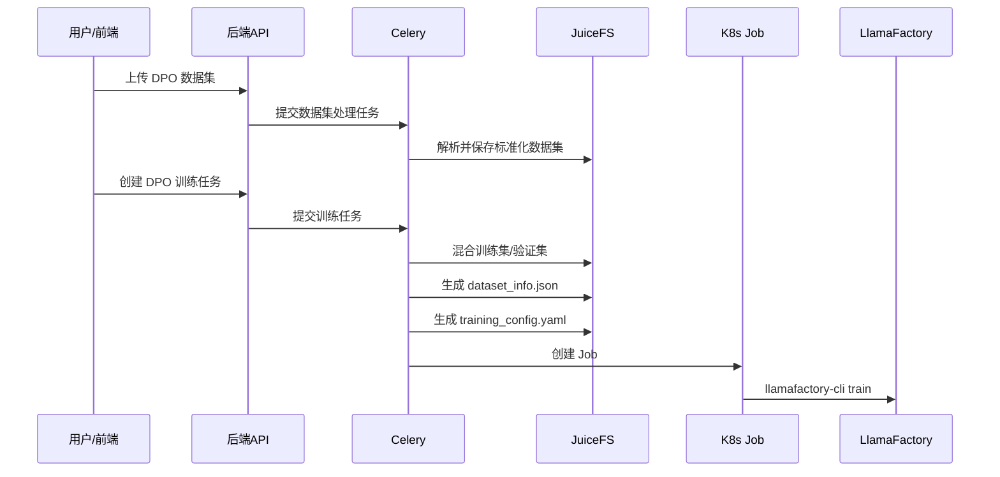

# DPO 训练能力设计文档

## 文档说明

- **目标**：在现有训练数据集、训练任务、K8s 训练链路基础上，补齐 **DPO（Direct Preference Optimization）训练** 的端到端能力。
- **训练框架**：固定使用 **LlamaFactory**。
- **原则**：以 DPO 新增能力的可落地实现为目标，数据库结构按实际需要设计。
- **范围**：本次仅覆盖大模型 DPO 训练，不扩展自动偏好数据构造、不改模型管理体系。

---

## 一、背景与目标

当前系统已经具备以下基础能力：

- 训练数据集管理：`training_datasets`
- 训练任务管理：`training_tasks`
- 训练任务提交接口：`/api/v1/training_tasks/project/{project_id}`
- 训练异步执行：Celery + K8s Job
- 训练配置生成：LlamaFactory YAML

现有代码中也已经有 DPO 基础结构：

- `TrainingMethodType.DPO`
- `training_tasks.dpo_config`
- `TrainingTaskCreate.dpo_config`

但当前还没有真正把 DPO 数据格式、数据处理、配置生成、训练执行完整打通。

本次目标：

1. 支持 DPO 数据集上传、解析、预览、下载。
2. 支持基于 DPO 数据集创建训练任务。
3. 支持生成符合 LlamaFactory 规范的 DPO `dataset_info.json`。
4. 支持通过现有 K8s Job 执行 `llamafactory-cli train` 完成 DPO 训练。

---

## 二、设计原则

### 2.1 数据库按 DPO 能力直接设计

本次 DPO 是新增能力，不考虑历史兼容包袱。

设计时只关注两点：

1. 是否能正确表达 DPO 数据集与训练任务
2. 是否能支撑 DPO 训练配置与执行流程

### 2.2 DPO 数据格式约定

统一规则：

| 训练方法 | dataset_format | 对齐方式 |
|----------|----------------|----------|
| sft | prompt-response | 现有 SFT 单轮格式 |
| dpo | alpaca | 对齐 Alpaca preference |
| sft | role-based | 现有多轮对话格式 |
| dpo | role-based | 对齐 OpenAI / ShareGPT preference |

也就是说：

- SFT 单轮继续使用现有 `prompt-response`
- DPO 单轮新增 `alpaca`
- DPO 多轮继续使用 `role-based`

---

## 三、现状与问题

### 3.1 训练数据集侧

当前已有：

- `training_method_type`
- `dataset_format`

但数据处理链路主要还是按 SFT 逻辑实现，问题主要有：

1. 数据集解析主要覆盖 `prompt/response`、`messages`，未明确支持 DPO 偏好字段。
2. 数据集处理异步任务主要按 `dataset_format` 分支，没有把 `training_method_type=dpo` 作为核心判断条件。
3. 样例下载当前没有 DPO 样例。
4. 导出/预览未明确 DPO 字段展示规则。

### 3.2 训练配置侧

当前训练执行会生成：

1. 混合训练数据集
2. `dataset_info.json`
3. LlamaFactory YAML

但 `dataset_info.json` 现在主要覆盖：

- `prompt-response`
- `role-based`
- `prefix-suffix-middle`

缺少 DPO 必要的：

- `ranking: true`
- `chosen`
- `rejected`

### 3.3 训练任务侧

当前 `training_tasks` 已经有 `dpo_config`，但还需要补齐以下约束：

1. DPO 任务必须绑定 DPO 数据集。
2. DPO 任务必须生成匹配的数据集配置。
3. DPO 多模态场景需要支持 `images` 字段透传。

---

## 四、DPO 数据格式设计

## 4.1 DPO Alpaca 风格

### 4.1.1 数据格式

本次对 DPO 单轮偏好数据新增独立的 `dataset_format=alpaca`。

该格式不再归入现有 `prompt-response`，而是作为 DPO 专用数据格式。

为了说明 DPO 偏好数据形态，下面给出一个 Alpaca preference 风格样例：

样例：

```json
[
  {
    "instruction": "人类指令（必填）",
    "input": "人类输入（选填）",
    "chosen": "优质回答（必填）",
    "rejected": "劣质回答（必填）"
  }
]
```

### 4.1.2 dataset_info.json 配置

对于 `dataset_format=alpaca`，训练阶段生成的 `dataset_info.json` 应为：

```json
{
  "dataset_name": {
    "file_name": "data.json",
    "ranking": true,
    "columns": {
      "prompt": "instruction",
      "query": "input",
      "chosen": "chosen",
      "rejected": "rejected"
    }
  }
}
```

### 4.1.3 设计说明

- 数据集层归类为：`dataset_format=alpaca`
- 训练方法仍为：`training_method_type=dpo`
- 与 SFT 的 `prompt-response` 明确区分
- 核心字段语义为：
  - `instruction`
  - `input`
  - `chosen`
  - `rejected`
- 训练阶段通过 `dataset_info.json` 映射为：
  - `instruction -> prompt`
  - `input -> query`
  - `chosen -> chosen`
  - `rejected -> rejected`

---

## 4.2 DPO OpenAI / ShareGPT 风格

### 4.2.1 数据格式

对齐现有 `role-based`，在 `messages` 基础上增加：

- `chosen`
- `rejected`

样例：

```json
[
  {
    "messages": [
      {
        "role": "system",
        "content": "你是一个严谨的中文助手。"
      },
      {
        "role": "user",
        "content": "请解释什么是过拟合。"
      }
    ],
    "chosen": {
      "role": "assistant",
      "content": "过拟合是指模型过度记住训练集细节，导致泛化能力下降。"
    },
    "rejected": {
      "role": "assistant",
      "content": "过拟合就是模型训练了很久。"
    }
  }
]
```

### 4.2.2 dataset_info.json 配置

```json
{
  "my_dpo_openai": {
    "file_name": "my_dpo_openai.json",
    "formatting": "openai",
    "ranking": true,
    "columns": {
      "messages": "messages",
      "chosen": "chosen",
      "rejected": "rejected"
    },
    "tags": {
      "role_tag": "role",
      "content_tag": "content",
      "user_tag": "user",
      "assistant_tag": "assistant",
      "system_tag": "system"
    }
  }
}
```

### 4.2.3 images 支持

该格式还需要支持 `images` 字段。

推荐样例：

```json
[
  {
    "messages": [
      {
        "role": "user",
        "content": "<image>请描述这张图片。"
      }
    ],
    "images": [
      "images/demo1.png"
    ],
    "chosen": {
      "role": "assistant",
      "content": "这是一张展示城市夜景的图片。"
    },
    "rejected": {
      "role": "assistant",
      "content": "这是一段文字。"
    }
  }
]
```

对应 `dataset_info.json` 建议：

```json
{
  "my_dpo_openai": {
    "file_name": "my_dpo_openai.json",
    "formatting": "openai",
    "ranking": true,
    "columns": {
      "messages": "messages",
      "images": "images",
      "chosen": "chosen",
      "rejected": "rejected"
    },
    "tags": {
      "role_tag": "role",
      "content_tag": "content",
      "user_tag": "user",
      "assistant_tag": "assistant",
      "system_tag": "system"
    }
  }
}
```

### 4.2.4 设计说明

- 该格式在系统中仍归类为：`dataset_format=role-based`
- 训练方法为：`training_method_type=dpo`
- `messages` 表示历史上下文
- `chosen` / `rejected` 表示当前轮偏好回答
- 多模态场景支持 `images` 字段

---

## 五、数据库设计

## 5.1 数据库结论

本次文档不再写历史兼容原则，DPO 作为新增能力直接采用目标设计。

当前最小实现约束为：

1. `training_method_type=dpo` 时，数据集内容必须符合 DPO 格式。
2. `training_type.train_method_type=dpo` 时，训练任务只能选择 DPO 数据集。
3. `dataset_format=alpaca` 时，DPO 解析按 Alpaca preference 处理。
4. `dataset_format=role-based` 时，DPO 解析按 OpenAI / ShareGPT preference 处理。

---

## 六、接口设计

## 6.1 训练数据集接口

### 6.1.1 上传数据集

接口路径：

`POST /api/v1/training-datasets/upload`

现有关键参数：

- `dataset_type`
- `training_method_type`
- `dataset_format`

本次要求：

1. 当 `training_method_type=dpo` 且 `dataset_format=alpaca` 时：
   - 上传内容按 Alpaca preference 校验
   - 必须包含：
     - `instruction`
     - `input`
     - `chosen`
     - `rejected`

2. 当 `training_method_type=dpo` 且 `dataset_format=role-based` 时：
   - 上传内容按 OpenAI / ShareGPT preference 校验
   - 必须包含：
     - `messages`
     - `chosen`
     - `rejected`
   - 可选包含：
     - `images`

### 6.1.2 下载样例数据集

接口路径：

`GET /api/v1/training-datasets/project/{project_id}/sample/download`

本次新增支持：

- `training_method_type=dpo`
- `dataset_format=alpaca`
- `dataset_format=role-based`

建议提供两类样例：

1. DPO Alpaca preference 样例
2. DPO OpenAI preference 样例

其中 role-based 样例建议同时提供：

- 纯文本版
- 带 `images` 的多模态版

### 6.1.3 数据集详情/预览/下载

详情、下载、预览接口需要补齐 DPO 字段逻辑：

#### DPO + alpaca 预览字段

预览页字段展示为：

- `instruction`
- `input`
- `chosen`
- `rejected`

#### DPO + role-based 预览字段

- `messages`
- `chosen`
- `rejected`
- `images`（如果存在）

---

## 6.2 训练任务接口

### 6.2.1 创建训练任务

接口路径：

`POST /api/v1/training_tasks/project/{project_id}`

本次增加校验规则：

1. 当 `training_type.train_method_type = dpo` 时：
   - `dpo_config` 必填
   - `dataset_items` 必填
   - `dataset_items` 中所有数据集的 `training_method_type` 必须为 `dpo`

2. 数据格式约束：
   - 如果数据集 `dataset_format=alpaca`，按 DPO Alpaca 训练
   - 如果数据集 `dataset_format=role-based`，按 DPO OpenAI / ShareGPT 训练

3. 多模态约束：
   - 如果 `role-based` 数据集中存在 `images`，则训练任务按多模态 DPO 处理
   - `dataset_info.json` 中要带上 `images` 映射

### 6.2.2 下载训练配置

接口路径：

`GET /api/v1/training_tasks/project/{project_id}/task/{task_name}/version/{version}/download-config`

本次要求：

- 当任务为 DPO 时，下载内容必须体现：
  - `stage: dpo`
  - DPO 参数
  - 对应的 `dataset_info.json` 配置语义

---

## 七、训练配置生成设计

## 7.1 dataset_info.json 生成规则

### 7.1.1 DPO + alpaca

当：

- `training_method_type=dpo`
- `dataset_format=alpaca`

如果项目内部已经按 DPO 语义标准化为：

- `instruction`
- `input`
- `chosen`
- `rejected`

则生成：

```json
{
  "custom_dataset": {
    "file_name": "custom_dataset.json",
    "ranking": true,
    "columns": {
      "prompt": "instruction",
      "query": "input",
      "chosen": "chosen",
      "rejected": "rejected"
    }
  }
}
```

如果有独立验证集，则同步生成 `custom_eval_dataset`。

### 7.1.2 DPO + role-based

当：

- `training_method_type=dpo`
- `dataset_format=role-based`

生成：

```json
{
  "custom_dataset": {
    "file_name": "custom_dataset.json",
    "formatting": "openai",
    "ranking": true,
    "columns": {
      "messages": "messages",
      "chosen": "chosen",
      "rejected": "rejected"
    },
    "tags": {
      "role_tag": "role",
      "content_tag": "content",
      "user_tag": "user",
      "assistant_tag": "assistant",
      "system_tag": "system"
    }
  }
}
```

若数据中存在 `images`，则变为：

```json
{
  "custom_dataset": {
    "file_name": "custom_dataset.json",
    "formatting": "openai",
    "ranking": true,
    "columns": {
      "messages": "messages",
      "images": "images",
      "chosen": "chosen",
      "rejected": "rejected"
    },
    "tags": {
      "role_tag": "role",
      "content_tag": "content",
      "user_tag": "user",
      "assistant_tag": "assistant",
      "system_tag": "system"
    }
  }
}
```

## 7.2 YAML 生成规则

LlamaFactory YAML 生成链路在 DPO 时必须满足：

1. `stage: dpo`
2. 透传 `dpo_config`
3. 指向 DPO 数据集目录
4. 使用对应的 DPO `dataset_info.json`

---

## 八、训练流程设计



---

## 九、实现改造点

## 9.1 数据集处理任务

本次需要调整为按：

- `training_method_type`
- `dataset_format`

联合判断。

建议逻辑：

1. `sft + prompt-response`
   - 按 SFT 单轮格式处理

2. `dpo + alpaca`
   - 按 Alpaca preference 校验：
     - `instruction`
     - `input`
     - `chosen`
     - `rejected`

3. `sft + role-based`
   - 走现有 role-based 逻辑

4. `dpo + role-based`
   - 按 OpenAI / ShareGPT preference 校验：
     - `messages`
     - `chosen`
     - `rejected`
     - `images` 可选

## 9.2 dataset_file_parser

需要新增两类解析分支：

1. `analyze_dpo_prompt_response_*`
2. `analyze_dpo_role_based_*`

输入文件类型建议支持：

- `json`
- `jsonl`
- `xlsx`
- `csv`
- `zip`（role-based + images）

## 9.3 训练任务配置生成

`training_tasks.py` 中 `dataset_info.json` 生成逻辑补齐：

1. DPO Alpaca 映射
2. DPO OpenAI 映射
3. `images` 列映射
4. `ranking: true`

---

## 十、实施顺序

建议按以下顺序实施：

1. 样例数据补充
   - DPO Alpaca 样例
   - DPO OpenAI 样例
   - DPO OpenAI + images 样例

2. 数据集处理改造
   - 上传解析
   - 预览
   - 下载

3. 训练配置改造
   - `dataset_info.json`
   - YAML 生成

4. 训练任务校验改造
   - DPO 数据集绑定校验
   - DPO 参数校验

5. 联调验证
   - 上传 DPO 数据集
   - 创建 DPO 任务
   - 下载训练配置
   - 启动训练

---

## 十一、验收标准

满足以下条件即可认为本次 DPO 设计目标完成：

1. 支持 `training_method_type=dpo` 的数据集上传。
2. 支持 `alpaca` 对齐 Alpaca preference。
3. 支持 `role-based` 对齐 OpenAI / ShareGPT preference。
4. role-based DPO 支持 `images` 字段。
5. 训练任务能基于 DPO 数据集生成正确的 `dataset_info.json`。
6. 训练任务能通过 `llamafactory-cli train` 正常启动。
7. 全流程无需引入非必要数据库字段变更。

---

## 十二、结论

这次 DPO 设计采用最小改造策略：

1. **数据库先不动**
2. **数据格式采用 `prompt-response / alpaca / role-based`**
3. **通过 `training_method_type=dpo` 区分训练语义**
4. **在 `dataset_info.json` 层补齐 `ranking/chosen/rejected/images` 支持**

这样可以在不扩大改造面的前提下，先把 DPO 训练流程真正打通。
