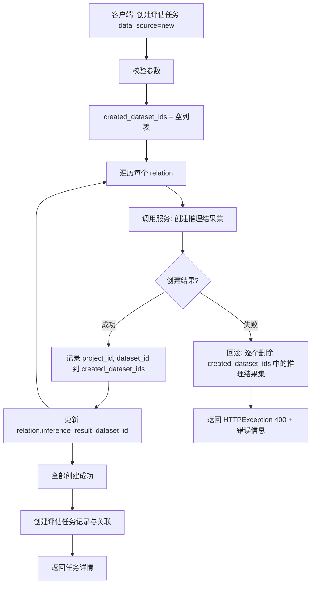
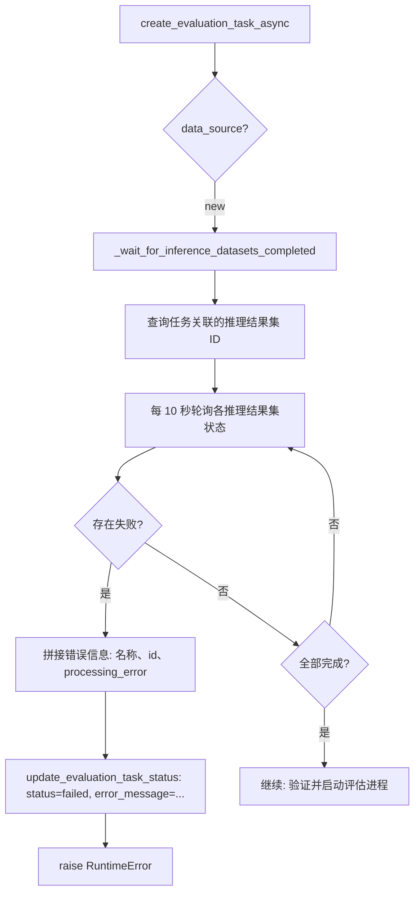

# 评估任务 - 新建推理结果集 流程图

## 1. API 层：创建评估任务（data_source=new）

```
┌─────────────────────────────────────────────────────────────────┐
│  客户端请求：创建评估任务 (data_source = "new")                    │
└───────────────────────────────┬─────────────────────────────────┘
                                 ▼
┌─────────────────────────────────────────────────────────────────┐
│  校验参数（inference_method、model_id/source_dataset_id 等）       │
└───────────────────────────────┬─────────────────────────────────┘
                                 ▼
┌─────────────────────────────────────────────────────────────────┐
│  created_dataset_ids = []   （记录本请求内已创建的推理结果集）       │
└───────────────────────────────┬─────────────────────────────────┘
                                 ▼
                    ┌────────────────────────┐
                    │  for 每个 relation in   │
                    │  dataset_model_relations│
                    └────────────┬───────────┘
                                 │
                                 ▼
┌─────────────────────────────────────────────────────────────────┐
│  调用推理结果集服务：创建推理结果集                                  │
└───────────────────────────────┬─────────────────────────────────┘
                                 │
              ┌──────────────────┴──────────────────┐
              ▼                                     ▼
        ┌──────────┐                         ┌──────────┐
        │  成功     │                         │  失败     │
        └─────┬────┘                         └─────┬────┘
              │                                     │
              ▼                                     ▼
┌──────────────────────────┐         ┌─────────────────────────────────────┐
│ 将 (project_id, dataset_id) │         │  回滚：对 created_dataset_ids 中    │
│ 加入 created_dataset_ids   │         │  每一项调用 delete_inference_result_ │
│ 更新 relation 的 dataset_id │         │  dataset(project_id, dataset_id)    │
└──────────────┬───────────┘         └─────────────────┬───────────────────┘
               │                                        │
               │ 继续下一个 relation                     ▼
               │                          ┌─────────────────────────────────┐
               │                          │  HTTPException(400, detail=      │
               │                          │  "创建推理结果集失败，已回滚...")   │
               │                          └─────────────────────────────────┘
               │
               ▼
        ┌──────────────┐
        │ 全部创建成功  │
        └──────┬───────┘
               ▼
┌─────────────────────────────────────────────────────────────────┐
│  创建评估任务记录、关联关系 → 提交 → 返回任务详情                     │
└─────────────────────────────────────────────────────────────────┘
```

## 2. Celery Worker：轮询推理结果集状态（data_source=new）

```
┌─────────────────────────────────────────────────────────────────┐
│  create_evaluation_task_async(task_id, ...)                      │
│  data_source == "new" → 进入“等待推理结果集完成”分支                │
└───────────────────────────────┬─────────────────────────────────┘
                                 ▼
┌─────────────────────────────────────────────────────────────────┐
│  _wait_for_inference_datasets_completed(task_id)                  │
│  查询任务关联的推理结果集 ID 列表                                   │
└───────────────────────────────┬─────────────────────────────────┘
                                 ▼
                    ┌────────────────────────┐
                    │  每 10 秒轮询一次        │
                    │  查询各推理结果集状态    │
                    └────────────┬───────────┘
                                 │
         ┌──────────────────────┼──────────────────────┐
         ▼                      ▼                      ▼
   ┌──────────┐           ┌──────────┐           ┌──────────┐
   │ completed│           │  failed  │           │ 其他状态   │
   └────┬─────┘           └────┬─────┘           └────┬─────┘
        │                      │                      │
        │                      ▼                      │
        │           ┌─────────────────────────────┐   │
        │           │  all_completed && has_failed │   │
        │           └──────────────┬──────────────┘   │
        │                          ▼                  │
        │           ┌─────────────────────────────┐   │
        │           │  拼接错误信息：                │   │
        │           │  推理结果集 name(id):         │   │
        │           │  processing_error（若有）    │   │
        │           └──────────────┬──────────────┘   │
        │                          ▼                  │
        │           ┌─────────────────────────────┐   │
        │           │  update_evaluation_task_     │   │
        │           │  status(FAILED, error_message)│   │
        │           └──────────────┬──────────────┘   │
        │                          ▼                  │
        │           ┌─────────────────────────────┐   │
        │           │  raise RuntimeError          │   │
        │           │  （任务失败，上层捕获并记录）   │   │
        │           └─────────────────────────────┘   │
        │                                              │
        ▼                      ┌───────────────────────┘
┌──────────────┐               │  继续等待
│ 全部 completed │◀──────────────┘
└──────┬───────┘
       ▼
┌─────────────────────────────────────────────────────────────────┐
│  继续后续：验证推理结果集、启动评估进程（K8s Job）等                  │
└─────────────────────────────────────────────────────────────────┘
```

## 3. 状态与错误信息汇总

| 场景 | 位置 | 行为 |
|------|------|------|
| 新建推理结果集时，某次创建接口报错 | API 层 | 回滚已创建的推理结果集，返回 400 + 错误详情 |
| 轮询发现推理结果集状态为 failed | Celery | 评估任务 status=failed，error_message=拼接的失败原因（含 processing_error） |
| 任务被取消 / 其他异常 | Celery | 评估任务 status=failed，error_message=取消原因或 str(e) |

---

## 4. Mermaid 流程图（可复制到支持 Mermaid 的编辑器中渲染）

### API 层：新建推理结果集 + 失败回滚



### Celery：轮询推理结果集状态



