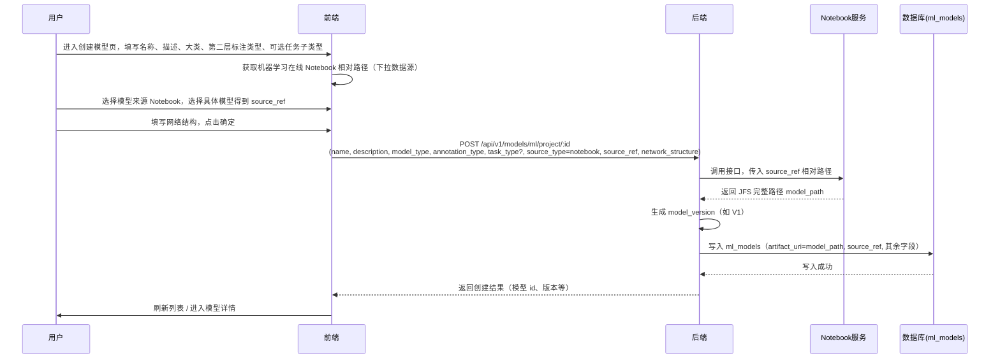
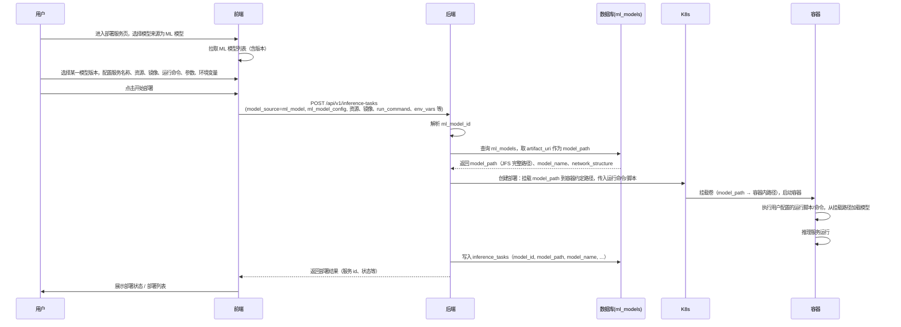

# 机器学习模型管理与部署设计

## 文档说明

- **范围**：仅包含「机器学习模型管理」与「机器学习模型部署」；**不涉及推理结果集**。推理结果集用于标注处理等现有能力，保持现状，不做任何表结构或逻辑变更。
- **对齐**：功能与交互以当前原型图（创建模型、模型管理、模型详情、新增版本、部署服务）为准，便于审核。

---

## 一、原型与功能对照

### 1.1 创建模型（原型）

| 区块     | 字段/控件           | 说明 |
|----------|---------------------|------|
| 基本信息 | 模型名称 *         | 输入，2–64 字符，支持中英文、数字、中划线、下划线，不能以下划线/中划线开头 |
|          | 模型版本           | 只读，如 V1（新建时默认首版） |
|          | 模型描述           | 选填，200 字以内 |
| 模型配置 | 模型类型           | 单选：文本 / 图片 |
|          | 子类型（文本时）   | 单选：文本分类 / 实体识别 |
|          | 模型来源           | 单选：Notebook 获取 |
|          | 请选择模型         | 下拉，从 Notebook 来源选择具体模型 |
|          | 网络结构           | 输入，如 ResNet50、BERT 等 |
| 操作     | 取消 / 确定        | 取消返回，确定提交创建 |

### 1.2 模型管理（列表页）

| 元素     | 说明 |
|----------|------|
| 搜索     | 按名称搜索 |
| 创建模型 | 进入「创建模型」 |
| 表格列   | 模型名称、版本数量、操作（查看详情、删除） |
| 分页     | 每页条数、页码 |

### 1.3 模型详情

| 区块       | 内容 |
|------------|------|
| 模型信息   | 模型名称、模型类型（如「文本分类-文本」） |
| 模型版本   | 「新增版本」按钮 + 表格 |
| 版本表格列 | 版本、描述、网络结构、状态、创建人、创建时间、操作（编辑、部署/排期、删除） |
| 状态       | 如：运行中、完成等 |

### 1.4 新增版本（弹窗/抽屉）

| 字段       | 说明 |
|------------|------|
| 模型版本   | 只读，如 V2（按已有版本递增） |
| 版本描述   | 选填 |
| 模型来源   | Notebook 获取 + 下拉「请选择模型」 |
| 网络结构   | 输入 |
| 取消 / 确定 | 提交后刷新详情页版本列表 |

### 1.5 部署服务（表单）

| 区块     | 字段/控件 |
|----------|-----------|
| 基本信息 | 服务名称、模型来源（如在线 Notebook）、选择模型 |
| 资源信息 | CPU 请求/限制、内存请求/限制、显卡配置与数量、部署实例数、镜像 |
| 环境信息 | 运行命令 |
| 更多配置 | 参数（参数名/参数值）、环境变量（变量名/变量值），支持多条 |
| 操作     | 取消、开始部署 |

### 1.6 部署服务（列表）

| 列       | 说明 |
|----------|------|
| 服务名称 | 部署实例名称 |
| 模型名称 | 所选模型名称 |
| 网络架构 | 展示用，如 ResNet50 |
| 部署状态 | 运行中 / 准备中 / 错误 / 已停止 |
| 创建人   | 创建者 |
| 创建时间 | 创建时间 |
| 操作     | 编辑、删除；按状态：启动 / 停止 / 重启 |

---

## 二、现有能力与复用策略

### 2.1 现有模型与部署

- **base_models**：预训练模型（ModelScope/本地等），当前用于大模型等场景。
- **trained_models**：训练任务产出，按「名称」多版本（一行一版本），列表按 name 聚合版本数。
- **inference_tasks**：在线部署任务，含服务名称、model_id、model_source（base_model / trained_model）、model_path、model_name、资源配置、镜像、运行命令、环境变量等；支持创建、启停、扩缩容、删除。

### 2.2 复用策略

- **机器学习模型**：新增「ML 模型」实体，采用与训练模型一致的「名称 + 多版本」形态，便于列表（按名称 + 版本数）、详情（版本列表）、新增版本等与原型一致。
- **部署**：继续使用 **inference_tasks**，仅扩展 `model_source` 支持 `ml_model`，`model_id` 指向 ML 模型表主键；资源、镜像、运行命令、参数、环境变量等全部沿用现有字段与流程。
- **推理结果集**：**不改造**。推理结果集仍仅使用现有 base_model / trained_model 等能力，用于标注处理等，与本次「机器学习模型管理与部署」无关。

---

## 三、表结构设计

### 3.1 新增表：ml_models（机器学习模型版本）

与原型一一对应：每个「模型」有多个版本，一行一个版本。

| 字段           | 类型             | 对应原型 / 说明 |
|----------------|------------------|------------------|
| （baseModel）  | —                | id, created_at, updated_at, created_id, created_by, tenant_id |
| name           | VARCHAR(100)     | 模型名称（创建模型） |
| model_version  | VARCHAR(50)      | 版本号，如 V1、V2（创建模型 / 新增版本） |
| description    | VARCHAR(500)     | 模型描述 / 版本描述，200 字以内可存 |
| project_id     | INTEGER          | 所属项目 |
| model_type     | VARCHAR(50)      | 第一层：text / image |
| annotation_type | VARCHAR(128)   | 第二层：与数据集对齐，如 text_classification、entity_recognition、image_classification、object_detection、image_segmentation |
| task_type      | VARCHAR(50)      | 第三层（可选）：MlTaskType 枚举值，如 text_classification_single_label、entity_recognition |
| source_type    | VARCHAR(50)      | 来源：notebook（Notebook 获取） |
| notebook_id    | INTEGER          | 关联 **notebooks.id**，须与 project_id 一致；JFS 路径用该 Notebook 的 **instance_name** 拼接（仅 notebook_instance_name 不够） |
| source_ref     | VARCHAR(500)     | 来源引用，即「请选择模型」选中的相对路径或资源标识 |
| network_structure | VARCHAR(200)  | 网络结构（创建模型 / 新增版本） |
| artifact_uri   | VARCHAR(1024)    | 模型产物路径（由 source 解析或上传得到） |
| status         | VARCHAR(50)      | 状态：created, running, completed, failed 等（详情页「状态」列） |

- **唯一约束**：`(project_id, name, model_version, tenant_id)`，保证同项目下同一模型名称的版本号不重复。
- **索引**：project_id、name、status、source_type、notebook_id，便于列表与筛选。

### 3.2 部署表 inference_tasks（仅扩展取值，可不改表结构）

- **model_source**：现有 VARCHAR(50)，应用层增加取值 `ml_model`；选择「ML 模型」部署时写入该值。
- **model_id**：现有 INTEGER，存 ml_models.id。
- **model_name / model_path**：创建部署时由 ml_models 的 name（及版本）与 artifact_uri 填入，列表「模型名称」「网络架构」可关联 ml_models 的 name、network_structure 展示。
- **可选**：若希望部署列表不关联查询，可为 inference_tasks 增加冗余列 `network_architecture VARCHAR(200)`，创建/编辑部署时写入，列表直接读该列。

---

## 四、接口与流程设计（与原型对应）

### 4.1 模型管理

| 原型场景   | 接口建议 | 说明 |
|------------|----------|------|
| 创建模型   | POST /api/v1/models/ml/project/{project_id} | Body 见下「请求样例」；必填含 **model_type**、**annotation_type**、name、source 相关字段等；Notebook 来源须 **notebook_id** + **source_ref**；服务端生成 model_version（V1）并解析 JFS 路径落库。 |
| 模型列表   | GET /api/v1/models/ml/project/{project_id} | Query：name（按名称搜索）、分页；返回按 name 分组的列表，每项含 model_name、version_count、**model_type**、**annotation_type**、task_type、操作所需 id/name。 |
| 模型详情   | GET /api/v1/models/ml/project/{project_id}/model/{model_name} | 返回该名称下所有版本列表，每版本含 **model_type**、**annotation_type**、task_type、描述、网络结构、状态、创建人、创建时间等。 |
| 新增版本   | POST /api/v1/models/ml/project/{project_id}/model/{model_name}/versions | Body：description, source_ref, network_structure；服务端生成下一版本号（如 V2）并落库。 |
| 删除模型   | DELETE /api/v1/models/ml/project/{project_id}/model/{model_name} | 语义可为删除该「名称」下所有版本或仅删除某版本，由产品约定；若仅删单版本，可用 DELETE .../versions/{version}。 |
| 编辑版本   | PUT /api/v1/models/ml/versions/{id} | 更新描述、网络结构等可编辑字段（与详情页「编辑」一致）。 |

#### 创建机器学习模型 — 请求样例

**接口**：`POST /api/v1/models/ml/project/{project_id}`，`Content-Type: application/json`。

**样例 1（文本模型，字段较全）**

```json
{
  "name": "text-clf-demo",
  "description": "Notebook 导出的文本分类基线",
  "model_type": "text",
  "annotation_type": "text_classification",
  "task_type": "text_classification_single_label",
  "source_type": "notebook",
  "notebook_id": 1001,
  "source_ref": "outputs/checkpoints/best",
  "notebook_instance_name": "nb-project-001",
  "network_structure": "BERT-base-chinese"
}
```

**样例 2（图像模型，最小必填）**

```json
{
  "name": "img-clf-v1",
  "model_type": "image",
  "annotation_type": "image_classification",
  "task_type": "image_classification_single_label",
  "notebook_id": 2002,
  "source_ref": "models/exported/model.onnx"
}
```

**cURL（请将 `{token}`、`{project_id}` 替换为实际值）**

```bash
curl -X POST "https://{host}/api/v1/models/ml/project/{project_id}" \
  -H "Authorization: Bearer {token}" \
  -H "Content-Type: application/json" \
  -d '{
    "name": "text-clf-demo",
    "model_type": "text",
    "annotation_type": "text_classification",
    "task_type": "text_classification_single_label",
    "notebook_id": 1001,
    "source_ref": "outputs/checkpoints/best"
  }'
```

字段说明：**第一层** `model_type` 为 `text` 或 `image`；**第二层** `annotation_type` 须与该大类匹配（如 text → `text_classification` / `entity_recognition`；image → `image_classification` / `object_detection` / `image_segmentation`），与数据集侧枚举一致；**第三层** `task_type` 可选，为 `MlTaskType` 枚举值（下划线风格，如 `text_classification_single_label`）；`source_type` 可省略（默认 `notebook`）；本地上传见接口说明中的 `local_upload` + `upload_id`。

#### Demo 样例下载（与第三层 task_type 对齐）

**接口**：`GET /api/v1/models/ml/project/{project_id}/demo-sample?ml_task_type={MlTaskType}`。

将本仓库 `scripts/{ml_task_type}/` 打成 zip 返回；`ml_task_type` 须与 `MlTaskType` 枚举及磁盘目录名一致（例如 `image_classification_single_label`、`semantic_segmentation`）。**注意**：该 Query 参数对应创建模型时的 **第三层** `task_type`，与 **第二层** `annotation_type` 为不同字段；下载前请确认仓库内已存在对应目录。

### 4.2 部署服务

| 原型场景   | 接口建议 | 说明 |
|------------|----------|------|
| 部署表单-选择模型 | 复用现有「选择模型」逻辑 | 当「模型来源」为 ML 时，下拉数据来自 GET .../models/ml/project/{project_id} 的模型+版本列表（或仅版本，按产品约定）。 |
| 创建部署   | `POST /api/v1/inference_tasks/project/{project_id}` | `model_source=ml_model`，`ml_model_config` 一般只传 **`ml_model_id`**（`ml_models.id`）；镜像、显卡、CPU、推理引擎等与现有部署一致。Swagger **Example Value** 已给出一套完整示例。 |
| 部署列表   | `GET /api/v1/inference_tasks/project/{project_id}` | 返回项中根据 model_source、model_id 关联 ml_models 等。 |
| 重新部署   | `PUT .../redeploy` | 请求体与创建一致（`InferenceTaskRedeploy`），示例同样面向 **ml_model**。 |
| 启停 / 扩缩容 / 删除 | 复用现有 inference_tasks 接口 | 无变更。 |

#### 机器学习模型部署 — 请求要点（与 Swagger 示例一致）

- **model_source**：`ml_model`
- **ml_model_config**：`{ "ml_model_id": <ml_models.id> }`（名称与路径由后端从库表解析）
- 其余字段：`server_name`、`image_config`、`graphics_card_resource`、`resource_cpu_config`、`inference_engine_type` 等与基础模型/训练模型部署相同；`project_id` 须与路径参数一致。

### 4.3 推理结果集

- 不新增、不修改任何与推理结果集相关的接口或 model_source 取值。推理结果集仅继续使用现有 base_model / trained_model 等，用于标注处理。

---

## 五、创建模型与模型部署流程图与接口设计

本节针对**创建模型**、**模型部署**两个核心接口，用时序图说明各角色之间的调用顺序与数据流，并明确「Notebook 相对路径 → JFS 完整路径」「挂载 model_path 到容器」的实现要点。

> **大图查看**：在浏览器中打开 **[design/diagrams/sequence-diagrams.html](diagrams/sequence-diagrams.html)** 可查看更大、更显眼的时序图（大字号、高对比度）；或将 `design/diagrams/create-model-sequence.mmd`、`deploy-sequence.mmd` 在 [Mermaid Live Editor](https://mermaid.live) 中打开并导出为 **PNG/SVG** 后插入下方，作为图片使用。

### 5.1 创建模型流程

**业务要点**：前端只提供「机器学习在线 Notebook」下的**相对路径**（或由用户在 Notebook 侧选择得到的相对路径）；后端调用 **Notebook 接口** 将该相对路径补全为 JFS 上的**完整 model_path**，写入 `ml_models` 表的 `artifact_uri`（即表中存储的 model_path）。



**接口设计说明（创建模型）**

| 步骤 | 角色 | 说明 |
|------|------|------|
| 1 | 前端 | 需要**获取机器学习在线 Notebook 的相对路径**，用于「请选择模型」的数据源或选中后的 `source_ref`。具体方式可与现有 Notebook 模块约定（例如调用 Notebook 列表/文件树接口，拿到相对路径）。 |
| 2 | 前端 | 提交 Body 包含：`name, description, model_type, annotation_type`（必填）、可选 `task_type`、`source_type=notebook`、`source_ref`（Notebook 侧相对路径）、`network_structure` 等。不传完整 JFS 路径。 |
| 3 | 后端 | 收到 `source_ref` 后，**调用 Notebook 相关接口**，将相对路径解析为 JFS 上的**完整路径** `model_path`。 |
| 4 | 后端 | 将 `model_path` 存入 `ml_models.artifact_uri`（即表中持久化的 model_path），并写入其余字段；返回新创建的模型版本。 |

**表字段对应**：`source_ref` 存前端传来的相对路径或 Notebook 资源标识；`artifact_uri` 存后端补全后的 JFS 完整路径（即 model_path），供后续部署挂载使用。

---

### 5.2 模型部署流程

**业务要点**：部署时根据已创建的 ML 模型（`ml_models`）读取其 **model_path**（即 `artifact_uri`），通过**挂载方式**将该路径挂载到推理容器内，在容器中执行用户配置的**运行脚本**，完成部署与推理服务运行。



**接口设计说明（模型部署）**

| 步骤 | 角色 | 说明 |
|------|------|------|
| 1 | 前端 | 部署表单中「选择模型」来自 ML 模型列表（含版本），提交时传 `model_source=ml_model` 与 `ml_model_config.ml_model_id`（及所需资源、镜像、运行命令、参数、环境变量）。 |
| 2 | 后端 | 根据 `ml_model_id` 查询 `ml_models`，取 `artifact_uri` 作为 **model_path**（JFS 完整路径）。 |
| 3 | 后端 | **挂载 model_path**：在创建 K8s 部署时，通过 PVC/Volume 将 JFS 上的 `model_path` 目录**挂载到容器内约定路径**（如 `/data/model` 或与现有 trained 模型一致的挂载点），保证运行脚本可直接访问模型文件。 |
| 4 | 后端 | 使用用户配置的**运行命令/脚本**启动容器，脚本在容器内通过挂载路径读取模型并启动推理服务；将 `model_id、model_path、model_name` 等写入 `inference_tasks`，返回部署信息。 |
| 5 | 运行时 | 容器内通过挂载点访问模型文件，执行运行脚本，对外提供推理服务。 |

**挂载约定（建议）**：与现有 trained 模型部署保持一致或单独约定 ML 模型挂载点（例如统一挂载到 `/data/ml_model`），便于运行命令中写死或通过环境变量传入「模型在容器内的路径」。

---

### 5.3 两流程关系小结

| 流程 | 关键数据 | 存储 / 使用 |
|------|----------|--------------|
| 创建模型 | 前端：Notebook **相对路径**（source_ref） | 后端调用 Notebook 接口补全为 JFS **model_path**，存入 `ml_models.artifact_uri`。 |
| 模型部署 | 后端：从 `ml_models.artifact_uri` 读取 **model_path** | 通过**挂载**将 model_path 挂载到容器，在容器内**运行脚本**完成部署与推理。 |

---

## 六、SQL 变更说明（仅 ML 与部署）

### 6.1 新建 ml_models 表（必做）

- 建表语句见附录 A；包含上述字段、注释、唯一约束与索引。
- 与原型一致：name、model_version、description、model_type、**annotation_type**、task_type、source_type、source_ref、network_structure、artifact_uri、status 等。

### 6.2 inference_tasks（可选）

- 不修改亦可：model_source 写 `ml_model`，model_id 写 ml_models.id，列表/详情通过关联 ml_models 展示「模型名称」「网络架构」。
- 若产品希望列表不关联查询，可增加列：`network_architecture VARCHAR(200)`，创建/编辑部署时冗余写入。

### 6.3 inference_result_datasets

- **不做任何 ALTER 或约束变更**。推理结果集不接入机器学习模型。

---

## 七、代码变更要点（不含推理结果集）

### 7.1 枚举与 Schema

- **ModelSourceEnum**：增加 `ML_MODEL = "ml_model"`（仅用于 inference_tasks，不用于推理结果集）。
- **InferenceTaskCreate**：当 model_source=ml_model 时，增加 `ml_model_config`（如 ml_model_id），与 base_model_config / trained_model_config 三选一校验。
- **ML 模型**：MlModelCreate / MlModelResponse / Summary 等含 **三层类型**：`model_type`（text|image）、`annotation_type`（与数据集对齐的第二层）、可选 `task_type`（MlTaskType）；MlModelUpdate、版本列表等与原型字段一致。

### 7.2 模型管理后端

- 新增 **MLModel** ORM，表名 ml_models，继承 baseModel，字段与 3.1 一致。
- Service：创建模型时**调用 Notebook 接口**将前端传入的 source_ref（相对路径）补全为 JFS model_path，写入 `artifact_uri`；按 name 分组的列表（version_count）、详情、新增版本、编辑版本、删除。
- API 与 4.1 建议一致；权限与租户沿用现有 project_id / tenant_id 规范。

### 7.3 部署后端

- **create_inference_task**：当 model_source=ml_model 时，根据 ml_model_config 查 ml_models，取 **artifact_uri 作为 model_path**，通过**挂载方式**将 model_path 挂载到容器；name（及 version）→model_name 写入 inference_tasks；若有 network_architecture 列则一并写入。
- **列表/详情**：根据 model_source、model_id 关联 base_models / trained_models / ml_models，返回 model_name、network_structure（或 network_architecture）。
- **存储挂载**：在现有 build_storage_volumes 或等价逻辑中，对 ML 模型按 **artifact_uri（JFS 路径）** 增加 Volume 挂载，使容器内可通过约定路径访问模型并**执行运行脚本**。

### 7.4 推理结果集

- **不增加** model_source=ml_model 分支，**不修改** 推理结果集创建/编辑/执行逻辑。推理结果集保持仅用于标注处理等现有能力。

---

## 八、迁移与上线顺序建议

1. 执行 **附录 A** 创建 ml_models 表。
2. （可选）为 inference_tasks 增加 network_architecture 列。
3. 后端：MLModel ORM、Schema、Service、模型管理 API；ModelSourceEnum 与 InferenceTaskCreate 扩展；create_inference_task 与列表/详情的 ml_model 分支；存储挂载（若需要）。
4. 前端：创建模型、模型管理列表、模型详情、新增版本、部署表单中「模型来源」为 ML 时的选择与展示、部署列表「模型名称」「网络架构」展示。

---

## 九、小结（审核用）

| 项目         | 结论 |
|--------------|------|
| 范围         | 仅「机器学习模型管理」+「机器学习模型部署」；与原型创建模型、模型管理、模型详情、新增版本、部署服务一致。 |
| 推理结果集   | **不改动**。推理结果集用于标注处理，不接入 ML 模型，无表结构无接口无逻辑变更。 |
| 表结构       | 新增 ml_models；inference_tasks 仅扩展 model_source 取值（及可选 network_architecture 列）。 |
| 复用         | 部署流程、资源配置、启停扩缩容、列表筛选等全部复用 inference_tasks；模型管理形态复用「名称+多版本」与现有 trained 模型类似。 |

---

## 附录 A：ml_models 建表 SQL（与 3.1 一致）

```sql
CREATE TABLE IF NOT EXISTS ml_models (
    id SERIAL PRIMARY KEY,
    created_at TIMESTAMP NOT NULL DEFAULT CURRENT_TIMESTAMP,
    updated_at TIMESTAMP NOT NULL DEFAULT CURRENT_TIMESTAMP,
    created_id BIGINT,
    created_by VARCHAR(100),
    tenant_id VARCHAR(32) NOT NULL,

    name VARCHAR(100) NOT NULL,
    model_version VARCHAR(50) NOT NULL,
    description VARCHAR(500),
    project_id INTEGER NOT NULL,
    model_type VARCHAR(50) NOT NULL,
    annotation_type VARCHAR(128),
    task_type VARCHAR(50),
    source_type VARCHAR(50) NOT NULL,
    notebook_id INTEGER,
    source_ref VARCHAR(500),
    network_structure VARCHAR(200),
    artifact_uri VARCHAR(1024),
    status VARCHAR(50) NOT NULL DEFAULT 'created'
);

COMMENT ON TABLE ml_models IS '机器学习模型版本表（Notebook 等来源），用于模型管理与部署，不参与推理结果集';
COMMENT ON COLUMN ml_models.name IS '模型名称';
COMMENT ON COLUMN ml_models.model_version IS '版本号，如 V1, V2';
COMMENT ON COLUMN ml_models.description IS '模型/版本描述';
COMMENT ON COLUMN ml_models.project_id IS '所属项目ID';
COMMENT ON COLUMN ml_models.notebook_id IS '关联 notebooks.id，用于解析 JFS 路径（instance_name）';
COMMENT ON COLUMN ml_models.model_type IS '模型类型：text, image 等';
COMMENT ON COLUMN ml_models.annotation_type IS '第二层标注类型：text_classification, entity_recognition, image_classification 等，与数据集对齐';
COMMENT ON COLUMN ml_models.task_type IS '第三层任务子类型：MlTaskType 枚举值，如 text_classification_single_label';
COMMENT ON COLUMN ml_models.source_type IS '来源：notebook';
COMMENT ON COLUMN ml_models.source_ref IS '来源引用（如 Notebook 选中的模型标识）';
COMMENT ON COLUMN ml_models.network_structure IS '网络结构描述';
COMMENT ON COLUMN ml_models.artifact_uri IS '模型产物路径';
COMMENT ON COLUMN ml_models.status IS '状态：created, running, completed, failed';

DO $$
BEGIN
  IF NOT EXISTS (
    SELECT 1 FROM pg_constraint WHERE conname = 'uq_ml_models_project_name_version_tenant'
  ) THEN
    ALTER TABLE ml_models ADD CONSTRAINT uq_ml_models_project_name_version_tenant
    UNIQUE (project_id, name, model_version, tenant_id);
  END IF;
END $$;

CREATE INDEX IF NOT EXISTS idx_ml_models_project_id ON ml_models(project_id);
CREATE INDEX IF NOT EXISTS idx_ml_models_name ON ml_models(name);
CREATE INDEX IF NOT EXISTS idx_ml_models_status ON ml_models(status);
CREATE INDEX IF NOT EXISTS idx_ml_models_source_type ON ml_models(source_type);
CREATE INDEX IF NOT EXISTS idx_ml_models_notebook_id ON ml_models(notebook_id);
```
