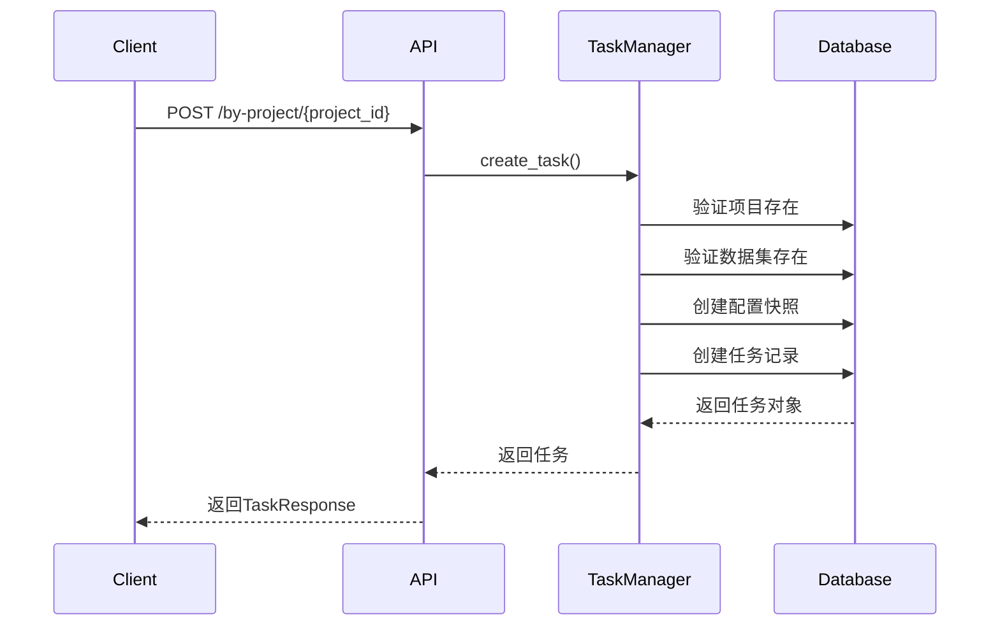
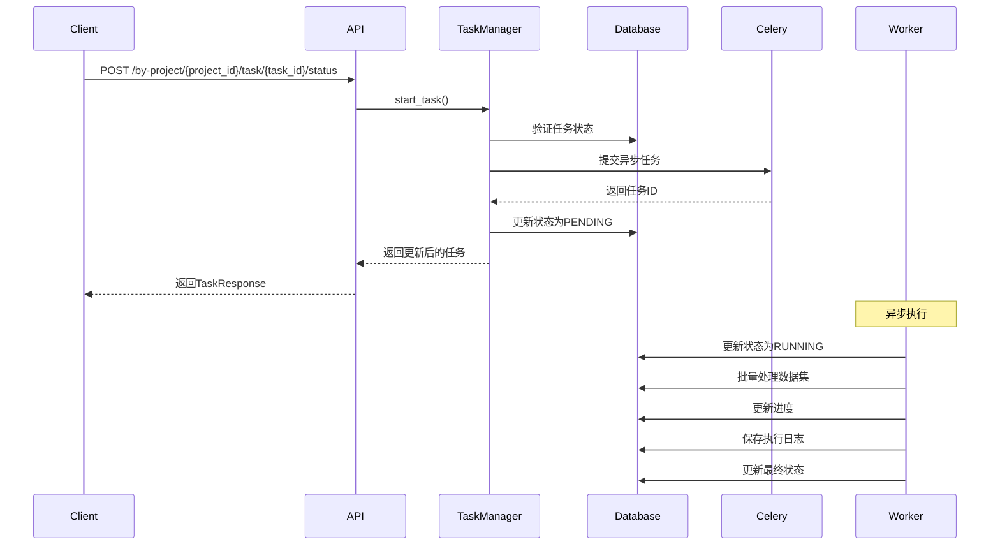
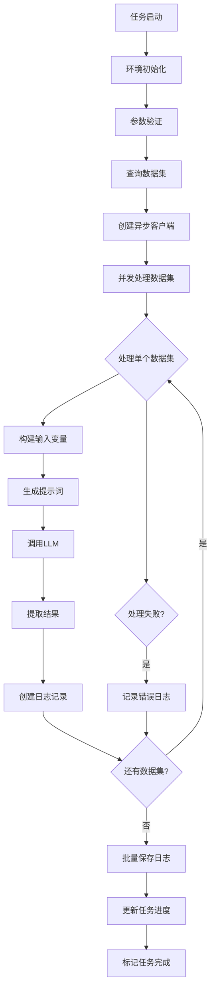

# 任务系统实现详解

## 概述

本文档详细描述了数据集管理系统中任务模块的代码实现逻辑和业务逻辑，包括任务的创建、执行、状态管理、进度跟踪等核心功能。

**最新更新（2024）：**
- 优化了任务取消机制，提高取消操作的可靠性
- 改进了Celery配置，避免任务被过早终止
- 增强了任务状态检查机制，支持更频繁的取消状态检查
- 实现了温和取消和强制取消的分层策略
- **修复了TestRun评估中Unicode字符显示问题**：在ToolCall对象创建时自动解码Unicode编码为中文字符，确保DeepEval评估日志的可读性

## 系统架构

任务系统采用分层架构设计：

```
前端 API → 路由层 → 业务逻辑层 → 数据访问层 → 异步任务队列
  ↓         ↓          ↓           ↓           ↓
task.py → task_manager.py → models.py → Celery + TaskBase
```

## 核心组件

### 1. 任务路由层 (`app/routers/task.py`)

#### 1.1 路由设计

所有任务相关的API都采用项目作用域设计：
- 基础路径：`/api/v1/tasks`
- 项目路径模式：`/by-project/{project_id}/...`

#### 1.2 核心路由功能

**任务创建：**
```python
@router.post("/by-project/{project_id}", response_model=TaskResponse)
async def create(project_id: int, task_data: TaskCreate, deps: Tuple[AsyncSession, User])
```
- 使用路径参数指定项目ID，确保任务归属明确
- 支持快照模式和引用模式创建任务
- 统一依赖注入使用`get_db_and_user`组合依赖

**任务列表：**
```python
@router.get("/by-project/{project_id}/list", response_model=Page[TaskResponse])
async def list(project_id: int, status: Optional[str], deps: Tuple[AsyncSession, User])
```
- 使用`fastapi-pagination`进行分页处理
- 支持按状态筛选
- 按创建时间降序排列

**任务详情、更新、删除：**
- 都采用`/by-project/{project_id}/task/{task_id}`的路径模式
- 统一使用`validate_task_belongs_to_project`进行权限验证

**状态管理：**
```python
@router.post("/by-project/{project_id}/task/{task_id}/status")
async def update_status_action(project_id: int, task_id: int, status_update: TaskStatusUpdate)
```
- 支持`start`和`cancel`操作
- 操作失败时提供详细的错误信息

#### 1.3 错误处理机制

- 统一使用`data_not_found_error()`处理资源不存在错误
- 区分业务逻辑错误（400）和系统错误（500）
- 提供详细的错误日志记录

### 2. 业务逻辑层 (`app/utils/task_manager.py`)

#### 2.1 任务创建逻辑

**参数验证：**
```python
# 支持两种创建模式：
# 1. 快照模式：直接提供prompt_messages和llm_config_content
# 2. 引用模式：提供prompt_id和llm_config_id，系统自动创建快照
```

**数据一致性检查：**
- 验证项目存在性
- 验证数据集存在性和数量统计
- 验证提示词和LLM配置的项目归属

**快照创建机制：**
```python
# 从引用对象创建配置快照，确保任务执行时的参数稳定性
prompt_messages = {
    "messages": prompt.messages,
    "input_variables": prompt.input_variables or [],
    "template_format": prompt.template_format 
}

llm_config_content = {
    "model": llm_config.model,
    "temperature": llm_config.temperature,
    # ... 其他参数
}
```

#### 2.2 任务启动逻辑

**状态流转验证：**
```python
if not task.can_transition_to(TaskStatus.PENDING):
    raise ValueError(f"任务状态 {task.status} 不能启动")
```

**异步任务提交：**
```python
# 使用Celery异步处理，避免阻塞API响应
celery_result = answer_generation_task.apply_async(
    args=(task_id, task_args), 
    countdown=3  # 延迟3秒执行，确保数据库事务提交
)
```

**状态同步更新：**
- 同时更新任务状态、Celery任务ID和时间戳
- 使用单次commit确保数据一致性

#### 2.3 任务取消逻辑

**Celery任务撤销：**
```python
if task.celery_task_id:
    try:
        celery_app.control.revoke(task.celery_task_id, terminate=True)
    except Exception:
        # 即使撤销失败，也要更新数据库状态
        pass
```

**优雅处理机制：**
- 即使Celery撤销失败，也要更新数据库状态
- 确保系统状态的最终一致性

#### 2.4 任务重试逻辑

**重试失败记录：**
```python
async def retry_error_task(db: AsyncSession, task_id: int, project_id: int) -> Task:
    """重试失败的答案生成任务"""
```

**重试验证机制：**
- 验证任务存在且属于指定项目
- 验证任务类型为答案生成任务
- 验证任务状态为FAILED或SUCCESS（可重试状态）

**Celery任务提交：**
```python
celery_result = answer_generation_retry_error.apply_async(
    args=(task_id, project_id), 
    countdown=3  # 延迟3秒执行
)
```

**状态管理：**
- 将任务状态更新为RUNNING
- 记录新的Celery任务ID
- 更新时间戳

### 3. 数据模型层 (`app/models/models.py`)

#### 3.1 Task模型设计

**核心字段：**
```python
class Task(Base):
    # 基础信息
    name = Column(String(255), nullable=False)
    project_id = Column(Integer, ForeignKey("projects.id"), nullable=False)
    task_type = Column(String(50), nullable=False, default="answer-generation")
    
    # 快照配置
    prompt_messages = Column(JSON, nullable=True)
    llm_config_content = Column(JSON, nullable=True)
    
    # 执行状态
    status = Column(String(20), nullable=False, default=TaskStatus.CREATED)
    celery_task_id = Column(String(255), nullable=True)
    
    # 进度统计
    progress = Column(Float, nullable=False, default=0.0)
    total_count = Column(Integer, default=0)
    processed_count = Column(Integer, default=0)
    successful_count = Column(Integer, default=0)
    failed_count = Column(Integer, default=0)
```

#### 3.2 状态管理方法

**状态流转验证：**
```python
def can_transition_to(self, target_status: str) -> bool:
    """验证是否可以转换到目标状态"""
    from app.tasks.constants import TaskStatus
    current_valid_transitions = TaskStatus.VALID_TRANSITIONS.get(self.status, [])
    return target_status in current_valid_transitions
```

**状态判断方法：**
```python
def is_editable(self) -> bool:
    return self.status in TaskStatus.EDITABLE_STATUSES

def is_cancellable(self) -> bool:
    return self.status in TaskStatus.CANCELLABLE_STATUSES

def is_deletable(self) -> bool:
    return self.status in TaskStatus.DELETABLE_STATUSES
```

### 4. 异步任务执行层 (`app/tasks/`)

#### 4.1 任务基类 (`task_base.py`)

**核心功能设计：**
```python
class TaskBase(Task):
    """
    任务基类 - 提供统一的任务执行框架
    集成了数据库操作、状态管理、日志记录等核心功能
    """
```

**统一日志接口：**
```python
def _log_info(self, message: str, **kwargs)
def _log_warning(self, message: str, **kwargs)  
def _log_error(self, message: str, error: Exception = None, **kwargs)
def _log_progress(self, processed: int, total: int, message: str)
```

**数据库操作封装：**
```python
@contextmanager
def get_db_session(self):
    """获取数据库会话的上下文管理器"""
    session = SessionLocal()
    try:
        yield session
    except Exception as e:
        session.rollback()
        raise
    finally:
        session.close()
```

**状态管理方法：**
```python
@db_operation_handler
def _update_task_status(self, task_id: int, status: str, **kwargs) -> bool:
    """统一的任务状态更新方法"""
    update_data = {'status': status, **kwargs}
    
    # 自动设置时间戳
    if status == TaskStatus.RUNNING:
        if not self._has_started():
            update_data['started_at'] = datetime.utcnow()
    elif status in TaskStatus.FINAL_STATUSES:
        update_data['finished_at'] = datetime.utcnow()
    
    return self._update_task_fields(task_id, update_data)
```

**进度跟踪机制：**
```python
def _update_task_progress(self, task_id: int, processed: int, total: int, 
                         success: int = 0, failed: int = 0) -> bool:
    """更新任务进度"""
    progress = min(100.0, (processed / total) * 100) if total > 0 else 0.0
    
    update_data = {
        'processed_count': processed,
        'total_count': total,
        'successful_count': success,
        'failed_count': failed,
        'progress': progress
    }
    
    return self._update_task_fields(task_id, update_data)
```

#### 4.2 答案生成任务 (`answer_generation.py`)

**任务入口点：**
```python
@celery_app.task(base=TaskBase, bind=True)
def answer_generation_task(self, db_task_id: int, task_args: Dict[str, Any]):
```

**执行流程：**
1. **环境初始化：**
   ```python
   self.setup_task(db_task_id)  # 设置任务环境
   self.update_status(TaskStatus.RUNNING)  # 更新状态为运行中
   ```

2. **参数验证：**
   ```python
   required_params = _validate_required_params(task_args)
   # 验证：project_id, prompt_messages, llm_config_content, directory_id
   ```

3. **数据查询：**
   ```python
   # 查询匹配的数据集
   query = session.query(Dataset).filter(
       Dataset.project_id == project_id,
       Dataset.directory_id == directory_id
   )
   datasets = query.all()
   ```

4. **异步批处理：**
   ```python
   result = asyncio.run(_process_datasets_async(
       self, datasets, project_id, prompt_messages, 
       llm_config_content, variable_mappings, db_task_id
   ))
   ```

**批处理优化策略：**
```python
# 并发控制
MAX_CONCURRENT, BATCH_SIZE = 5, 10
semaphore = asyncio.Semaphore(MAX_CONCURRENT)

# 流式处理，避免内存堆积
for completed_task in asyncio.as_completed(tasks):
    # 实时处理结果，更新进度
```

**LLM调用处理：**
```python
async def process_single_dataset(dataset, dataset_index):
    """处理单个数据集的异步函数"""
    async with semaphore:
        try:
            # 构建输入变量
            input_vars = {
                prompt_var: getattr(dataset, dataset_field, "") 
                for prompt_var, dataset_field in variable_mappings.items()
            }
            
            # 生成最终消息
            prompt_value = prompt_template.invoke(input_vars)
            final_messages = convert_to_openai_messages(prompt_value.messages)
            
            # 调用LLM
            response = await async_client.chat.completions.create(**openai_params)
            
            # 提取结果
            output = response.choices[0].message.content
            tools_called = [
                {"name": tc.function.name, "arguments": tc.function.arguments}
                for tc in (response.choices[0].message.tool_calls or [])
            ]
            
        except Exception as e:
            # 错误处理和日志记录
```

**结果记录机制：**
```python
def _create_dataset_log(dataset_id, project_id, db_task_id, task_name, 
                       llm_config_content, prompt_messages, dataset_content=None, 
                       question="", output=None, tools_called=None, input_values=None, 
                       success=True, error_message=None, execution_time_ms=None):
    """创建 DatasetLog 记录的通用函数"""
    from app.models.models import DatasetLog
    
    return DatasetLog(
        dataset_id=dataset_id,
        project_id=project_id,
        question=question,
        output=output,
        task_id=db_task_id,
        task_name=task_name,
        log_type="job",
        llm_config_content=llm_config_content,
        prompt_messages=prompt_messages,
        dataset_content=dataset_content or {},
        tools_called=tools_called or [],
        input_values=input_values or {},
        success=success,
        error_message=error_message,
        execution_time_ms=execution_time_ms,
        created_at=datetime.utcnow()
    )
```

#### 4.3 答案生成重试任务 (`answer_generation_retry_error`)

**任务目的：**
专门用于重试之前失败的答案生成任务。从DatasetLog表中查询success=False的记录，使用保存的配置信息重新调用LLM生成答案，并更新原记录。

**任务入口点：**
```python
@celery_app.task(base=TaskBase, bind=True)
def answer_generation_retry_error(self, db_task_id: int, project_id: int):
    """重试失败的答案生成任务"""
```

**执行流程：**
1. **环境初始化：**
   ```python
   self.setup_task(db_task_id)  # 设置任务环境
   self.update_status(TaskStatus.RUNNING)  # 更新状态为运行中
   ```

2. **查询失败记录：**
   ```python
   # 查询特定任务下所有失败的数据集日志
   failed_logs_query = session.query(DatasetLog).filter(
       DatasetLog.project_id == project_id,
       DatasetLog.success == False,
       DatasetLog.task_id == db_task_id
   )
   failed_logs = failed_logs_query.all()
   ```

3. **异步重试处理：**
   ```python
   result = asyncio.run(_retry_failed_logs_async(
       self, failed_logs, project_id, db_task_id
   ))
   ```

**重试逻辑特点：**

1. **配置恢复机制：**
   ```python
   # 从失败记录中恢复LLM配置和提示词配置
   if not failed_log.llm_config_content or not failed_log.prompt_messages:
       # 跳过缺少配置信息的记录
       return failed_log, False
   
   # 使用保存的input_values重新构建prompt
   if failed_log.input_values:
       prompt_template = ChatPromptTemplate.from_messages(
           failed_log.prompt_messages.get("messages", []), 
           template_format=failed_log.prompt_messages.get("template_format")
       )
       prompt_value = prompt_template.invoke(failed_log.input_values)
       final_messages = convert_to_openai_messages(prompt_value.messages)
   ```

2. **直接更新机制：**
   ```python
   # 直接更新失败记录，而不是创建新记录
   failed_log.output = output
   failed_log.question = question
   failed_log.tools_called = tools_called
   failed_log.success = True
   failed_log.error_message = None
   failed_log.execution_time_ms = execution_time_ms
   ```

3. **优雅降级处理：**
   ```python
   # 如果重试仍然失败，更新错误信息但保持success=False
   except Exception as e:
       error_msg = str(e)
       failed_log.error_message = f"重试失败: {error_msg}"
       return failed_log, False
   ```

4. **简化处理流程：**
   ```python
   # 重试任务专注于日志记录，不更新任务进度
   # 所有记录处理完成后统一提交到数据库
   with task_instance.get_db_session() as session:
       session.commit()
       task_instance.log_info(f"批量更新完成: {len(failed_logs)} 条记录已更新到数据库")
   ```

**与原始任务的区别：**
- **数据源**：从DatasetLog查询特定任务的失败记录，而非从Dataset表查询
- **操作类型**：更新现有记录，而非创建新记录
- **配置来源**：使用记录中保存的快照配置，确保重试时参数一致
- **进度管理**：只记录详细日志，不更新任务进度条
- **容错性**：即使部分记录缺少配置信息也能继续处理其他记录

### 5. 常量定义 (`app/tasks/constants.py`)

#### 5.1 任务状态管理

**状态定义：**
```python
class TaskStatus:
    CREATED = 'CREATED'      # 已创建
    PENDING = 'PENDING'      # 等待中（已提交到Celery队列）
    RUNNING = 'RUNNING'      # 运行中
    SUCCESS = 'SUCCESS'      # 成功
    FAILED = 'FAILED'        # 失败
    CANCELLED = 'CANCELLED'  # 已取消
```

**状态流转规则：**
```python
VALID_TRANSITIONS = {
    CREATED: [PENDING, CANCELLED],           # 已创建 -> 等待中、已取消
    PENDING: [RUNNING, CANCELLED],           # 等待中 -> 运行中、已取消
    RUNNING: [SUCCESS, FAILED, CANCELLED],   # 运行中 -> 成功、失败、已取消
    SUCCESS: [],   # 终态
    FAILED: [],    # 终态
    CANCELLED: []  # 终态
}
```

**状态分类：**
```python
# 终态状态（不可再流转）
FINAL_STATUSES = [SUCCESS, FAILED, CANCELLED]

# 可编辑的状态
EDITABLE_STATUSES = [CREATED]

# 可取消的状态
CANCELLABLE_STATUSES = [CREATED, PENDING, RUNNING]

# 可删除的状态（只有终态可删除）
DELETABLE_STATUSES = FINAL_STATUSES
```

#### 5.2 任务类型管理

```python
class TaskType:
    ANSWER_GENERATION = 'answer-generation'
    ALL_TYPES = [ANSWER_GENERATION]
    
    TYPE_DESCRIPTIONS = {
        ANSWER_GENERATION: "答案生成任务 - 使用LLM为数据集生成答案"
    }
```

## 业务流程

### 1. 任务创建流程



### 2. 任务启动流程



### 3. 任务执行流程



## 关键设计模式

### 1. 快照模式

**问题：** 任务执行时间较长，期间引用的提示词或LLM配置可能被修改，导致执行结果不一致。

**解决方案：** 创建任务时将配置内容复制到任务记录中，确保执行时的参数稳定性。

```python
# 创建配置快照而不是存储引用ID
prompt_messages = {
    "messages": prompt.messages,
    "input_variables": prompt.input_variables or [],
    "template_format": prompt.template_format 
}
```

### 2. 状态机模式

**问题：** 任务状态流转复杂，需要严格控制状态转换的合法性。

**解决方案：** 使用状态机模式，定义明确的状态流转规则。

```python
# 状态流转规则定义
VALID_TRANSITIONS = {
    CREATED: [PENDING, CANCELLED],
    PENDING: [RUNNING, CANCELLED],
    RUNNING: [SUCCESS, FAILED, CANCELLED]
}

def can_transition_to(self, target_status: str) -> bool:
    current_valid_transitions = TaskStatus.VALID_TRANSITIONS.get(self.status, [])
    return target_status in current_valid_transitions
```

### 3. 模板方法模式

**问题：** 不同类型的任务有相似的执行流程，但具体处理逻辑不同。

**解决方案：** 使用TaskBase基类定义通用流程，具体任务类实现特定逻辑。

```python
class TaskBase(Task):
    def setup_task(self, db_task_id: int):
        """通用的任务初始化流程"""
        
    def update_status(self, status: str, **kwargs):
        """通用的状态更新方法"""
        
    def update_progress(self, processed: int, total: int, success: int = 0, failed: int = 0):
        """通用的进度更新方法"""
```

### 4. 装饰器模式

**问题：** 数据库操作需要统一的异常处理和日志记录。

**解决方案：** 使用装饰器统一处理数据库操作的异常和日志。

```python
def db_operation_handler(func: Callable) -> Callable:
    """数据库操作装饰器，统一处理异常和日志"""
    @wraps(func)
    def wrapper(self, *args, **kwargs):
        try:
            return func(self, *args, **kwargs)
        except Exception as e:
            self._log_error(f"数据库操作失败 [{func.__name__}]: {str(e)}")
            return False
    return wrapper
```

## 性能优化策略

### 1. 数据库优化

**减少查询次数：**
```python
# 一次性获取任务并进行所有验证，避免多次查询
query = select(Task).where(Task.id == task_id)
result = await db.execute(query)
task = result.scalar_one_or_none()
```

**批量操作：**
```python
# 批量插入日志记录，减少数据库交互
@db_operation_handler
def batch_insert_dataset_logs(self, dataset_logs: list) -> bool:
    with self.get_db_session() as session:
        session.bulk_save_objects(dataset_logs)
        session.commit()
        return True
```

### 2. 并发控制

**信号量限制：**
```python
MAX_CONCURRENT = 5
semaphore = asyncio.Semaphore(MAX_CONCURRENT)

async def process_single_dataset(dataset, dataset_index):
    async with semaphore:
        # 处理逻辑
```

**流式处理：**
```python
# 使用 asyncio.as_completed 进行流式处理，避免内存堆积
for completed_task in asyncio.as_completed(tasks):
    result = await completed_task
    # 实时处理结果
```

### 3. 错误处理优化

**优雅降级：**
```python
# Celery撤销失败时，仍然更新数据库状态
if task.celery_task_id:
    try:
        celery_app.control.revoke(task.celery_task_id, terminate=True)
    except Exception:
        # 即使撤销失败，也要更新数据库状态
        pass
```

**分类错误处理：**
```python
try:
    # 业务逻辑
except ValueError as e:
    # 业务逻辑错误
    raise HTTPException(status_code=400, detail=str(e))
except IntegrityError as e:
    # 数据完整性错误
    raise HTTPException(status_code=409, detail=f"Data integrity error: {str(e)}")
except Exception as e:
    # 系统错误
    raise HTTPException(status_code=500, detail=f"System error: {str(e)}")
```

## 监控和日志

### 1. 任务执行日志

**分层日志记录：**
```python
# TaskBase提供统一的日志接口
def _log_info(self, message: str, **kwargs):
    if self.task_logger:
        self.task_logger.info(message, **kwargs)
    else:
        self.logger.info(message)
```

**执行过程跟踪：**
```python
def _log_progress(self, processed: int, total: int, message: str):
    if self.task_logger and hasattr(self.task_logger, 'log_progress'):
        self.task_logger.log_progress(processed, total, message)
    else:
        self._log_info(f"[PROGRESS] {message}")
```

### 2. 性能监控

**执行时间统计：**
```python
start_time = time.time()
response = await async_client.chat.completions.create(**openai_params)
execution_time_ms = int((time.time() - start_time) * 1000)
```

**进度实时更新：**
```python
# 批次处理完成后立即更新进度
task_instance.update_progress(processed_count, total_count, success_count, failed_count)
```

## 扩展性设计

### 1. 任务类型扩展

**可插拔的任务类型：**
```python
class TaskType:
    ANSWER_GENERATION = 'answer-generation'
    # 新增任务类型只需在此添加
    ALL_TYPES = [ANSWER_GENERATION]
```

**统一的任务接口：**
```python
# 所有任务都继承自TaskBase，确保接口一致
@celery_app.task(base=TaskBase, bind=True)
def new_task_type(self, db_task_id: int, task_args: Dict[str, Any]):
    # 实现具体逻辑
```

### 2. 配置扩展

**灵活的参数配置：**
```python
# 使用JSON字段存储灵活配置
llm_config_content = Column(JSON, nullable=True)
prompt_messages = Column(JSON, nullable=True)
variable_mappings = Column(JSON, nullable=True)
```

**向后兼容性：**
```python
# 通过版本化确保配置的向后兼容
def _validate_config_version(self, config: Dict[str, Any]) -> Dict[str, Any]:
    version = config.get('version', '1.0')
    if version == '1.0':
        return self._migrate_from_v1(config)
    return config
```
## 总结

任务系统的设计充分考虑了以下几个方面：

1. **可靠性：** 通过状态机模式确保状态流转的正确性，通过快照模式确保执行参数的一致性
2. **性能：** 通过异步并发处理、批量数据库操作、流式处理等方式优化性能
3. **可维护性：** 通过分层架构、设计模式、统一接口等方式提高代码的可维护性
4. **可扩展性：** 通过可插拔的任务类型、灵活的配置系统支持功能扩展
5. **可观测性：** 通过分层日志、性能监控、进度跟踪等方式支持系统监控

整个系统在保证功能完整性的同时，也充分考虑了生产环境的实际需求。 