# API业务流程与系统交互

## 用户角色定义

### 1. 系统管理员（Admin）
- **权限范围**: 系统级完全访问权限
- **主要职责**: 用户管理、系统配置、全局监控
- **访问资源**: 所有项目、用户、系统设置
- **标识字段**: User.is_admin = True

### 2. 普通用户（User）
- **权限范围**: 项目级访问权限
- **主要职责**: 数据集管理、模型评估、任务执行
- **访问资源**: 通过project_id隔离的项目内资源
- **标识字段**: User.is_admin = False

## 核心业务流程

### 1. 认证与授权流程

#### 1.1 JWT认证流程
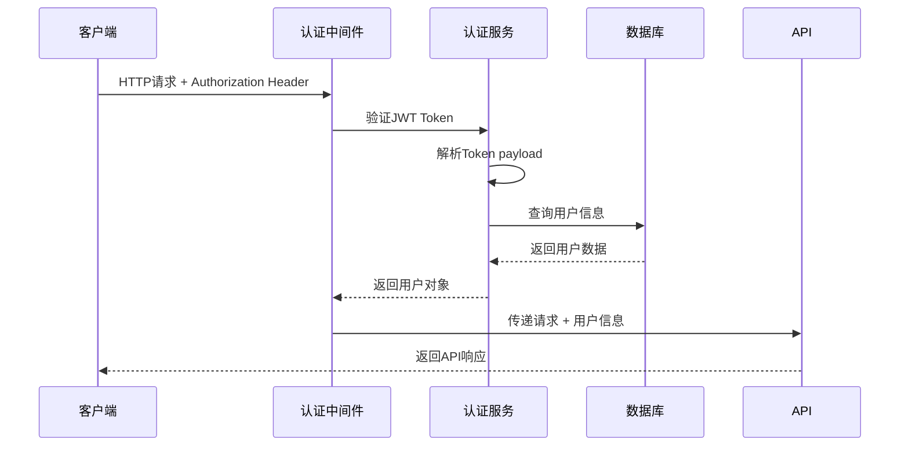

#### 1.2 项目级权限控制
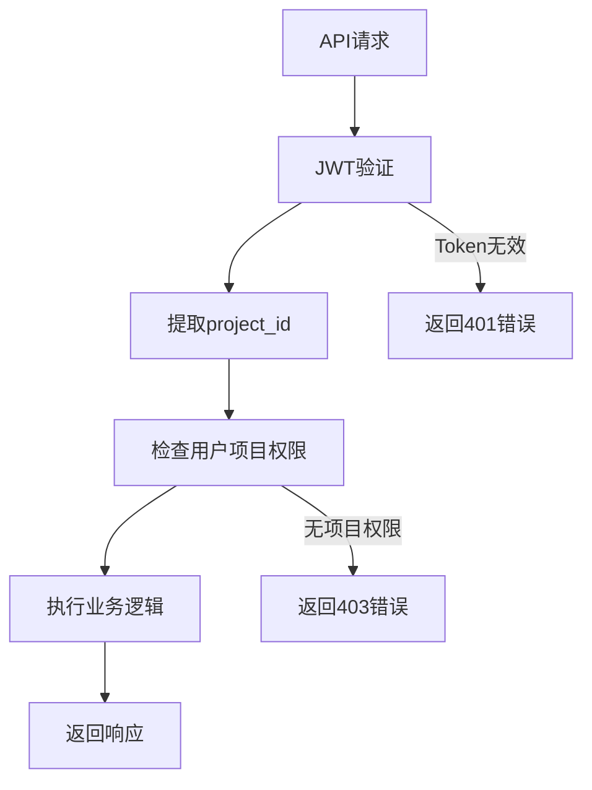

### 2. 项目管理流程

#### 2.1 项目生命周期
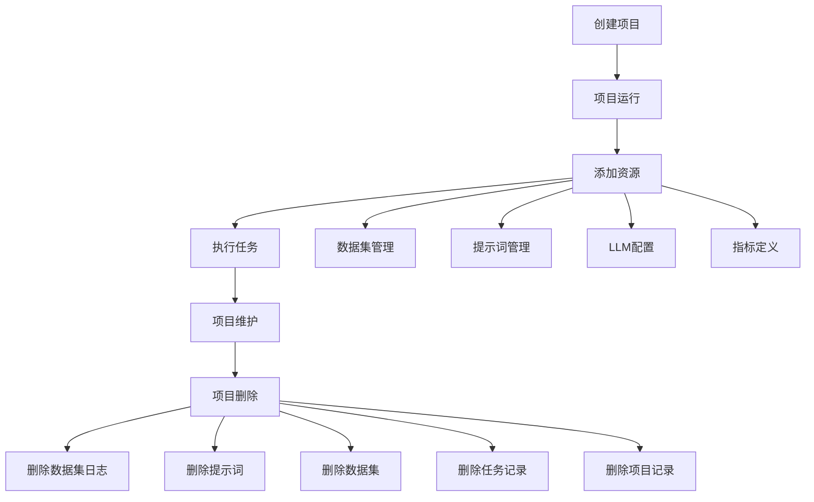

#### 2.2 级联删除策略
```python
# 项目删除时的级联删除顺序
delete_order = [
    "dataset_logs",      # 数据集日志
    "prompts",           # 提示词
    "prompt_directories", # 提示词目录
    "datasets",          # 数据集
    "dataset_directories", # 数据集目录
    "metrics",           # 指标
    "metric_directories", # 指标目录
    "tasks",             # 任务
    "test_runs",         # 测试运行
    "projects"           # 项目
]
```

### 3. 数据集管理流程

#### 3.1 数据集CRUD操作
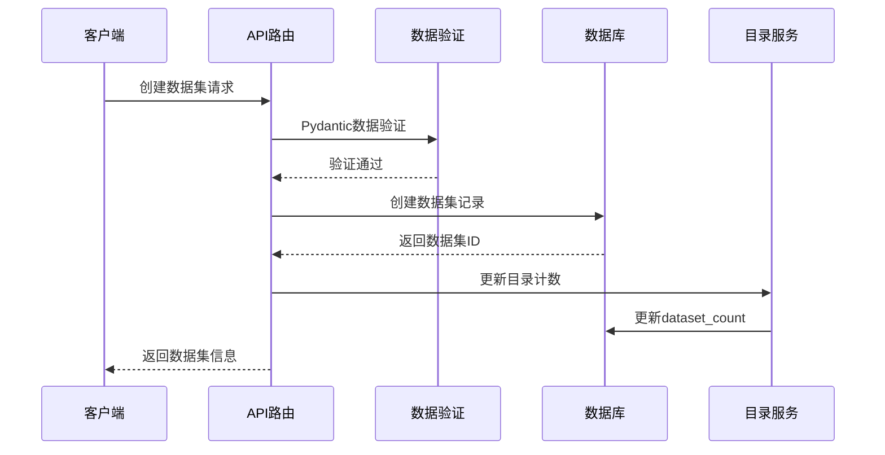

#### 3.2 批量导入处理
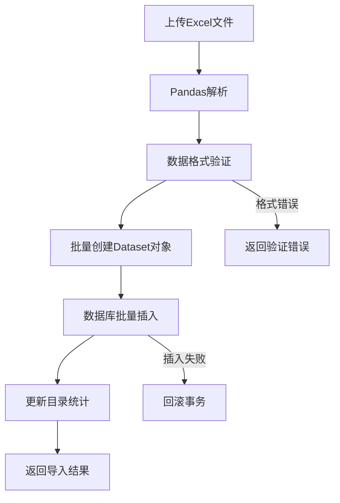

#### 3.3 数据集执行日志
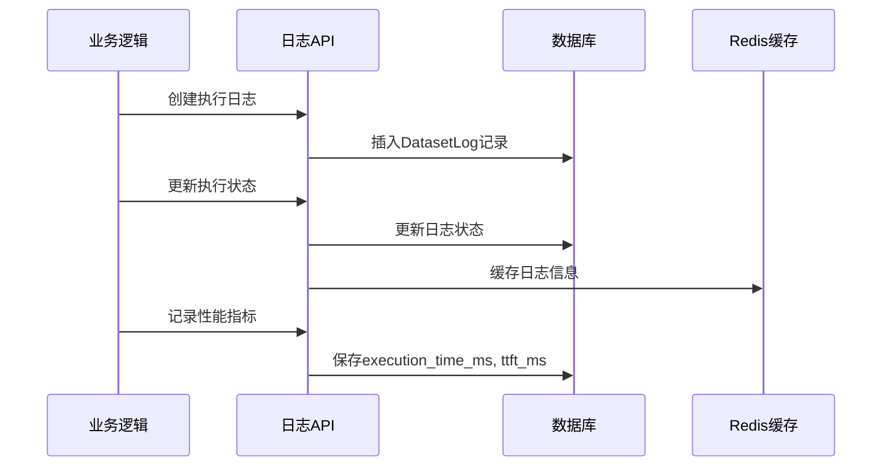

### 4. 异步任务处理流程

#### 4.1 Celery任务生命周期
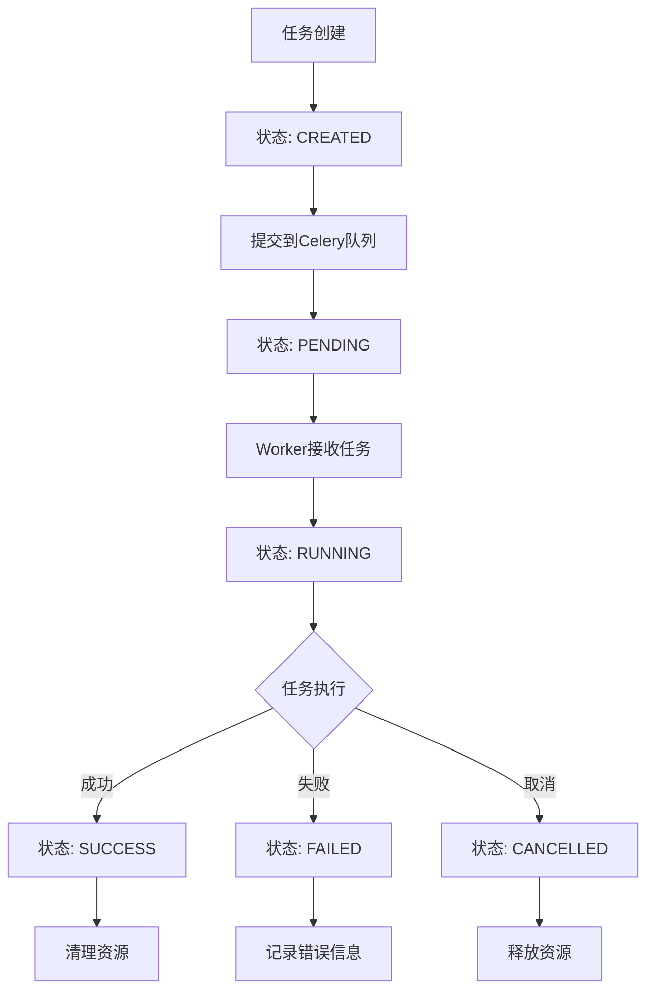

#### 4.2 答案生成任务流程
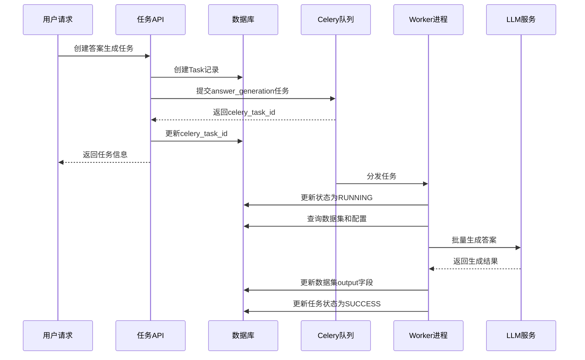

### 5. LangChain集成流程

#### 5.1 提示词模板渲染
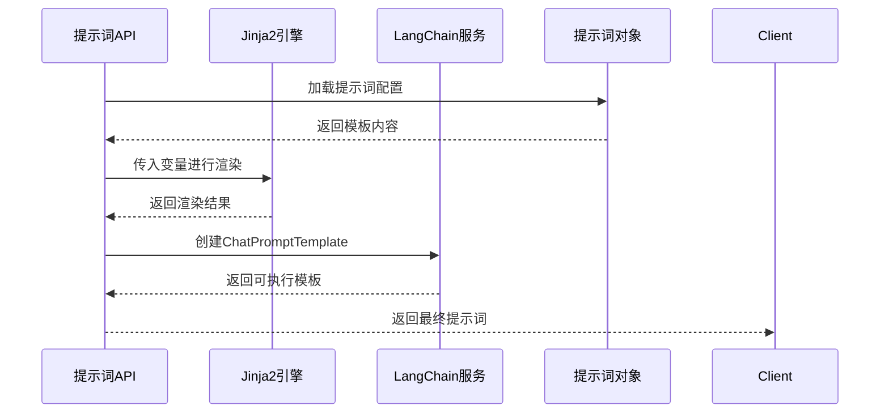

#### 5.2 消息模板处理
```python
# 支持的消息类型
message_types = {
    "system": SystemMessage,
    "human": HumanMessagePromptTemplate,
    "ai": AIMessage
}

# 模板渲染过程
def render_chat_template(prompt_data, variables):
    messages = []
    for msg_config in prompt_data.get('messages', []):
        msg_type = msg_config.get('type')
        content = msg_config.get('content')
        
        # Jinja2模板渲染
        template = Template(content)
        rendered_content = template.render(**variables)
        
        # 创建LangChain消息对象
        message = message_types[msg_type](content=rendered_content)
        messages.append(message)
    
    return ChatPromptTemplate.from_messages(messages)
```

### 6. 在线Notebook管理流程

#### 6.1 Notebook实例生命周期
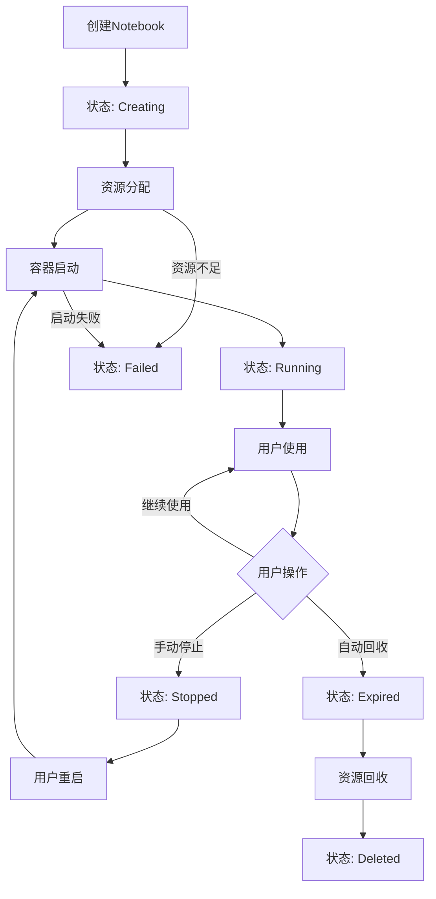

#### 6.2 Notebook创建流程
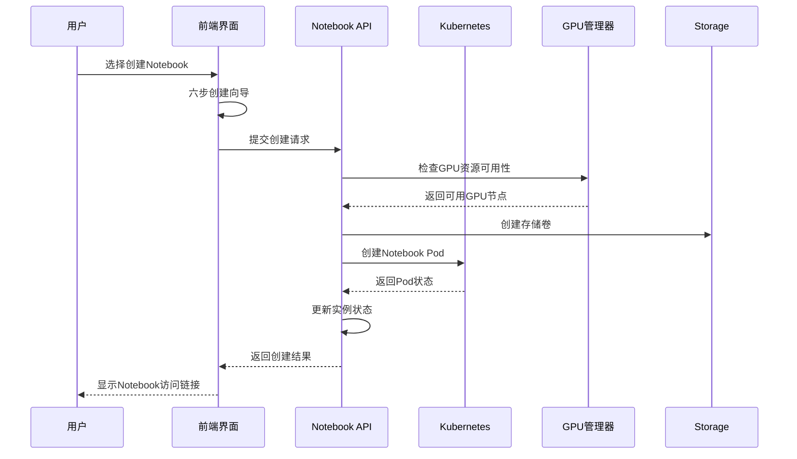

#### 6.3 资源配置与监控
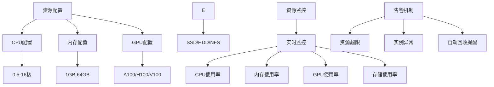

#### 6.4 数据集成与访问
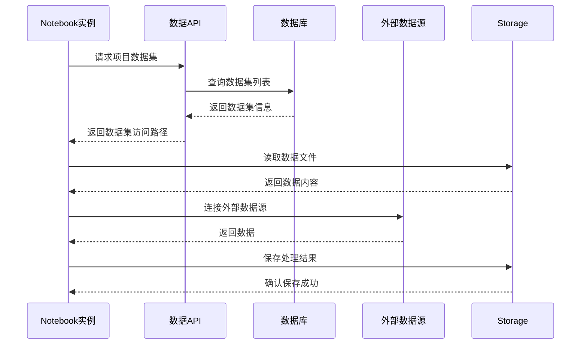

#### 6.5 协作与共享流程
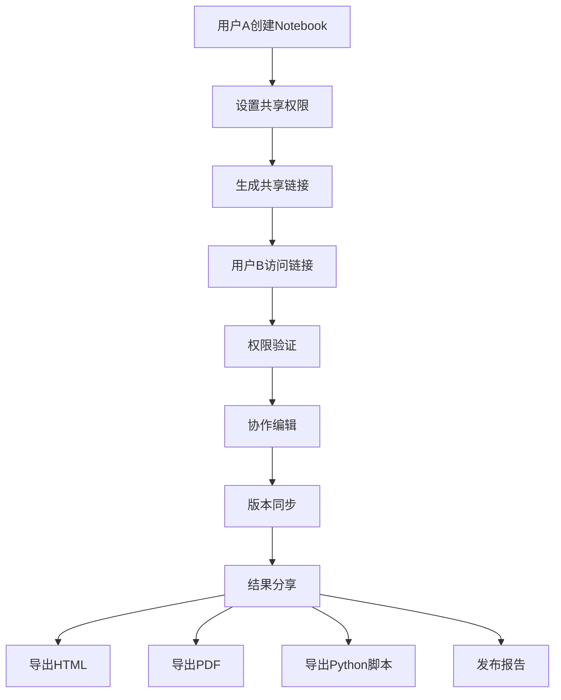

### 7. 分页查询优化

#### 7.1 fastapi-pagination集成
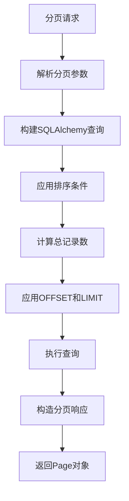

#### 7.2 查询性能优化
```python
# 标准分页查询实现
@router.get("/list", response_model=Page[DatasetResponse])
async def list_datasets(
    project_id: int,
    db: AsyncSession = Depends(get_db)
):
    # 构建基础查询，使用索引优化
    query = select(Dataset).where(
        Dataset.project_id == project_id
    ).order_by(Dataset.created_at.desc())
    
    # 使用fastapi-pagination自动处理分页
    return await apaginate(db, query)
```

### 8. 错误处理与监控

#### 8.1 统一错误处理
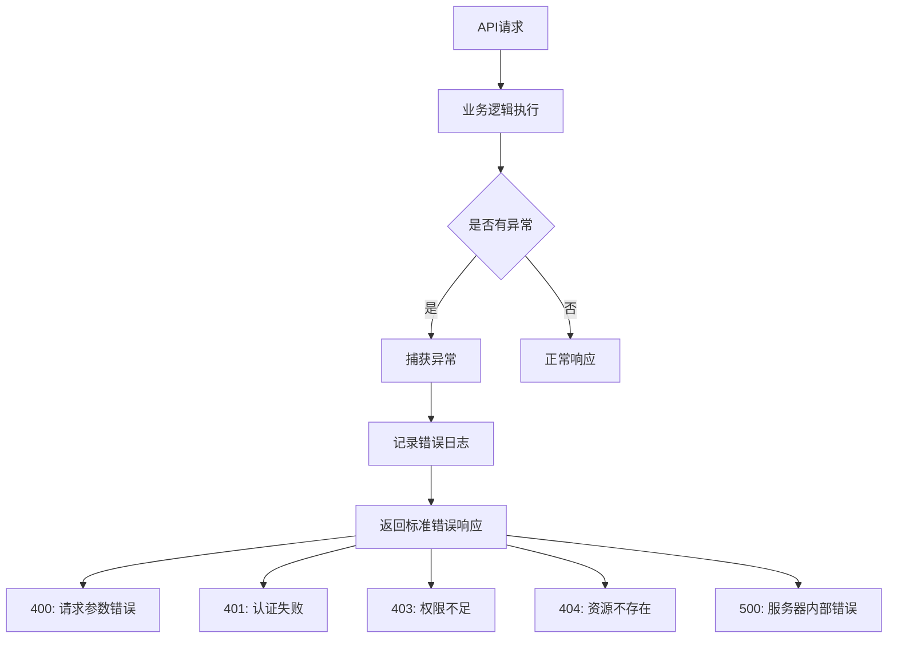

#### 8.2 请求生命周期监控
```python
# RequestLoggingMiddleware记录的信息
log_data = {
    "method": request.method,
    "url": str(request.url),
    "user_agent": request.headers.get("user-agent"),
    "start_time": start_time,
    "end_time": end_time,
    "duration_ms": duration_ms,
    "status_code": response.status_code,
    "user_id": getattr(request.state, 'user_id', None)
}
```

## API设计最佳实践

### 1. RESTful资源设计
```
# 项目级别资源
GET    /api/v1/projects/{project_id}
PUT    /api/v1/projects/{project_id}
DELETE /api/v1/projects/{project_id}

# 项目内资源
GET    /api/v1/datasets/by-project/{project_id}/
POST   /api/v1/datasets/by-project/{project_id}/
GET    /api/v1/datasets/by-project/{project_id}/{dataset_id}

# 目录级别资源
GET    /api/v1/datasets/by-project/{project_id}/directory/{directory_id}/
POST   /api/v1/datasets/by-project/{project_id}/directory/{directory_id}/
```

### 2. 数据验证策略
```python
# 使用Pydantic进行请求验证
class DatasetCreate(BaseModel):
    question: str = Field(..., min_length=1, max_length=5000)
    ground_truth: Optional[str] = None
    context: List[str] = Field(default_factory=list)
    meta_info: Dict[str, Any] = Field(default_factory=dict)
    
    @validator('meta_info')
    def validate_meta_info(cls, v):
        # 自定义验证逻辑
        return v
```

### 3. 数据库事务管理
```python
# 事务边界控制
async def create_dataset_with_directory_update(
    dataset_data: DatasetCreate,
    project_id: int,
    db: AsyncSession
):
    async with db.begin():  # 事务开始
        # 创建数据集
        dataset = Dataset(**dataset_data.dict(), project_id=project_id)
        db.add(dataset)
        await db.flush()  # 获取生成的ID
        
        # 更新目录统计
        if dataset.directory_id:
            directory = await db.get(DatasetDirectory, dataset.directory_id)
            directory.dataset_count += 1
        
        await db.commit()  # 事务提交
        return dataset
``` 